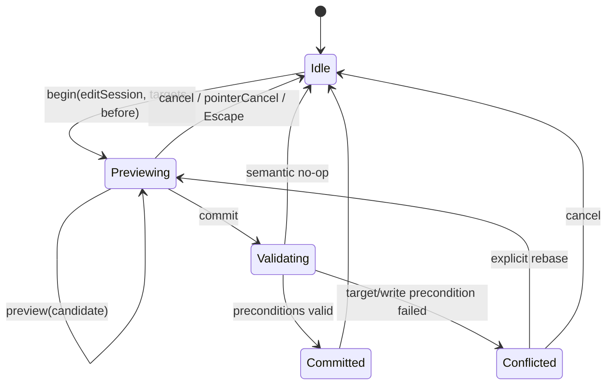
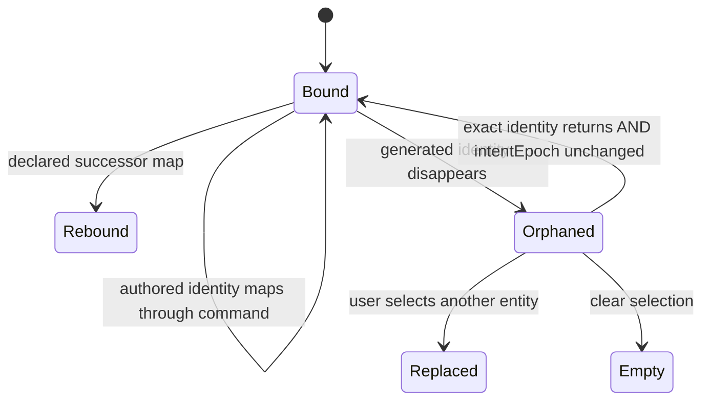
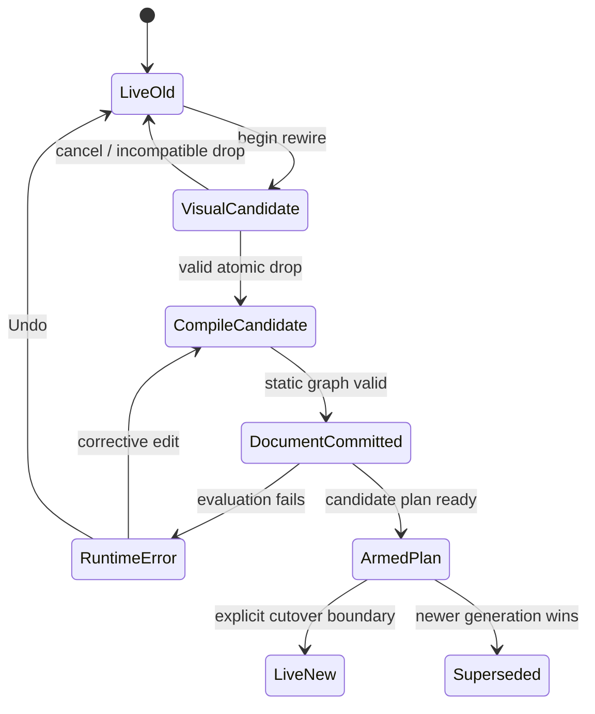
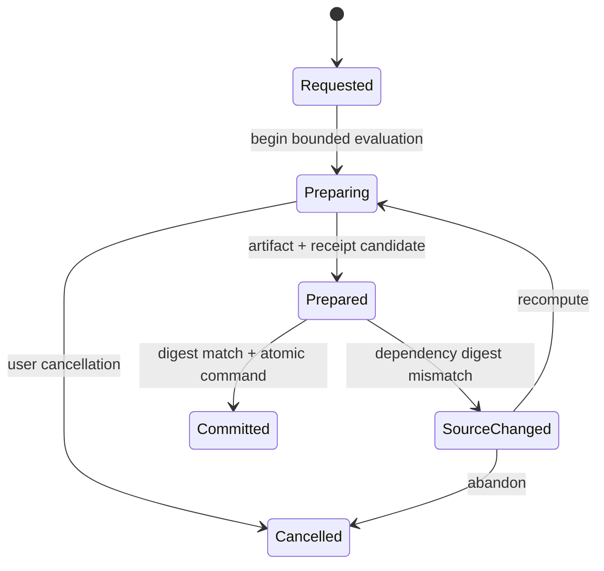

# Aural Geometry Lab — Interaction State-Machine Conformance Baseline

**Run:** FR-03 foundation  
**Date:** 2026-08-18  
**Source:** DR-11 + DR-14 integrated with DR-03/08/09/12/15  
**Status:** model baseline complete; repeat against production command/history implementation

## 1. Authoritative state domains

```text
ProjectState          authored semantic truth
SessionState          workspace, selection, focus, viewport
PreviewState          uncommitted effective overlay
DerivedState          evaluation, geometry, provenance, plans, caches
AudioRuntimeState     transport epoch, generations, device/backend
HistoryState          committed transactions and redo pointer
LineageState          receipts, forks, exceptions, migrations
```

No reducer or framework store may collapse these into one undifferentiated mutable object.

## 2. Gesture model



Conformance laws:

- previews never increment project revision;
- one edit session produces at most one transaction;
- canonical start equals final means no transaction;
- undo during preview cancels preview before applying undo;
- coalescing requires same explicit session, compatible target set, and compatible write set;
- elapsed time alone never merges actions.

## 3. Selection model



Required distinctions:

- focus does not imply selection;
- hover never becomes a command target by itself;
- provenance relationships are highlights, not implicit selection;
- missing generated entities are never repaired by proximity;
- orphans are non-actionable but explainable;
- primary selection must be a member of selection;
- range anchor/head use stable identity or exact rational-time fallback.

## 4. Async derivation acceptance

A result may publish as current only when all fields match current intent:

```text
projectEpoch
scopeId
channel (committed | preview | override)
generation
inputDigest
semanticEnvironmentDigest
result integrity
```

Outcomes:

- `current` — publish and optionally cache;
- `cacheOnly` — deterministic/integrity-valid but superseded;
- `discarded` — invalid, incompatible, non-deterministic, or wrong namespace.

Cancel/abort never replaces this test.

## 5. Graph rewire while playing



Rules:

- edge drag never disconnects committed graph;
- compiler validates the complete proposed graph;
- one rewire is one command;
- document truth is not rolled back merely because runtime evaluation fails;
- last-valid audio may remain only under an explicit visible policy;
- affected scope may mute/error rather than silently misrepresent new semantics;
- cutover time/frame, tail preservation, and timeout are audio-policy fields.

## 6. Generated material decision state

```text
Attempt edit on generated projection
        │
        ├─ changes global rule ─────────► Edit generator
        ├─ stable local/systematic edit ► Add exception/downstream operator
        ├─ independent live variant ────► Fork generator
        └─ authored event editing ──────► Materialize range
```

Capability gate:

```text
stable             exceptions + persistent selection allowed
successor-mapped   allowed with declared/versioned mapping
 ephemeral          no per-entity exception; edit generator or materialize
```

Exception active/dormant status is derived from current output; it is not persisted truth.

## 7. Materialization state



A committed payload is immutable. Re-materialization creates an explicit successor rather than overwriting history.

## 8. Audio generation state

```text
project commit / seek / loop edit
        ↓
new project/render generation
        ↓
prepare plan and backend resources
        ↓
armed at effective time/frame
        ↓
atomic active-generation switch
        ↓
old future events stopped/gated; already emitted audio remains history
```

Transport epoch and evaluation generation are distinct. Interruption or sleep never produces a catch-up burst.

## 9. Minimum model test catalogue

The production suite must cover at least:

1. preview isolation;
2. no-op elimination;
3. first-before/final-after coalescing;
4. target/write-set conflict;
5. undo/redo equivalence;
6. redo clearing after new edit;
7. undo during preview;
8. focus without selection;
9. hover without selection;
10. provenance highlight without selection;
11. orphan and exact reactivation;
12. no proximity retargeting;
13. stable/successor/ephemeral capability behavior;
14. dormant exception behavior;
15. fork preserves initial deterministic stream;
16. materialization source drift;
17. late worker result cache-only behavior;
18. wrong environment rejection;
19. stale worklet generation rejection;
20. atomic graph rewire;
21. runtime error after valid document commit;
22. migration creates new epoch/history baseline;
23. Swift/web command fixture equivalence;
24. accessibility non-drag command equivalence.

The current foundation implements and tests representative portions of these laws. Production acceptance requires model-based sequence generation across the full command/history store.
