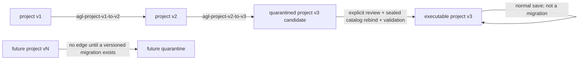

# FR-02 — Project Format and Migration Torture Test

- **Run:** FR-02 from `docs/17-frontier-model-runbook.md`
- **Baseline:** Aural Geometry Lab v0.4.0, commit `352f10374f48e21a885b1041fd67af919b7bc166`
- **Date:** 2026-08-19
- **Authority:** bundle at the baseline commit; accepted ADRs 0019–0024; public schemas/fixtures; reference implementation
- **Companion artifacts:** ADR 0025, `program/fr02-findings-register.json`, `conformance/fr02/`, `tests/fr02.test.mjs`, and `native/AuralGeometryCore/.../FR02ProjectFormatTests.swift`

## Result

**VERDICT: project v3 is freezable as-is. Do not create project v4 for FR-02.**

The wire model can express required future-safe behavior through closed core fields, versioned extensions, required semantic-extension declarations, content-addressed assets, and external package/repository recovery state. The blocking failures are implementation and workflow defects: invalid migration composition, synthetic operator binding, undisclosed deterministic-version changes, absent target validation, incomplete asset closure, and missing native strict-JSON parity.

The freeze is conditional on the gates in §10. AGL-172 must not declare the freeze complete before those tests pass.

## Evidence versus conclusion

### What the artifacts say

- `schemas/agl-project-v3.schema.json` closes core objects with `additionalProperties:false`, exposes `extensions[]`, and requires `requiredSemanticExtensions`.
- `src/core/project-schema.ts` performs v1→v2→v3 migration, projects semantic state, checks some compatibility, and validates cross-collection lineage.
- ADR 0019 requires loss-aware quarantine, separate source-byte and semantic digests, sequential migration, exact operator binding, and a new undo baseline.
- ADR 0021 defines strict JSON, typed canonical encoding, exact Rational wire values, stable-ID v2, PRNG v2, no repeated rounding, and cross-language vectors.
- ADR 0023 defines measured package-member trust, content-addressed assets, and native/browser hostile-input parity.
- ADR 0024 forbids nearest-version operator execution and makes cross-platform conformance fixture-first.
- `native/AuralGeometryCore/Sources/AuralGeometryCore/Contracts.swift` contains Codable DTOs, while AGL-191 remains the accepted native strict-JSON/package gate.

### FR-02 conclusions

- Unknown optional data must use extensions; arbitrary unknown v3 fields are not future-compatible data.
- Quarantine is a repository/package state, not a reason to revise the project wire schema.
- Migration receipt v2 is sufficient for audit, not for rollback without retained source bytes.
- A valid v3 target is not executable until compatibility, sealed catalog, unresolved-loss, and asset closure checks pass.
- The current v2→v3 implementation has Critical defects and must not be used as an unattended clean upgrade.

---

# 1. Compatibility matrix

## Reader classes

These are contract readers, not unverified claims about historical product binaries:

- **R1:** understands project schema v1 only.
- **R2:** understands v1/v2 and writes v2.
- **R3:** AGL v0.4 contract reader; strict bytes, v1/v2 migration source, v3 new-write authority.

## Base matrix

| Reader \ writer | v1 project | v2 project | v3 project | future vN, N > 3 |
|---|---|---|---|---|
| **R1** | **accept** | **refuse — COMP-UNSUPPORTED-SCHEMA.** Show “This project was created by a newer AGL format”; do not rewrite. | **refuse — COMP-UNSUPPORTED-SCHEMA.** Same consequence. | **refuse — COMP-UNSUPPORTED-SCHEMA.** Same consequence. |
| **R2** | **quarantine — MIG-LEGACY-BLOCKING-LOSS.** Preserve source; require an explicit v1→v2 review because track/operator and lab meaning are not reconstructable as clean v2 semantics. | **accept** | **refuse — COMP-UNSUPPORTED-SCHEMA.** Preserve only through an external file copy; no v2 rewrite. | **refuse — COMP-UNSUPPORTED-SCHEMA.** Same consequence. |
| **R3** | **quarantine — MIG-LEGACY-BLOCKING-LOSS.** Run v1→v2→v3 only; retain source bytes and receipt; no execution until all blocking losses are resolved. | **quarantine — MIG-LEGACY-BLOCKING-LOSS.** Retain source bytes and receipt; sealed-catalog rebind and deterministic-version review required. | **accept** when every capability gate passes. | **quarantine — COMP-FUTURE-SCHEMA.** Preserve exact bytes, show bounded metadata, never down-convert or execute. |

## Capability overrides

The following rules override an `accept` base cell:

| Condition | Result | Rule and user-visible consequence |
|---|---|---|
| Unknown `affectsSemantics:false` extension | **accept** | `EXT-OPTIONAL-PRESERVE`. Open normally; show the extension as unavailable; structurally round-trip it. |
| Unknown nonsemantic lab/view hint | **accept-with-loss** | `VIEW-FALLBACK`. Open the neutral studio; the unavailable view/preset is not applied; project semantics remain intact. |
| Unknown required semantic extension | **quarantine** | `CAP-REQUIRED-EXTENSION`. Name the missing contract; allow inspection/raw-source export only. |
| Unsupported operator catalog digest, node type/version/digest, budget profile, or required numerical profile | **quarantine** | `CAP-EXECUTION-ENVIRONMENT`. List every missing identity; compile/evaluate/export are disabled. |
| Unresolved blocking migration loss or rebinding receipt | **quarantine** | `MIG-UNRESOLVED-LOSS`. Show loss codes and resolution actions. |
| Missing project asset metadata/reference closure | **refuse** for project structure | `ASSET-DANGLING-REFERENCE`. Identify the exact JSON path. |
| Missing, extra, mismatched, linked, or hostile package member | **refuse** for package | `PACKAGE-INTEGRITY`. Do not extract or trust any member. |
| Duplicate JSON name, unsafe integer, malformed Unicode/UTF-8, trailing data, exceeded limit | **refuse** | `JSON-TRUST-BOUNDARY`. Show stable error identity; never fall back to ordinary parsing. |

`accept-with-loss` never means hidden semantic loss. It is limited to unavailable nonsemantic presentation behavior whose data remains preserved.

---

# 2. Unknown-field policy

## Normative rule text

1. A value claiming `schemaVersion:3` **MUST** contain only fields admitted by the v3 schema and runtime contract at every closed core object.
2. An unknown core field **MUST NOT** be ignored, dropped, renamed, guessed, or automatically moved into `extensions`. The reader returns `refuse / AGL-FMT-PROJECT-UNKNOWN_FIELD`.
3. Future optional data **MUST** be encoded as one `extensions[]` entry with a reverse-domain namespace, positive schema version, explicit `affectsSemantics`, and JSON payload.
4. An unknown extension with `affectsSemantics:false` **MUST** be preserved as a JSON value and **MAY** be round-tripped by a reader that does not understand it.
5. An unknown extension with `affectsSemantics:true` **MUST** also be present in `compatibility.requiredSemanticExtensions`. A reader lacking that exact `namespace@vN` contract quarantines the project.
6. A required semantic extension declaration with no matching project extension, or a semantic extension not declared required, is malformed and refused.
7. Structural round-trip and byte round-trip are distinct. A normal save may change whitespace, key order, escapes, and numeric spelling. Exact source bytes are retained separately when recovery/forensics are promised.
8. Unknown fields inside `presentation` are still unknown core fields. Future presentation data uses a nonsemantic extension.
9. A future schema version is not treated as “v3 plus fields.” Its entire byte stream is preserved in quarantine without canonical rewrite.

## Semantic digest interaction

- Known and unknown semantic extensions are included in the v3 semantic projection, sorted by namespace/version.
- Nonsemantic extensions and `presentation` are excluded.
- Original source bytes and `sourceBytesDigest` never enter the project semantic digest.
- Removing an unknown nonsemantic extension may leave the sound/math digest unchanged but is still forbidden data loss unless the user explicitly deletes it.

## `src/core/project-schema.ts` change note

- Keep `rejectUnknownKeys`; do not loosen v3 records.
- Add an import/open disposition layer outside `validateProject` so future schema and unsupported capabilities become quarantine rather than generic validation failure.
- Preserve unknown extension payload objects without mapping through typed domain DTOs that discard keys.
- Add stable error identities from `conformance/fr02/error-identities.json` while retaining paths/messages for humans.

---

# 3. Unknown-required-feature policy

## Capability classes

A v3 project declares execution requirements through:

- semantic contract and canonical versions;
- graph compiler, operator catalog, per-node operator semantic digests;
- stable-ID and deterministic-generation versions;
- budget profile/version;
- tempo, command, selection, package, and resolved-plan versions;
- required semantic extensions;
- numerical profile when profile-numeric semantics are present;
- required assets and payload resolver contracts.

## Quarantine algorithm

```text
strict bytes pass?
  no  -> refuse
claimed schema supported?
  no, future -> quarantine exact bytes
  no, malformed/old unsupported -> refuse or explicit legacy migration path
schema + runtime + cross-reference pass?
  no  -> refuse
legacy migration has any blocking loss?
  yes -> quarantine migrated candidate + source bytes + receipt
all required extensions/catalog/operators/budget/numerical/assets supported?
  no  -> quarantine
otherwise -> accept (or accept-with-loss for nonsemantic view fallback only)
```

## Quarantine permissions

| Operation | Allowed? |
|---|---:|
| Verify/store exact source bytes and digests | Yes |
| Show project name/ID/schema, bounded counts, missing capability list | Yes |
| Inspect raw JSON/extension payload as inert text/tree | Yes |
| Export original source bytes | Yes |
| Save a new canonical project generation | No |
| Compile/evaluate graph | No |
| Schedule/play procedural output | No |
| Regenerate frozen material | No |
| Materialize, mutate, or run commands | No |
| Semantic MIDI/MusicXML/WAV export | No |
| Resolve quarantine through an explicit supported migration/rebind | Yes, transactionally |

The UI message names every missing contract and never says “corrupt” when the file is merely newer or unsupported.

---

# 4. Migration graph

## Version graph



## Edge table

| Edge | Loss class | Transform reversible? | Byte-recoverable? | Unattended? | Mandatory losses/checks |
|---|---|---:|---:|---:|---|
| v1→v2 | blocking semantic ambiguity | No | Yes, with retained v1 bytes | **No** | track→operator membership opaque; lab state opaque; legacy IDs/PRNG; validate v2 target |
| v2→v3 | blocking semantic/environment ambiguity | No | Yes, with retained v2 bytes | **No** | exact operator rebind; `affectsResult` conflict; PRNG/stable-ID change; budget version assumption; opaque experiments; material/receipt legality; validate v3 target |
| v1→v3 | composed only | No | Yes, to original v1 bytes | **No** | exactly the ordered union of both edge losses; no direct shortcut |
| quarantined v3→executable v3 | review/rebinding resolution, not schema migration | No | Source bytes remain | **No** | all blocking loss codes resolved by immutable receipts; actual sealed catalog and assets; full validation |
| v3→v3 | no migration | N/A | source save generation remains | Yes when accepted | canonical save must not drop extensions; semantic digest recomputed |
| future vN→v3 | no legal edge | N/A | exact future bytes retained | No | requires a new, named, reviewed migration after vN semantics are known |

## Sequential-composition rules

1. No edge is skipped.
2. Each edge consumes a validated source and returns either a validated target or no target.
3. Edge IDs are ordered in `appliedMigrations`.
4. Losses are append-only across hops; duplicate codes may be coalesced only when source paths/evidence remain complete.
5. `blocking` never becomes `warning` during composition.
6. The final receipt source digest refers to the original source; final target digest refers to the validated final candidate.
7. Intermediate bytes are optional; without them, rollback reaches only the original source.
8. Migration time is not part of the migrated project semantic digest. With the same source, migration code versions, and reviewed choices, the target is deterministic.

## Concrete defects to repair

- `migrateProjectV2ToV3` computes `migratedConnections` and then writes the original v2 connections, retaining forbidden `affectsResult`.
- It computes catalog placeholder references with one formula and node placeholders with another.
- It changes PRNG/stable-ID versions without the dedicated blocking loss.
- It can copy legacy `materializationReceiptId` while writing an empty receipt collection.
- `migrateProjectToLatest` computes a target digest before proving the target is valid.

These are FR02-001–005 and block unattended migration.

---

# 5. Rollback/recovery semantics

## What a receipt must record

Migration receipt v2 already records source/target schema versions, semantic digests, ordered migrations, losses, review state, time, and optional source-byte digest. That is sufficient to audit **what was claimed**.

It is insufficient by itself to restore bytes. A SHA-256 digest is not a copy of the source. For v1/v2, the current field named `sourceSemanticDigest` is the canonical digest of the full validated legacy object, not the v3 result-affecting projection. Treat it as a version-bound normalized source digest and never compare it across schema versions as execution equality.

## FR-02 persisted-migration profile

For a migration that is saved:

- `sourceBytesDigest` is mandatory even though the general v2 schema makes it optional.
- The exact source bytes are retained under `assets/<sourceBytesDigest hex>.project.json`.
- The measured member hash must equal `sourceBytesDigest`.
- The migration receipt is stored under `migration-receipts/<receipt raw-byte SHA-256>.json`.
- Package/repository save is atomic: target project, source blob, receipt, and manifest generation commit together or not at all.
- The source save generation is never overwritten.

`conformance/fr02/package-migration-recovery.valid/` is the normative fixture.

## Undoability table

| Recovery request | Possible? | Required evidence |
|---|---:|---|
| Restore exact original project bytes | Yes | source blob exists and hashes to `sourceBytesDigest` |
| Restore original semantic object but not exact bytes | Yes, but not called byte rollback | validated source object and source semantic digest |
| Reverse v2→v3 field-by-field | No | migration is not defined as a bijection |
| Roll back only v2→v3 in a v1→v3 migration | Only if exact intermediate v2 bytes were separately retained | intermediate blob + edge receipt |
| Recover unknown historical operator behavior | No by construction | original executable implementation/conformance receipt would be required |
| Recreate legacy PRNG stream after changing algorithms | Only under the declared legacy algorithm or from materialized artifacts | root seed, exact stream semantics, original code contract |
| Recover dropped bytes when no source blob was saved | No by construction | digest alone is insufficient |
| Continue pre-migration Undo history | No | migration establishes a new active undo baseline |

## Receipt consistency checks

A runtime validator must enforce:

- `requiresUserReview === losses.some(severity == "blocking")` for a newly emitted receipt;
- source/target digests match measured validated objects;
- `appliedMigrations` is a legal contiguous path;
- target schema is the declared target;
- every resolution receipt references an existing migration/loss code and cannot resolve unrelated losses;
- no target save is committed if any blocking loss remains unresolved.

**ADR required:** yes. ADR 0025 adds the byte-store, rollback, quarantine, and resolution semantics not explicit in ADR 0019.

---

# 6. Asset/package addressing rules

## Logical and physical identity

1. Project fields reference assets by logical `asset.id`.
2. `asset.digest` is `sha256:<64 lowercase hex>` over measured bytes.
3. A package member is `assets/<64-hex>[.<portable suffix>]`; the captured stem equals the member SHA and project digest without `sha256:`.
4. The suffix is advisory. Integrity and media handling use measured bytes plus the declared media type; extension alone is never trusted.
5. Every project asset in a complete package must resolve to one measured member with exact digest, byte count, and normalized media type.
6. Multiple logical IDs may share one member only when digest/bytes/media type agree. Rights remain logical metadata and may differ only when the application can present the most restrictive applicable handling.
7. Every package member with `role:asset` must be reachable from project asset metadata or from an accepted migration/research receipt by exact digest and media contract. The retained migration source blob is the explicit receipt-referenced exception to project asset membership; arbitrary orphan asset members are refused.
8. Unreferenced project assets are still part of the project package until an explicit garbage-collection command removes their metadata and bytes.
9. No external URI/network fetch is authoritative in project v3.

## Dangling-reference behavior

| Reference | Missing metadata | Metadata exists, bytes missing | Digest/bytes/media mismatch |
|---|---|---|---|
| `material.payloadAssetId` | refuse project | quarantine bare local record; refuse complete package | refuse package |
| `sourceRecipe.graphSnapshotAssetId` | refuse project | quarantine/refuse package | refuse package |
| `receipt.artifactAssetId` | refuse project | quarantine/refuse package | refuse package |
| migration `sourceBytesDigest` | receipt may be audited but rollback unavailable; persisted-migration profile fails | quarantine recovery promise | refuse tampered package |
| `payloadRef` | N/A; unresolved resolver | quarantine dependent material/project | quarantine/refuse according to resolver contract |

A File Provider placeholder is not “present” until bytes have been measured. Eviction may delay open but cannot bypass hash verification.

## Legacy sealed-catalog rebinding

Rebinding is required by FR01-031 and is all-or-nothing:

1. Open the exact source bytes and migration receipt in quarantine.
2. Seal the candidate operator catalog.
3. For each legacy node, select an exact operator type/version; nearest version is prohibited.
4. Validate parameters, input/output ports, dimensions, connection kinds, and graph compilation.
5. Record selected operator semantic digest and target catalog digest.
6. Recompute project compatibility, node digests, graph/source-recipe environment as appropriate.
7. Preserve frozen artifact bytes and historical lineage; do not claim regeneration equivalence.
8. Emit an immutable rebinding resolution receipt naming the migration and resolved loss codes.
9. Add `agl.migration.operator-rebinding@v1` as an `affectsSemantics:true` extension and required contract.
10. Execute only after the full target validates and no blocking loss remains.

`conformance/fr02/operator-rebinding-receipt-v1.provisional.json` defines the minimum payload. Cryptographic signature syntax is **unverified** because no accepted key/trust contract was present in the reviewed tree; implementation must not invent one silently.

## Package fixture additions

- `package-asset-closure.valid/` proves project↔manifest↔bytes closure.
- `package-migration-recovery.valid/` proves content-addressed original bytes and migration receipt recovery.
- Corpus cases C027–C029 remove or alter members and name the exact expected failures.

---

# 7. Canonical JSON/normalization rules

## Parse and canonicalization layers

| Layer | Purpose | Rule |
|---|---|---|
| Source bytes | forensic recovery, exact file identity | SHA-256 over exact bytes; preserve separately |
| Strict JSON v1 | unambiguous language-neutral JSON value | strict UTF-8; duplicate names/unsafe integers/malformed Unicode/trailing data/limits rejected |
| Project schema/runtime | version shape, invariants, references | both must pass; one never substitutes for the other |
| Canonical value v1 | typed semantic digest/ID input | not JSON text; type tags, lengths, UTF-8 key order, binary64 bit encoding |
| Project semantic projection v3 | result-affecting project identity | selected metadata excluded; collections normalized only where explicitly coded |

## Exact rules

- **Object keys:** source JSON may use any order. Canonical objects sort keys by raw UTF-8 bytes, not locale.
- **Unicode:** well-formed scalar sequences only. No NFC/NFD/NFKC normalization occurs. Canonically distinct scalar sequences remain distinct.
- **Strings:** canonical length prefix is UTF-8 byte length.
- **Numbers:** finite IEEE-754 binary64, encoded by exact big-endian bits. `-0` normalizes to `+0`. Source spellings `1`, `1.0`, and `1e0` parse to the same number.
- **Integers:** unsafe JSON integer literals are rejected. Arbitrary exact integers are represented by domain string contracts such as Rational components or by canonical bigint only in non-JSON internal values.
- **Rational JSON:** exactly `{numerator:string, denominator:string}`; no extra fields; canonical decimal syntax; denominator positive/nonzero; fraction reduced; zero exactly `0/1`; component hostile-input limit 4096 digits.
- **Arrays:** order is preserved unless the project semantic projection explicitly sorts that collection.
- **Dates:** source date spelling can differ. Project authorship timestamps are excluded from execution semantic digest; materialization `committedAt` is excluded from receipt semantic projection.
- **Canonical JSON:** AGL does not currently define one. Pretty/minified JSON is storage presentation only. Do not call `JSON.stringify` output “canonical.”

## Project semantic equality

The following can be byte-different yet have the same project semantic digest:

- whitespace, object key order, escapes, equivalent binary64 number spelling;
- project `id`, `name`, `createdAt`, `modifiedAt`;
- track/material display names;
- `presentation.defaultLab` and graph layout;
- nonsemantic extensions;
- graph node/connection, material, recipe, receipt, and asset array permutations that the projection sorts;
- materialization `committedAt`.

This means “same semantic digest” does **not** mean “same project identity,” “same authorship,” or “same bytes.” The package separately binds project ID and raw member SHA.

The following remain semantic and change the digest:

- seed context, exact seed Unicode, meter, tempo map/order;
- operator type/version/digest and parameters;
- result-affecting graph connection state;
- track order, IDs, kinds, material order within `materialIds`, route state;
- material/source/recipe/receipt/asset identity and digests;
- semantic extensions and required capability declarations.

## Agreement/divergence

These rules agree with `canonical.ts`, `strict-json.ts`, `rational.ts`, and `projectSemanticProjectionV3`. The key policy addition is explicit: **no Unicode normalization** and **no canonical JSON text format**. Any future change requires a new canonical encoding/digest version and migration; v1 is not edited.

---

# 8. Malformed/adversarial project corpus

The machine-readable authority is `conformance/fr02/corpus.json`; stable error identities are in `conformance/fr02/error-identities.json`.

## Coverage map

| Area required by runbook | Corpus IDs |
|---|---|
| Rational JSON | C011–C014 |
| Seeds and deterministic versions | C015–C016, C022 |
| IDs/collisions | C017–C018 |
| Operator versions/digests/rebinding | C019–C022, C038 |
| Lab presets and view state | C010; layout generators in tests |
| Frozen lineage | C023–C025 |
| Assets/package closure | C026–C029 |
| Unknown future optional/required data | C006–C009 |
| Depth/size exhaustion | C031–C034 |
| Future native clients | C035 and `native-parity-cases.json` |
| Migration target/receipt integrity | C036–C037 |
| Strict JSON ambiguity | C001–C005 |
| Payload addressing | C030 |

Each corpus entry contains exact bytes, a static fixture path, or a deterministic generator with parameters; attack class; expected disposition; and exact error identity. Generators are part of the contract and must be implemented identically in TypeScript and Swift where `requiredClients` names both.

## Corpus execution order

1. Load bytes without normalization.
2. Apply strict parser limits.
3. Apply the declared source schema/runtime validator.
4. Apply migration only for valid legacy sources.
5. Validate every migration target.
6. Apply compatibility/quarantine classification.
7. For packages, enumerate and measure actual members before trusting JSON.
8. Assert one exact disposition and error identity; additional human diagnostics are allowed but may not replace the identity.

---

# 9. Migration property tests

`tests/fr02.test.mjs` is the executable landing artifact. It uses deterministic generators rather than one-off examples. Tests blocked on implementation are named `TODO` with owner and property; converting them to passing tests is part of AGL-172/173/179/191.

> **Measured status as landed (2026-08-19).** The property tests below generate their own inputs, but **no code reads `conformance/fr02/corpus.json`**: the suite reaches its fixtures by hardcoded path, and the 24 generator-sourced corpus cases (`mutate-rational`, `repeat-digit`, `flip-byte`, …) are neither implemented nor dispatched — they are silently absent, not skipped. So a case listed in the corpus manifest gains no executable coverage from being listed, and the "must be implemented identically in TypeScript and Swift" requirement in section 8 is a requirement, not a description. Dispatching the corpus is owned by AGL-173. `npm run verify` gates what is checkable today: that every corpus case declares a source file that exists or a generator, that every generator `base` resolves, and that every finding's `regressionTest` names a real test or case.

| Property | Universal statement and generator strategy |
|---|---|
| FR02-P01 | ∀ strict JSON byte encodings B1/B2 that decode to equal values, semantic digest is equal while raw-byte digest may differ. Generate whitespace/key-order/number-spelling variants. |
| FR02-P02 | ∀ accepted v3 P, changing only authorship/presentation metadata preserves project semantic digest. Generate names/timestamps/layout/lab hints. |
| FR02-P03 | ∀ P and unknown nonsemantic extension E, validate(P+E) and digest(P+E)=digest(P), while E survives structural round-trip. Generate JSON payload trees. |
| FR02-P04 | ∀ P and semantic extension E declared required, digest(P+E)≠digest(P). Generate namespace/version/payload. |
| FR02-P05 | ∀ unsupported required extension C, compatibility(P,C) includes exactly the unsupported contract and disposition is quarantine. |
| FR02-P06 | ∀ valid legacy P and fixed migration time, migrate(P) is deterministic and does not mutate P. Generate bounded v1/v2 projects. |
| FR02-P07 | ∀ valid v1 P, latest(P)=migrateV2ToV3(migrateV1ToV2(P)) under target canonical equality. |
| FR02-P08 | ∀ source bytes B supplied to persistent migration, receipt.sourceBytesDigest=sha256(B). Generate formatting variants. |
| FR02-P09 | ∀ integers n,d with d>0, only reduced positive-denominator Rational wire is accepted; equivalent aliases are rejected. Generate coprime and multiplied pairs. |
| FR02-P10 | ∀ v3 P, any within- or cross-collection semantic ID collision is rejected. Generate collision location pairs. |
| FR02-P11 | ∀ unknown lab ID/view layout over known nodes, validation succeeds, digest is unchanged, and disposition is accept-with-loss only for unavailable view. |
| FR02-P12 | ∀ schemaVersion>3 strict project bytes, current reader never writes v3; disposition is quarantine. Generate versions 4..2^31-1. |
| FR02-P13 | ∀ asset member bytes B, package path stem and manifest SHA equal sha256(B). Generate byte arrays and suffixes. |
| FR02-P14 | ∀ valid package fixture, measured verification succeeds independent of physical enumeration order. |
| FR02-P15 | ∀ valid v2 connection, migration omits `affectsResult`; if Boolean conflicts with v3 kind-derived semantics, one blocking loss is emitted. |
| FR02-P16 | ∀ v1/v2 project declaring ID/PRNG v1, v3 candidate records a blocking deterministic-semantics change unless legacy replay is retained. |
| FR02-P17 | ∀ migration result T, receipt emission implies schema+runtime+cross-reference validation(T)=pass. |
| FR02-P18 | ∀ complete package, every project asset and every receipt/source blob has exact measured member closure; removing one member fails. |
| FR02-P19 | ∀ persisted migration receipt R, rollback is advertised iff the measured source blob exists and hashes to R.sourceBytesDigest. |
| FR02-P20 | ∀ native parity bytes B, TypeScript and Swift return the same disposition/error identity before DTO decoding. |
| FR02-P21 | ∀ graph containing profile-numeric operators, execution compatibility requires a supported numerical profile/backend identity. |
| FR02-P22 | ∀ material whose only payload address is `payloadRef`, execution is quarantined unless an exact required resolver extension is supported. |
| FR02-P23 | ∀ legacy graph G and sealed catalog C, rebind either resolves every node/connection atomically and compiles, or resolves none. |
| FR02-P24 | ∀ well-formed Unicode strings S, canonical v1 preserves exact scalar sequence; NFC(S) is not substituted. Shared TS/Swift vectors include composed/decomposed pairs. |

Property weights in the test file favor Rational/identity/migration permutations over golden examples. The corpus remains the exhaustive named adversarial layer.

---

# 10. Freeze verdict on project v3

## Verdict

**Freeze project v3 as-is. No v4 delta is justified by FR-02.**

The following are implementation fixes or new sidecar/extension contracts, not project-schema changes:

1. Fix sequential migration composition and validate every target.
2. Add complete loss disclosure for connection semantics, PRNG/stable-ID, budget assumptions, materials, and operator binding.
3. Implement quarantine/open disposition outside the project object.
4. Persist exact source bytes and enforce receipt/source closure.
5. Implement explicit sealed-catalog rebinding with immutable resolution receipt/semantic extension.
6. Enforce project asset↔package member closure.
7. Add required numerical-profile compatibility.
8. Define `payloadRef` as quarantined unless a resolver extension is present.
9. Run the identical strict-byte corpus in Swift before DTO decode.
10. Land stable error identities and property/corpus tests.

## Freeze gate checklist

| Gate | Owner | Required evidence |
|---|---|---|
| FR02-001–005 migration repairs | AGL-173 | FR02-P15–P17 passing; connected v2 fixture validates/quarantines correctly |
| Source-byte recovery | AGL-172/173 | FR02-P08/P19; recovery package fixture round-trip |
| Asset closure | AGL-179 | FR02-P13/P14/P18; missing/mismatched members fail |
| Native strict parity | AGL-191 | FR02-P20 and `native-parity-cases.json` pass in Swift |
| Numerical profile compatibility | AGL-170 | FR02-P21 |
| Payload resolver policy | AGL-172 | FR02-P22 |
| Catalog rebinding | AGL-173 | FR02-P23; immutable resolution receipt; graph compiler pass |
| v3 schema immutability | release gate | v3 schema SHA remains unchanged; no in-place edits |

## What would change this verdict

A project v4 would become justified only if accepted requirements prove that one or more of these cannot be represented by v3 plus versioned extensions/package state:

- unknown core fields must be round-tripped while still executing as v3;
- remote/external mutable assets become authoritative;
- more than one authoritative project document is required per package;
- quarantine/recovery state must itself travel inside the project semantic object;
- a portable inline-payload registry cannot be expressed by assets or extensions;
- the canonical encoding/digest contract has a collision or ambiguity requiring project-level rebinding;
- exact legacy executable semantics must be embedded, not quarantined or materialized;
- a new result-affecting field cannot be represented by a required semantic extension without breaking core invariants.

Absent one of those evidenced requirements, v4 would add migration cost without solving the actual defects.

---

# Landing plan for AGL-172

## `src/core/project-schema.ts`

- Use `migratedConnections` rather than original v2 connection objects.
- Compare v2 `affectsResult` with v3 `connectionAffectsResult(kind)` and emit blocking conflict loss.
- Do not construct executable synthetic operator/catalog digests. Mark candidate quarantined until exact catalog rebind.
- Add blocking deterministic-version loss for stable-ID/PRNG v1→v2.
- Validate each edge target and final target before digest/receipt.
- Prevent dangling legacy materialization receipt IDs and illegal v3 material kinds.
- Correct and test `sourceBytesDigest` input; add receipt relationship validator.
- Expand compatibility to numerical profile and unresolved payload resolver.

## `src/core/project-package.ts`

- Cross-check project asset records against measured package members.
- Cross-check migration receipt `sourceBytesDigest` against retained source member.
- Require exact media type/bytes/digest closure and deduplicate by digest.
- Keep current path/link/compression defenses.

## Native

- Add strict-byte preflight equivalent to `agl-strict-json-v1` before `JSONDecoder`; enable the owner-tagged test in `FR02ProjectFormatTests.swift`.
- Consume `conformance/fr02/native-parity-cases.json` directly or byte-identical copies verified by manifest hash.

## Public schemas

- **Do not edit project v3, migration-receipt v2, or package-manifest v2 in place.**
- If a future cryptographic rebinding signature or new package-member role is required, create a separately versioned contract; do not patch existing schemas.
