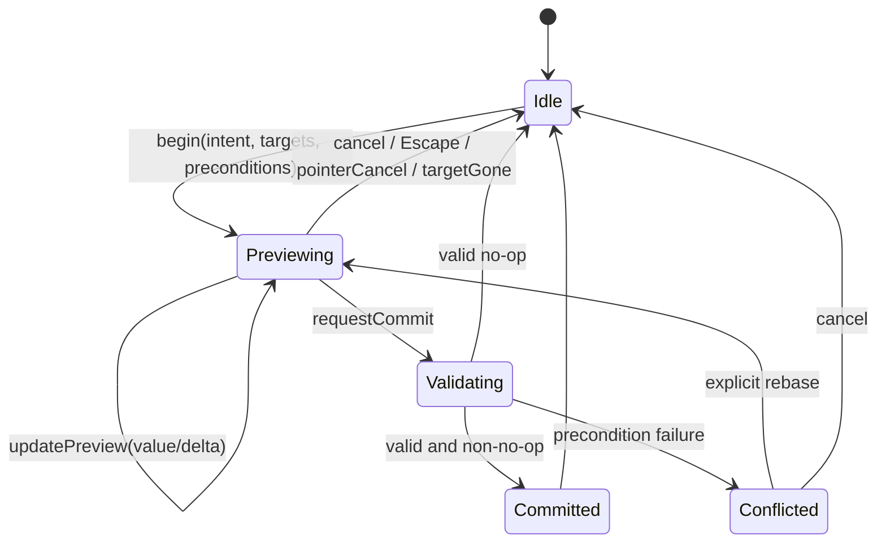

2026-08-18

# Aural Geometry Lab — DR-14 Research Integration Packet

**Research integration target:** Cross-Surface Editing, Node-Graph, Timeline, and Undo Semantics
**Disposition:** Architecture-significant; required before production editor mutation paths are wired
**Primary gate:** AGL-145, followed by FR-03 and FR-11
**Evidence posture:** Strong architecture synthesis, but **not a code audit**. The report did not have access to the four named TypeScript/design artifacts, so every proposed delta still requires repository-level reconciliation. 

> **Decision posture**
>
> AGL should adopt the report’s central architecture: one semantic editing core over several explicitly separated state domains.
> The transaction, selection, generated-content, async-result, migration, and native-adapter semantics are strong enough to freeze with targeted refinements.
> Live audio cutover remains conditional on DR-03; stable generated identity remains conditional on operator- and lab-specific contracts.
> A/B overrides should not enter MVP architecture until their edit-routing and undo-domain behavior are fully specified.

## Classification used below

* **Established evidence:** Directly supported by primary literature or official framework/platform behavior.
* **Strong inference:** Follows strongly from AGL’s existing goals and the evidence, but is not itself an externally established fact.
* **Engineering recommendation:** A proposed AGL contract or implementation decision.
* **Speculative possibility:** Worth preserving as an option, but not suitable for the current architecture baseline.

---

# 1. Executive Decision Summary

|  # | Conclusion                                                                                                                                                  | Disposition                           | Why                                                                                                                                                                                                                                                                                                               |
| -: | ----------------------------------------------------------------------------------------------------------------------------------------------------------- | ------------------------------------- | ----------------------------------------------------------------------------------------------------------------------------------------------------------------------------------------------------------------------------------------------------------------------------------------------------------------- |
|  1 | Maintain one platform-neutral **semantic editing kernel**, but multiple sharply separated state domains.                                                    | **ADOPT**                             | Canvas, graph, timeline, inspector, React, and Swift must observe the same document meaning without forcing selection, transport, preview, evaluation, and persistence into one state model. This is the report’s strongest and most coherent conclusion.                                                         |
|  2 | High-frequency manipulation uses `begin → preview* → commit/cancel`; previews never modify the canonical project or global history.                         | **ADOPT**                             | Interaction sampling rate is not semantic history granularity. One gesture should produce zero or one committed transaction. Hierarchical command patterns and explicit undo grouping provide strong precedent, but the exact AGL boundary is an engineering decision. ([CMU School of Computer Science][1])      |
|  3 | Commands carry semantic identity, transaction identity, actor/origin metadata, schema versions, and fine-grained preconditions.                             | **ADOPT WITH CONDITIONS**             | `baseRevision` alone is too coarse. The report’s direction is correct, but `field: string` must be replaced by a versioned canonical field/path identifier, and `projectEpoch` should be added.                                                                                                                   |
|  4 | The core—not a UI payload—generates canonical inverses from validated pre-state.                                                                            | **ADOPT**                             | This prevents stale, incomplete, or malicious UI adapters from defining undo meaning. It also enables identical web/native conformance.                                                                                                                                                                           |
|  5 | MVP undo is linear, transaction-level, and semantic; new edits after Undo clear Redo.                                                                       | **ADOPT**                             | Selective or collaborative undo is unnecessary for MVP and substantially harder. Whole-project snapshot restoration may remain a checkpoint optimization, but not the primary semantic inverse.                                                                                                                   |
|  6 | Coalescing is based on one explicit interaction/edit session and compatible target/write sets—not elapsed time.                                             | **ADOPT**                             | Godot’s merge-ends behavior supports preserving the first undo state and final redo state, but AGL should be stricter than command-name or time-window matching. Yjs’s documented 500 ms default illustrates why generic temporal capture is unsuitable as AGL’s semantic rule. ([Godot Engine documentation][2]) |
|  7 | Selection, primary selection, keyboard focus, hover, provenance highlighting, range anchors, and orphaned references remain distinct concepts.              | **ADOPT**                             | This is both an accessibility requirement and a latency/control requirement. W3C explicitly distinguishes focus from selection and warns that selection-follow-focus can be severely harmful when activation is expensive. ([W3C][3])                                                                             |
|  8 | Generated selections and exception targets never silently retarget to a nearby event, point, tile, or note.                                                 | **ADOPT**                             | Proximity does not establish semantic identity. Missing references become non-actionable or dormant unless an operator supplies a declared successor relation.                                                                                                                                                    |
|  9 | Generated-content editing uses four explicit meanings: edit the generator, add a downstream operator/exception, fork the generator, or freeze/materialize.  | **ADOPT**                             | This preserves explainability and regeneration semantics. Procedural systems provide strong implementation precedent for downstream edits, correspondence requirements, and stashed/frozen outputs. ([SideFX][4])                                                                                                 |
| 10 | Each generator/operator declares whether its output identity is stable, successor-mappable, or ephemeral.                                                   | **ADOPT WITH CONDITIONS**             | The report relies on stable keys but does not define an operator capability contract. Sparse exceptions and generated selection cannot be safe without one.                                                                                                                                                       |
| 11 | `ExceptionRecord.status` should be **derived**, not authoritative persisted state.                                                                          | **ADOPT — INTEGRATION CORRECTION**    | Active versus dormant depends on the currently evaluated generator output. Persisting it as canonical state would create stale truth after regeneration, migration, or semantic-version change. Store the target and operation; derive resolution status.                                                         |
| 12 | Freeze/materialization is asynchronous preparation followed by a hash-guarded atomic commit.                                                                | **ADOPT WITH CONDITIONS**             | Source drift must fail the commit. Replace platform-local `storageRef` with a content-addressed project asset reference or package-relative artifact ID.                                                                                                                                                          |
| 13 | Async correctness uses `projectEpoch + scope + channel + generation + inputHash + semanticEnvironmentHash`; cancellation is only resource control.          | **ADOPT**                             | DOM abort and Swift task cancellation are observed/cooperative mechanisms and cannot establish freshness. ([DOM Standard][5])                                                                                                                                                                                     |
| 14 | A valid stale deterministic result may enter the cache but may never become current without a fresh generation requesting that hash.                        | **ADOPT WITH CONDITIONS**             | Cache admission must also validate operator/evaluator semantic versions, output integrity, determinism eligibility, and namespace.                                                                                                                                                                                |
| 15 | Graph rewiring is one atomic document command; edge-drag motion never mutates the live graph or audio topology.                                             | **ADOPT**                             | Intermediate disconnect/reconnect states are not the user’s action and may violate graph invariants. Static validation must occur against the complete proposed graph before commit.                                                                                                                              |
| 16 | During live playback, a committed graph may have `lastValid`, `candidate`, `armed`, and `error` runtime states.                                             | **REQUIRES CROSS-RUN RECONCILIATION** | The state model is correct, but activation boundary, pending timeout, crossfade, voice-tail behavior, frame semantics, and failure scope belong to DR-03/audio architecture.                                                                                                                                      |
| 17 | A/B is a transient override session with its own local history; Commit B produces one document transaction.                                                 | **DEFER**                             | The report does not settle document edits during A/B, baseline drift, local-vs-global Cmd-Z routing, nested sessions, structural overrides, or rebase conflict UX. These are architecture-level omissions.                                                                                                        |
| 18 | Migration establishes a new active-undo baseline while preserving source hashes and explicit entity/command lineage.                                        | **ADOPT**                             | Active undo need not survive software/schema boundaries. Durable provenance and migration receipts should.                                                                                                                                                                                                        |
| 19 | Native document systems and `UndoManager` adapt to AGL history; they do not define or duplicate semantic history.                                           | **ADOPT WITH CONDITIONS**             | Apple’s automatic grouping follows run-loop events. A single adapter stack must prevent divergence between native and AGL histories. ([Apple Developer][6])                                                                                                                                                       |
| 20 | Anticipate collaboration through stable IDs, semantic positions, fine-grained commands, actor/origin metadata, and derived outputs—but ship no CRDT in MVP. | **ADOPT**                             | Yjs and Automerge show useful convergence and conflict patterns, but neither supplies AGL graph legality or musical conflict semantics. ([Yjs Documentation][7])                                                                                                                                                  |
| 21 | The report’s claimed “78” model tests must be corrected to **83 enumerated cases**.                                                                         | **ADOPT — CORRECTION REQUIRED**       | The visible groups total `14 + 10 + 12 + 20 + 7 + 6 + 4 + 7 + 3 = 83`. The acceptance artifact and backlog must use one accurate count.                                                                                                                                                                           |
| 22 | Production mutation paths in the React shell should remain blocked until AGL-145 incorporates the accepted contracts and FR-03 passes.                      | **ADOPT**                             | AGL-145 is explicitly the research-gated hardening task; FR-03 is specifically the post-DR-14 state-machine audit.                                                                                                                                                                                                |

---

# 2. Evidence → Decision Matrix

| Finding / evidence                                                                                                                                               | Evidence strength                                                             | Engineering implication                                                                                                            | Recommended decision                                                                         | Confidence                                   | Source(s)                                                       |
| ---------------------------------------------------------------------------------------------------------------------------------------------------------------- | ----------------------------------------------------------------------------- | ---------------------------------------------------------------------------------------------------------------------------------- | -------------------------------------------------------------------------------------------- | -------------------------------------------- | --------------------------------------------------------------- |
| Hierarchical command models distinguish low-level interaction from application-level semantic commands.                                                          | Established primary HCI precedent; not proof of AGL-specific optimality       | Pointer samples and widget callbacks should terminate in a higher-level AGL command rather than become history entries themselves. | Use semantic command generation at commit.                                                   | High                                         | Myers & Kosbie, CHI 1996. ([CMU School of Computer Science][1]) |
| Apple `UndoManager` automatically groups by run-loop pass unless explicit grouping is used.                                                                      | Established official platform behavior                                        | Native event timing cannot define AGL semantic transaction boundaries.                                                             | AGL owns boundaries; native adapter explicitly groups one AGL transaction.                   | Very high                                    | Apple Foundation docs. ([Apple Developer][6])                   |
| Godot `MERGE_ENDS` preserves the first undo operations and last do operations for sequential value changes.                                                      | Established framework behavior                                                | A merged gesture should retain first-before/final-after state.                                                                     | Adopt algebraic merge-ends semantics, with stricter AGL session/target conditions.           | High                                         | Godot 4.7 docs. ([Godot Engine documentation][2])               |
| W3C distinguishes one focus locus from persistent, potentially multiple selection state; selected and focused styling should remain distinct.                    | Established accessibility guidance                                            | Focus navigation cannot implicitly rewrite selection on graph/timeline multi-selection surfaces.                                   | Separate focus and selection state and visuals.                                              | Very high                                    | W3C APG. ([W3C][3])                                             |
| Selection-follow-focus can severely degrade accessibility when changing selection causes latency or expensive activation.                                        | Established accessibility guidance, directly analogous rather than AGL-tested | AGL selection may trigger evaluation, provenance, visualization, or inspector work; focus movement must remain cheap.              | No selection-follow-focus for multi-selectable/expensive AGL surfaces.                       | Very high                                    | W3C keyboard-interface guidance. ([W3C][3])                     |
| ProseMirror models anchor/head separately and maps selection bookmarks through document transformations.                                                         | Established editor-framework behavior                                         | AGL range anchors should be identity/semantic-position based and transformable across edits.                                       | Adopt fixed anchor, moving head, explicit mapping contract.                                  | High                                         | ProseMirror reference. ([ProseMirror][8])                       |
| Houdini’s Edit SOP is cumulative, can use reference geometry, and distinguishes committed edits; Stash caches output independently of future input.              | Established procedural-editor implementation evidence                         | Downstream edits and frozen artifacts are semantically different operations.                                                       | Adopt exception/operator versus freeze distinction.                                          | High for analogy; medium for direct transfer | SideFX docs. ([SideFX][4])                                      |
| Houdini requires compatible correspondence for generating an edit from two geometries and warns that topology/order changes require IDs.                         | Established procedural correspondence evidence                                | Per-generated-entity exceptions require an explicit stable identity contract.                                                      | Require operator identity capability before sparse edits.                                    | High                                         | SideFX docs. ([SideFX][9])                                      |
| DOM abort signals express cancellation wishes an observing API can ignore; Swift task cancellation requires task code to observe it.                             | Established platform semantics                                                | Cancellation cannot be the freshness proof.                                                                                        | Use generation/hash/epoch acceptance barriers.                                               | Very high                                    | DOM and Apple Swift docs. ([DOM Standard][5])                   |
| A dedicated worker can be terminated immediately, but already-transferred messages, cache hits, and other async work still require application-level validation. | Established browser behavior plus strong inference                            | Worker termination improves resource control but does not eliminate stale-result gates.                                            | Keep result acceptance independent of worker lifecycle.                                      | Very high                                    | MDN worker termination; DR-14 synthesis. ([MDN Web Docs][10])   |
| React event handlers observe render-time state snapshots; `useSyncExternalStore` is designed for subscribing to an external store.                               | Established official React behavior                                           | Canonical editing state should not depend on component-local closures or duplicated component state.                               | Use an external deterministic core/store and immutable snapshots.                            | High                                         | React docs. ([React][11])                                       |
| React Flow exposes drag start/drag/drag stop and describes its simple state helpers as prototyping conveniences.                                                 | Established current framework behavior                                        | React Flow can supply interaction phases and presentation, but not AGL’s authoritative command/history semantics.                  | Adapter maps callbacks to AGL preview lifecycle.                                             | High                                         | React Flow docs, updated July 22, 2026. ([React Flow][12])      |
| SwiftUI `GestureState` is transient and resets when a gesture ends or is canceled; `onEnded` runs only after successful completion.                              | Established official platform behavior                                        | Native adapters need cancellation cleanup independent of `onEnded`.                                                                | Map gesture state to preview and explicitly cancel abandoned core sessions.                  | Very high                                    | Apple SwiftUI docs. ([Apple Developer][13])                     |
| Yjs updates are commutative, associative, and idempotent, while its undo manager uses scoped origins and a configurable temporal capture window.                 | Established framework behavior                                                | Generic CRDT convergence and generic undo grouping do not solve AGL semantic conflicts or action grouping.                         | Preserve actor/origin metadata but do not adopt Yjs semantics as AGL semantics.              | High                                         | Yjs docs. ([Yjs Documentation][7])                              |
| Automerge retains conflicts for concurrent writes to the same property and identifies operations using actor/counter information.                                | Established framework behavior                                                | Concurrent graph/property conflicts remain product-domain decisions even under a convergent store.                                 | Use fine-grained targets and explicit conflict handling in any future collaboration adapter. | High                                         | Automerge docs. ([Automerge][14])                               |
| AGL already plans command grouping, cancellable workers, content-addressed caching, freeze-to-clip, linked selection, render plans, and generation IDs.          | Established program intent, not implementation proof                          | DR-14 is cross-cutting and cannot be localized to React event handlers.                                                            | Integrate across AGL-012/023/024/027/036/041/044.                                            | Very high                                    | AGL backlog.                                                    |
| Seven labs rely heavily on generated content with varying topology and provenance demands.                                                                       | Established program scope                                                     | Generated identity/editing semantics are foundational, not an edge case.                                                           | Freeze a common identity/materialization contract before lab production.                     | Very high                                    | Lab manifest.                                                   |
| The report did not inspect the named source files.                                                                                                               | Established limitation                                                        | No claim can be made that current code conforms or that proposed fields are backward-compatible.                                   | Require repository reconciliation and migration analysis before acceptance.                  | Very high                                    | DR-14 report scope statement.                                   |

---

# 3. Architecture Consequences

| Affected subsystem                    | Exact architectural implication                                                                                                                                                                                                                                            | Contract impact                              | Dependencies                          | Cost of implementing later                                           | Recommendation                                                 |
| ------------------------------------- | -------------------------------------------------------------------------------------------------------------------------------------------------------------------------------------------------------------------------------------------------------------------------- | -------------------------------------------- | ------------------------------------- | -------------------------------------------------------------------- | -------------------------------------------------------------- |
| **Canonical project model**           | Persist only authoritative authored/procedural state: nodes, edges, clips, generator parameters, exceptions, forks, frozen artifacts, and durable lineage. Do not persist preview, focus, hover, current evaluation, audible plan, or A/B state as canonical project data. | **Public project contract**                  | AGL-010, AGL-011                      | Critical migration risk if transient/derived state is serialized now | Freeze state-strata boundaries before schema v1.               |
| **Command/undo architecture**         | All mutations enter a semantic command bus; UI submits intent/payload, core validates, applies atomically, computes inverse, and records one transaction.                                                                                                                  | Core public/internal command contract        | AGL-012, AGL-145                      | Very high; surface-specific histories would be difficult to unwind   | Implement before production editor wiring.                     |
| **Project revision model**            | Global revision is local ordering/dirty metadata, not async freshness and not the sole optimistic-concurrency precondition.                                                                                                                                                | Internal plus diagnostics                    | AGL-012/013                           | Medium–high if APIs overfit to revision equality                     | Add field/input preconditions now.                             |
| **Canonical hashing**                 | Define project hash, scope input hash, semantic-environment hash, and artifact hash as distinct concepts with versioned canonical serialization.                                                                                                                           | **Public conformance contract**              | AGL-010/020/024; DR-15                | Critical if TS and Swift independently invent hashing                | Freeze canonical encoding/hash ownership before fixtures.      |
| **Rational musical-time model**       | Selection anchors, insertion exceptions, clip ranges, and freeze ranges use exact rational time plus an explicit time domain.                                                                                                                                              | Public project/interaction schema            | AGL-002/003/032                       | Medium if current fields use ambiguous project/local time            | Add `TimeRef` rather than bare numerator/denominator.          |
| **Event/pattern model**               | Distinguish authored event identity from generated semantic references. Generated references include producer, output port, key version, and stable key.                                                                                                                   | **Public semantic model**                    | AGL-003/005/020                       | Critical for exceptions, selection, provenance, export               | Introduce an explicit generated-reference union.               |
| **Operator contract**                 | Every generator declares identity semantics: `stable`, `successorMapped`, or `ephemeral`; emits stable keys only where promised.                                                                                                                                           | Public operator/plugin-like contract         | AGL-020; each lab research run        | Critical if exceptions ship before identity capability               | Add capability metadata and fixtures.                          |
| **Typed operator graph**              | Structural edits validate the complete proposed post-command graph atomically: ports, types, cardinality, cycles, versions, and operator constraints.                                                                                                                      | Core graph contract                          | AGL-021/022/034                       | High if UI performs disconnect/connect sequences                     | Add `RewireEdge` and `InsertOperatorOnEdge` semantic commands. |
| **Generated-content/materialization** | Exceptions remain procedural; forks preserve initial semantic output and random streams; freeze creates authored data with immutable lineage.                                                                                                                              | **Public project and UX contract**           | AGL-005/020/027/032                   | Critical; hidden direct mutation would corrupt provenance            | Adopt four-way edit model and two-phase freeze.                |
| **Asset store/project package**       | Frozen artifacts reference content-addressed asset IDs and manifest metadata, not a platform-local `storageRef`.                                                                                                                                                           | Public persistence/package contract          | AGL-014/015                           | High portability migration                                           | Replace `storageRef` before implementation.                    |
| **Worker/runtime execution**          | Requests/results carry project epoch, scope, channel, generation, input hash, semantic environment, and request ID. Results are classified `current`, `cacheOnly`, or `discarded`.                                                                                         | Internal worker protocol                     | AGL-023/024/025                       | High; stale-result bugs become pervasive                             | Version the protocol before worker implementation.             |
| **Evaluation cache**                  | Cache keys derive from exact semantic dependency closure; revision and interaction state are excluded. Stale deterministic results may populate cache but never auto-publish.                                                                                              | Internal cache contract; conformance-visible | AGL-024                               | High if revision-keyed cache ships                                   | Freeze cache-key composition and namespaces.                   |
| **Preview evaluation**                | Preview uses a distinct channel/generation. It may reuse or populate deterministic caches but cannot publish committed state or history.                                                                                                                                   | Internal interaction/evaluator seam          | AGL-023/145                           | Medium                                                               | Implement as first-class channel, not a Boolean flag.          |
| **Offline rendering/export**          | **Strong inference:** export jobs bind to an immutable snapshot/project hash and remain valid even if the interactive document changes. They are not “current UI result” jobs.                                                                                             | Export contract                              | AGL-045; DR-03                        | High if one freshness rule cancels valid exports                     | Add job-class-specific acceptance policy.                      |
| **Render plan**                       | Render plan is immutable/content-addressed; runtime tracks last-valid, candidate, armed, and active plan separately.                                                                                                                                                       | Core audio/render-plan contract              | AGL-041; DR-03                        | Critical if plan identity is not explicit                            | Adopt plan identity; defer activation boundary details.        |
| **Realtime audio**                    | Static-invalid rewires do not commit. Runtime-failing valid graphs remain document truth but enter explicit affected-scope error/mute state rather than silently playing old semantics.                                                                                    | User-visible runtime contract                | AGL-031/041/044; DR-03                | High; otherwise visual/audio truth can diverge invisibly             | Adopt conditionally; resolve switch policy in DR-03.           |
| **Transport**                         | Seek/restart increments `transportEpoch`; old scheduled messages cannot produce new output after epoch change. Evaluation generation remains independent.                                                                                                                  | Runtime protocol                             | AGL-031/044; DR-03                    | High if stale worklet messages are not gateable                      | Add epoch to scheduling envelopes.                             |
| **Control signals**                   | Preview and A/B controls use isolated runtime channels. They cannot leak into committed project state or frozen output without an explicit transaction.                                                                                                                    | Internal/public semantic boundary            | AGL-112 and DR-08 when integrated     | Medium                                                               | Declare channel in every evaluation request.                   |
| **Selection/provenance**              | Cross-surface selection uses semantic refs; provenance highlighting is a derived projection, not implicit multi-selection. Orphaned generated references are non-actionable.                                                                                               | Public UX/interaction contract               | AGL-036/050/053; DR-13                | High accessibility/behavior migration                                | Adopt before React shell selection wiring.                     |
| **Geometry subsystem**                | Generated geometry must state correspondence semantics before point/tile-level exceptions or persistent selection are enabled.                                                                                                                                             | Geometry/operator contract                   | AGL-050/051/052; DR-09 for Penrose    | Very high for topology-changing labs                                 | Capability-gate direct editing.                                |
| **MIDI/MusicXML**                     | Export binds to an explicit project/snapshot hash. Generated material may be resolved for export without becoming frozen in the project; frozen provenance must remain distinct.                                                                                           | Public export manifest                       | AGL-130/131                           | Medium                                                               | Add source hash and materialization-mode metadata.             |
| **Project persistence and migration** | Opening/migrating creates a new project epoch and active history baseline. Migration receipts preserve source hash and identity split/merge/retirement relations.                                                                                                          | **Public migration contract**                | AGL-011/013                           | Critical if IDs are recomputed silently                              | Add lineage schema before first format migration.              |
| **Native Swift client**               | Swift adapters invoke the same command core or a fixture-conformant implementation; `UndoManager` mirrors transactions without maintaining an independent semantic stack.                                                                                                  | Cross-platform contract                      | AGL-143/146; DR-12/15                 | Critical dual-stack risk                                             | Implement adapter protocol and shared fixtures first.          |
| **React client**                      | React subscribes to immutable external-core snapshots. React Flow owns hit-testing/presentation but not project history.                                                                                                                                                   | Internal adapter contract                    | AGL-144/145                           | Medium–high                                                          | Use a thin intent adapter and external store.                  |
| **WebAssembly/shared core**           | If command application/hashing is implemented independently in TS and Swift, exact canonical fixtures are mandatory; a shared core may reduce divergence.                                                                                                                  | Architecture option                          | DR-15                                 | Very high if chosen late                                             | Reconcile before canonical hash/API freeze.                    |
| **Provenance**                        | Transactions, forks, exceptions, freezes, migrations, and generated identities produce structured lineage. Runtime evaluation is not itself a user edit.                                                                                                                   | Public explainability model                  | AGL-020/035/036                       | High                                                                 | Treat lineage as structured data, not prose.                   |
| **Future collaboration**              | IDs are never repurposed; operations target semantic entities/positions; generated output is derived locally; domain conflicts remain explicit.                                                                                                                            | Future-facing shape, not MVP feature         | DR-15 or later collaboration research | Medium if arrays/index-based commands proliferate                    | Shape for compatibility, make no readiness claim.              |

---

# 4. Proposed ADRs

## ADR-DR14-A: Stratified Editor State and Semantic Transactions

**Context**

AGL exposes one project through canvas, graph, timeline, inspector, visualization, transport, React, and future Swift clients. These surfaces currently risk treating local interaction state or framework state as document truth. High-frequency gestures can also trigger evaluations, autosave, rendering, and audio updates far more frequently than the semantic action warrants.

**Decision**

AGL will maintain the following non-overlapping state domains:

1. authoritative project document;
2. local interaction state;
3. transient preview overlay;
4. temporary override/A-B state;
5. asynchronously derived state and caches;
6. transport/audio runtime state;
7. active command/history state;
8. durable migration/provenance lineage.

Only validated semantic transactions mutate the authoritative document. A continuous gesture creates one preview session and culminates in zero or one committed transaction.

**Alternatives considered**

* One global application store with no semantic state classes.
* Every pointer/slider update as a command.
* Surface-owned reducers and histories.
* Full project snapshots as the primary edit representation.

**Consequences**

* Consistent behavior across surfaces and platforms.
* Continuous previews without revision/history explosion.
* More explicit coordinator APIs and state ownership.
* Preview/derived/runtime state must be separately observable and cleaned up.

**Risks**

* More architectural machinery than a simple React reducer.
* Accidental state leakage if adapters bypass the command bus.
* Requires disciplined project-schema exclusions.

**Evidence**

Hierarchical command objects and explicit native undo grouping establish useful precedents; the exact state taxonomy is an AGL-specific recommendation. ([CMU School of Computer Science][1])

**Confidence**

**Very high — accept before M1 schema and editor mutation freeze.**

---

## ADR-DR14-B: Cross-Surface Selection, Focus, Range, and Orphan Semantics

**Context**

AGL needs linked event, graph, geometry, and provenance interactions, but keyboard navigation, pointer hover, inspection, and command targeting are not the same intent. Generated entities may disappear after regeneration.

**Decision**

AGL will model separately:

* actionable selection;
* primary selection;
* logical keyboard focus path;
* pointer-specific hover;
* provenance/relationship highlighting;
* range anchor and head;
* orphaned generated references.

Selection will not automatically follow focus on multi-selectable or evaluation-triggering surfaces. Cross-surface relationships are highlights unless the user explicitly selects the related entity. Range mapping uses stable identities or declared order transformations, with exact rational-time fallback where applicable. Missing generated entities are never replaced by proximity; they become non-actionable orphan references. Exact identity may reactivate only while the selection `intentEpoch` remains unchanged.

**Alternatives considered**

* Focus and selection as one variable.
* Hover as temporary selection.
* Nearest-time or nearest-geometry repair.
* Clearing all missing selections immediately.

**Consequences**

* Accessible keyboard traversal.
* Stable inspector intent.
* More complex reconciliation and visual states.
* Operators need identity/successor capability metadata.

**Risks**

* Orphan state may confuse users without strong visual and semantic treatment.
* Retention and cleanup policy must be bounded.
* Multi-selection primary fallback must be deterministic.

**Evidence**

W3C strongly distinguishes focus and selection and warns against selection-follow-focus under latency. ProseMirror demonstrates anchor/head and transformation-aware selection bookmarks. ([W3C][3])

**Confidence**

**Very high for separation; high for orphan model; reconcile presentation with DR-13.**

---

## ADR-DR14-C: Generated Identity, Exceptions, Forks, and Materialization

**Context**

Most AGL labs produce procedural events or geometry. Directly mutating derived output leaves the project unable to explain whether the user changed a rule, applied a local exception, created a variant, or converted output into authored material.

**Decision**

Each generator declares:

```ts
type GeneratedIdentityCapability =
  | {
      kind: "stable";
      keySchema: string;
      keyVersion: number;
    }
  | {
      kind: "successorMapped";
      keySchema: string;
      keyVersion: number;
      successorMapVersion: number;
    }
  | {
      kind: "ephemeral";
    };
```

Generated edits use exactly one of:

1. generator parameter edit;
2. downstream operator, including sparse exceptions;
3. generator fork;
4. freeze/materialization.

Exceptions target a composite generated reference. Their resolution state is derived, not persisted. Missing targets are dormant; no nearest substitution occurs.

A fork receives new authored graph IDs but preserves semantic seed/random-stream keys so its initial evaluated output equals the source. Divergence occurs only through an explicit subsequent edit or reseed.

Freeze is prepare-then-commit. It records the exact source input hash, range, generated artifact hash, content-addressed asset reference, and lineage. Commit fails if the relevant source hash changed.

**Alternatives considered**

* Direct mutation of generated events.
* Automatically freezing on any direct edit.
* Automatically forking on any exception.
* Retargeting exceptions by time/index/proximity.
* Platform-local cached artifacts.

**Consequences**

* Strong provenance and predictable regeneration.
* More operator metadata and UI decision support.
* Some direct edits unavailable for ephemeral outputs.
* Materialization becomes a multi-resource atomic transaction.

**Risks**

* Stable identity may be incorrectly promised.
* Key-version migrations require explicit handling.
* Sparse exception accumulation may become unwieldy; this is a UX concern, not a fixed numeric threshold.

**Evidence**

Procedural editing systems distinguish cumulative downstream edits, correspondence requirements, and stashed outputs, but AGL’s exact four-way contract is an engineering recommendation. ([SideFX][4])

**Confidence**

**Very high for semantic distinction; per-operator identity confidence must be established individually.**

---

## ADR-DR14-D: Generation- and Hash-Gated Asynchronous Derivation

**Context**

Graph evaluation, geometry generation, provenance indexing, previewing, audio-plan construction, export preparation, and materialization can complete out of order. Cancellation may arrive late or be ignored. A global project revision invalidates too much and still does not prove semantic equality.

**Decision**

Every interactive derived request carries:

```ts
interface DerivationIdentity {
  projectEpoch: ProjectEpoch;
  scopeId: EvaluationScopeId;
  channel: "committed" | "preview" | "override";
  generation: GenerationId;
  inputHash: ContentHash;
  semanticEnvironmentHash: ContentHash;
  requestId: RequestId;
}
```

A result becomes current only if:

```text
scope still exists
AND projectEpoch matches
AND channel still exists
AND generation matches desired generation
AND inputHash matches desired semantic input
AND semanticEnvironmentHash is accepted
AND result integrity validates
```

Cancellation is best-effort resource management only.

A deterministic result that fails currentness solely because it was superseded may be admitted to the appropriate content-addressed cache. It cannot become visible/current until a fresh desired generation consumes it.

Immutable snapshot jobs—such as offline export—use a separate completion policy keyed by job ID and snapshot hash. They need not become invalid when the interactive document changes.

**Alternatives considered**

* Cancellation-only freshness.
* `result.revision === currentRevision`.
* Latest wall-clock completion wins.
* Discard every stale result, including reusable deterministic artifacts.
* Treat export jobs as current-view derivations.

**Consequences**

* Race safety and cache reuse across Undo.
* More generation bookkeeping and protocol fields.
* Explicit distinction between interactive currentness and snapshot-job completion.

**Risks**

* Incorrect dependency closure yields unsafe cache hits.
* Semantic-environment hash must include all decision-affecting versions.
* Generation wrap/reuse must be prohibited within a project epoch.

**Evidence**

DOM and Swift cancellation semantics directly establish that cancellation alone is insufficient. The remaining identity model is an AGL engineering decision. ([DOM Standard][5])

**Confidence**

**Very high.**

---

## ADR-DR14-E: Atomic Graph Rewiring and Versioned Audio-Plan Activation

**Status:** **Provisional; requires DR-03 reconciliation**

**Context**

A visual edge drag can create transiently incomplete or invalid topology. A committed valid graph may still require asynchronous compilation and evaluation before a new audio plan is available. The interface must not indefinitely show graph B while silently playing graph A.

**Decision**

* Edge drag is visual candidate state only.
* Valid drop creates one atomic `RewireEdge` command.
* Static validation occurs against the complete proposed graph before commit.
* After commit, the runtime derives a candidate plan under a new evaluation generation.
* The previous plan may remain audible only in an explicit, visibly pending state.
* A candidate activates only if its plan hash and evaluation/activation/transport generations are current.
* If runtime evaluation fails, the committed document remains. Affected outputs enter explicit error/muted state.
* “Audition last good” may be a later explicit user action, never an unlabeled fallback.

The following remain unresolved by DR-14 and are delegated to DR-03:

* activation sample/frame boundary;
* pending timeout;
* crossfade versus hard swap;
* already-sounding voice and effect-tail treatment;
* partial versus global mute;
* scheduler/worklet message protocol;
* behavior during rapid seek/scrub.

**Alternatives considered**

* Live topology mutation during edge drag.
* Evaluate candidate fully before document commit.
* Continue old audio indefinitely after failure.
* Stop all audio immediately on every graph edit.

**Consequences**

* Document intent is immediate and undoable.
* Audible truth may transiently lag document truth, but the lag is explicit.
* Runtime needs plan-state and affected-scope tracking.

**Risks**

* Poor pending/error UX can still mislead.
* Commit-first behavior may surprise users if evaluation commonly fails.
* Audio policy cannot be finalized without scheduler evidence.

**Evidence**

The atomic graph semantics are strong inference from AGL’s typed graph model. Audio cutover details are not resolved by the editor literature.

**Confidence**

**High for graph edit semantics; medium pending DR-03 for audible transition.**

---

## ADR-DR14-F: AGL-Authoritative Undo with Native Document-System Adaptation

**Context**

Web and native clients need identical semantic results, but Apple document systems also own file coordination, autosave, native menus, and edited-state integration. Maintaining an AGL stack and an independent `UndoManager` stack would allow divergence.

**Decision**

* The AGL core is the sole semantic history authority.
* One committed AGL transaction maps to one native undo group.
* Native undo callbacks invoke the matching AGL inverse through the core.
* Registration is suppressed while native undo/redo is invoking AGL.
* Opening, reopening, or migrating a project establishes a new active-history baseline.
* Dirty state derives from the current canonical project hash/revision versus the last successfully saved baseline.
* Native text controls may use local per-keystroke/IME undo during editing; semantic field commit produces one AGL transaction.
* Platform document systems handle file lifecycle, versions, autosave, and restoration; they do not define cross-platform command meaning.

**Alternatives considered**

* Independent native and AGL stacks.
* Native `UndoManager` as source of truth.
* No native integration.
* Persist active undo history across reopen and arbitrary schema versions.

**Consequences**

* Native menu and dirty-state integration without semantic divergence.
* Adapter needs careful recursion suppression and reset behavior.
* Session undo is not a portable project-file guarantee.

**Risks**

* Incorrect adapter registration can double-apply operations.
* Native document APIs differ between iPadOS/macOS and need DR-12 validation.
* Shared-core versus duplicate-core decision remains with DR-15.

**Evidence**

Apple documents run-loop grouping and explicit nested groups. SwiftUI gesture behavior reinforces the need for adapter cleanup independent of successful gesture completion. ([Apple Developer][6])

**Confidence**

**High, conditional on a native proof and shared conformance tests.**

---

## ADR-DR14-G: Migration Lineage and Collaboration-Compatible Data Shape

**Context**

Project migrations may preserve, split, merge, or retire entities. Active undo across schema/software boundaries creates substantial compatibility obligations. Future collaboration may create non-linear history, but AGL does not need collaboration in MVP.

**Decision**

Migration emits a durable receipt containing:

* source and target schema versions;
* original source-bytes hash;
* target canonical project hash;
* project epoch transition;
* identity relations: same, split, merge, retired;
* command/audit lineage where archived records are transformed;
* warnings and information loss.

Stable identity is preserved when semantics remain the same. IDs are never repurposed for unrelated entities. Active undo is reset at migration/reopen.

Commands and project operations will:

* target stable entity IDs and semantic positions, not transient array indexes;
* include actor/origin metadata;
* avoid whole-object snapshot inverses where a field-level semantic inverse exists;
* treat generated output and async caches as derived;
* leave collaboration conflict policy unimplemented.

**Alternatives considered**

* Recompute all IDs during migration.
* Carry executable old undo stacks indefinitely.
* Adopt a CRDT in MVP.
* Use array indexes as operation targets.
* Claim collaboration readiness from actor metadata alone.

**Consequences**

* Better long-term compatibility and auditability.
* Migration schema becomes richer.
* Future collaboration remains possible but not promised.

**Risks**

* Lineage receipts can become large.
* Some semantic splits/merges require human-authored migration mapping.
* Fine-grained commands are necessary but not sufficient for collaborative undo.

**Evidence**

Yjs and Automerge demonstrate actor/origin, convergence, and explicit same-property conflicts; neither supplies AGL graph legality. ([Yjs Documentation][7])

**Confidence**

**High for data shape; no claim of CRDT readiness.**

---

## ADR-DR14-H: Temporary A/B Override Sessions

**Status:** **Deferred candidate**

**Context**

A/B comparison can be useful for hearing or viewing alternatives without polluting project history. However, a second local history domain creates command-routing and conflict questions.

**Provisional decision**

An A/B session, if implemented, must have:

```ts
interface OverrideSession {
  sessionId: string;
  scope: OverrideScope;
  baselineProjectHash: ContentHash;
  baselineRevision: Revision;
  baselineFieldHashes: Precondition[];
  overlay: OverrideOperation[];
  localUndo: OverrideStep[];
  activeSide: "A" | "B";
  generation: GenerationId;
}
```

* A is immutable baseline.
* B is a transient overlay.
* Transport and A/B toggles do not mutate project history.
* Commit B creates one ordinary AGL transaction under baseline preconditions.
* Cancel restores the exact committed baseline.
* In MVP, an out-of-scope document mutation attempted during A/B should require explicit Commit B, Discard B, or Cancel Action. No silent rebase.
* Undo routing must be visibly scoped and action-labeled.

**Why deferred**

The report does not settle:

* overlapping versus non-overlapping document mutation;
* whether all eligible commands route into B;
* structural override support;
* nested or multiple sessions;
* global Cmd-Z while B is active;
* autosave and project close behavior;
* baseline changes caused by external/native restoration;
* accessibility announcements of the audible/visible side.

**Confidence**

**Medium; insufficiently specified for MVP architecture freeze.**

---

# 5. Mathematical / Behavioral Contracts

## 5.1 Canonical state partition

Let:

* (D) = authoritative project document;
* (I) = local interaction state;
* (P) = preview overlay;
* (O) = temporary override;
* (E) = derived evaluation/cache state;
* (R) = transport/audio runtime;
* (H) = active command history;
* (L) = durable lineage/migration records.

The rendered editor state is a projection:

[
V = \operatorname{Project}(D, I, P, O, E, R, L)
]

but only a validated transaction may change (D):

[
D_{n+1} =
\begin{cases}
\operatorname{Apply}(D_n,T), & \operatorname{Validate}(D_n,T)=\text{success}\
D_n, & \text{otherwise}
\end{cases}
]

Updates to (I,P,O,E,R) do not independently increment the canonical project revision.

### Required invariant

```text
documentRevision changes ⇔ a non-no-op authoritative transaction commits,
                           Undo commits an inverse,
                           or Redo reapplies a forward transaction.
```

Autosave bookkeeping may change without changing the semantic document revision.

---

## 5.2 Preview-session contract

```ts
interface PreviewSession {
  interactionId: string;
  projectEpoch: ProjectEpoch;
  logicalActionId: string;
  intentKind: InteractionIntentKind;

  baselineRevision: Revision;
  baselineProjectHash: ContentHash;

  targets: readonly SemanticTarget[];
  preconditions: readonly Precondition[];

  initialValues: CanonicalValueMap;
  currentOverlay: CanonicalValueMap;

  previewGeneration: GenerationId;
}
```

For preview updates (p_1,\ldots,p_k):

[
D_i = D_0 \quad \forall i \in [1,k]
]

and:

[
H_i = H_0,\quad \operatorname{revision}(D_i)=\operatorname{revision}(D_0)
]

On commit:

[
T = \operatorname{SemanticDiff}(D_0,\operatorname{Overlay}(D_0,P_k))
]

If:

[
\operatorname{CanonicalHash}(\operatorname{Apply}(D_0,T))
=========================================================

\operatorname{CanonicalHash}(D_0)
]

then no command, revision, autosave mutation, or undo entry is produced.

### Lifecycle



### Undo during preview

```text
Undo request while Previewing:
1. cancel preview;
2. clear preview-derived channel;
3. then apply the previous committed transaction’s inverse.
```

Undo never commits the unfinished gesture.

---

## 5.3 Command envelope

The report’s envelope should be amended as follows:

```ts
interface CommandEnvelope<K extends CommandKind, P> {
  schemaVersion: number;
  payloadVersion: number;

  projectEpoch: ProjectEpoch;

  commandId: CommandId;
  transactionId: TransactionId;
  logicalActionId: LogicalActionId;

  actor: {
    actorId: ActorId;
    // Canonical unsigned decimal string; monotonically increasing per actor
    // within its durable actor identity.
    sequence: string;
  };

  origin:
    | "user"
    | "undo"
    | "redo"
    | "migration"
    | "system";

  kind: K;
  payload: P;

  // Diagnostic and local ordering metadata; not sufficient for validity.
  baseRevision: Revision;

  preconditions: readonly Precondition[];

  lineage?: {
    causedByCommandId?: CommandId;
    migratedFromCommandId?: CommandId;
    inverseOfTransactionId?: TransactionId;
    redoOfTransactionId?: TransactionId;
  };
}
```

### Preconditions

Avoid unversioned `field: string`. Use a canonical typed path:

```ts
type Precondition =
  | {
      kind: "project-epoch-equals";
      expected: ProjectEpoch;
    }
  | {
      kind: "entity-exists";
      ref: AuthoredEntityRef;
    }
  | {
      kind: "entity-absent";
      id: EntityId;
    }
  | {
      kind: "field-value-hash-equals";
      target: AuthoredEntityRef;
      field: CanonicalFieldRef;
      expectedHash: ContentHash;
    }
  | {
      kind: "edge-endpoints-equal";
      edgeId: EntityId;
      expectedSource: PortRef;
      expectedTarget: PortRef;
    }
  | {
      kind: "scope-input-hash-equals";
      scope: SemanticScopeRef;
      expectedHash: ContentHash;
    };
```

`CanonicalFieldRef` must be versioned and schema-controlled; raw JavaScript property paths are insufficient for portable history and migrations.

---

## 5.4 Transaction and inversion laws

```ts
interface CommittedTransaction {
  transactionId: TransactionId;
  logicalActionId: LogicalActionId;
  actionLabel: string;

  projectEpoch: ProjectEpoch;

  revisionBefore: Revision;
  revisionAfter: Revision;

  projectHashBefore: ContentHash;
  projectHashAfter: ContentHash;

  forward: readonly CanonicalCommand[];
  inverse: readonly CanonicalCommand[];

  writeSet: readonly CanonicalWriteTarget[];
}
```

### Atomicity

[
\operatorname{Apply}(D,[C_1,\ldots,C_n])
]

either returns one valid final document or returns (D) unchanged.

### Exact semantic inversion

For transaction (T) valid at (D):

[
\operatorname{Canonical}\left(
\operatorname{Apply}(
\operatorname{Apply}(D,T),
\operatorname{Inverse}_D(T)
)
\right)
=======

\operatorname{Canonical}(D)
]

### Redo equivalence

[
\operatorname{Canonical}\left(
\operatorname{Apply}(
\operatorname{Apply}(
\operatorname{Apply}(D,T),
\operatorname{Inverse}_D(T)
),
T
)
\right)
=======

\operatorname{Canonical}(\operatorname{Apply}(D,T))
]

This equality is at the canonical project-semantic layer. Runtime generations and wall-clock request IDs are expected to differ.

---

## 5.5 Coalescing law

For sequential edits:

[
C_1:a\rightarrow b,\qquad C_2:b\rightarrow c
]

a merge (M) is valid only if:

[
\operatorname{Apply}(a,M)=c
]

[
\operatorname{Undo}(c,M)=a
]

and:

[
\operatorname{ObservableDocumentResult}(M)
==========================================

\operatorname{ObservableDocumentResult}(C_2\circ C_1)
]

### Necessary coalescing conditions

```text
same project epoch
AND same logicalActionId/edit session
AND compatible command family
AND identical target set
AND compatible field/write set
AND no structural barrier
AND no explicit commit boundary
AND no intervening overlapping authoritative edit
```

Temporal proximity alone is neither necessary nor sufficient.

### Coalescing matrix

| Operation               |                                        Coalescible | Boundary                                                          |
| ----------------------- | -------------------------------------------------: | ----------------------------------------------------------------- |
| Node or multi-node drag |                                                Yes | One pointer/gesture lifecycle; target set fixed                   |
| Clip move/trim          |                                                Yes | One gesture                                                       |
| Slider/fader/knob       |                                                Yes | Pointer/key edit session                                          |
| Key-repeat nudge        |                                                Yes | Key-down through key-up                                           |
| Wheel adjustment        | Yes, if adapter creates one explicit wheel session | Session end; numeric idle heuristic is adapter-only, not semantic |
| Text/number field       |      Native/local edits internally; one AGL commit | Enter, explicit Apply, or validated focus commit                  |
| Create/delete           |                                   No generic merge | Each semantic invocation                                          |
| Split/join              |                                                 No | Each invocation                                                   |
| Rewire                  |                                                 No | Each valid drop                                                   |
| Insert operator         |                                                 No | Each invocation                                                   |
| Fork                    |                                                 No | Each invocation                                                   |
| Freeze                  |                                                 No | Each materialization                                              |
| Randomize/reseed        |                                                 No | Each invocation                                                   |
| Transport/A-B toggle    |                           Outside document history | N/A                                                               |

---

## 5.6 Selection invariants

```ts
type EntityRef =
  | {
      domain: "authored";
      kind: EntityKind;
      id: EntityId;
    }
  | {
      domain: "generated";
      kind: EntityKind;
      producerId: EntityId;
      outputPortId: PortId;
      stableKey: string;
      keySchema: string;
      keyVersion: number;
      producerSemanticVersion: string;
      sourceFingerprint?: ContentHash;
    };

interface SelectionState {
  intentEpoch: SelectionIntentEpoch;
  members: readonly EntityRef[];
  primary?: EntityRef;

  range?: {
    domainId: OrderedSelectionDomainId;
    anchor: SemanticPosition;
    head: SemanticPosition;
  };

  orphaned: readonly OrphanedReference[];
}
```

Required:

```text
primary ∈ members, if primary exists
members contain no duplicates
focus movement does not mutate members
hover movement does not mutate members
provenance highlighting does not mutate members
orphaned references are not command targets
```

### Generated reconciliation function

[
\operatorname{ResolveSelection}(r,G') =
\begin{cases}
\operatorname{Bound}(r), & \text{same composite identity exists}\
\operatorname{Bound}(s), & \text{declared successor } s \text{ exists}\
\operatorname{Orphaned}(r), & \text{otherwise}
\end{cases}
]

No distance, index, time, or visual-proximity fallback is permitted.

An orphan may rebind when the exact identity returns only if:

[
\operatorname{currentIntentEpoch}
=================================

\operatorname{orphanIntentEpoch}
]

---

## 5.7 Range-position contract

```ts
type TimeRef =
  | {
      domain: "project";
      time: RationalTime;
    }
  | {
      domain: "clip-local";
      clipId: EntityId;
      time: RationalTime;
    }
  | {
      domain: "generator-local";
      producerId: EntityId;
      outputPortId: PortId;
      time: RationalTime;
    };

type SemanticPosition =
  | {
      kind: "entity";
      ref: EntityRef;
      fallback?: TimeRef;
    }
  | {
      kind: "time";
      laneId?: EntityId;
      at: TimeRef;
      orderKey?: StableOrderKey;
    };
```

Rational-time normalization follows the existing AGL exact-time contract:

```text
denominator > 0
gcd(abs(numerator), denominator) = 1
zero normalized to 0/1
```

No new numeric timing tolerance is introduced by DR-14.

---

## 5.8 Generated exceptions

```ts
interface GeneratedTarget {
  producerId: EntityId;
  outputPortId: PortId;
  stableKey: string;
  keySchema: string;
  keyVersion: number;
  producerSemanticVersion: string;
}

type ExceptionOperation =
  | {
      kind: "modify";
      target: GeneratedTarget;
      field: CanonicalGeneratedFieldRef;
      value: CanonicalValue;
    }
  | {
      kind: "suppress";
      target: GeneratedTarget;
    }
  | {
      kind: "insert";
      anchor: {
        producerId: EntityId;
        outputPortId: PortId;
        laneId?: EntityId;
        at: TimeRef;
        orderKey: StableOrderKey;
      };
      authoredEntity: AuthoredEntity;
    };

interface ExceptionRecord {
  exceptionId: EntityId;
  operation: ExceptionOperation;
}
```

Resolution is derived:

```ts
type ExceptionResolution =
  | { status: "active"; resolvedRef: EntityRef }
  | { status: "dormant"; reason:
      | "target-missing"
      | "identity-version-incompatible"
      | "producer-missing"
      | "output-port-missing" };
```

### Required laws

```text
missing target ⇒ dormant
nearby different target ⇒ still dormant
exact target return under compatible semantics ⇒ active
producer semantic-version incompatibility ⇒ dormant or explicit migration
```

---

## 5.9 Fork equivalence

Let (F(G)) be a fork operation before any user divergence.

Required:

[
\operatorname{CanonicalOutputHash}(G)
=====================================

\operatorname{CanonicalOutputHash}(F(G))
]

for identical declared inputs and evaluation environment.

Graph entity IDs may differ, but semantic random-stream keys used by deterministic generation must initially remain equivalent.

A node ID must not implicitly be the random-stream identity unless the fork explicitly preserves that stream identity.

---

## 5.10 Freeze/materialization

```ts
interface PreparedMaterialization {
  preparationId: string;

  source: {
    rootId: EntityId;
    outputPortId: PortId;
    inputHash: ContentHash;
    semanticEnvironmentHash: ContentHash;
  };

  range: {
    start: TimeRef;
    end: TimeRef;
  };

  artifact: {
    artifactId: AssetId;
    contentHash: ContentHash;
    mediaType: string;
    canonicalFormatVersion: number;
  };

  lineage: {
    sourceProjectRevision: Revision; // provenance only
    sourceProjectHash: ContentHash;
    sourceGraphHash: ContentHash;
  };
}
```

Commit predicate:

[
\operatorname{CurrentInputHash}(\text{source scope})
====================================================

\operatorname{PreparedInputHash}
]

If false, the default action is fail and rematerialize.

Successful commit must atomically:

1. add the content-addressed asset/package entry;
2. add authored clip/event/geometry entities;
3. add lineage;
4. update routing/references;
5. record one transaction.

Subsequent upstream edits must not mutate frozen content.

---

## 5.11 Async acceptance

```ts
interface EvaluationRequest {
  projectEpoch: ProjectEpoch;
  scopeId: EvaluationScopeId;
  channel: "committed" | "preview" | "override";

  generation: GenerationId;
  requestId: RequestId;

  inputHash: ContentHash;
  semanticEnvironmentHash: ContentHash;

  diagnosticRevision: Revision;
}

interface EvaluationResult<T> extends EvaluationRequest {
  resultHash: ContentHash;
  result: T;
}
```

Currentness:

[
\operatorname{Current}(x) =
\operatorname{ScopeExists}(x)
\land x.epoch=E_c
\land x.channel=C_c
\land x.generation=G_c
\land x.inputHash=H_c
\land x.environmentHash=S_c
\land \operatorname{Valid}(x)
]

Not required:

[
x.diagnosticRevision = \operatorname{CurrentProjectRevision}
]

### Result classification

```ts
type ResultDisposition =
  | "publish-current"
  | "cache-only"
  | "discard-incompatible"
  | "discard-invalid";
```

A stale error is never allowed to replace a newer success or error state.

---

## 5.12 Immutable snapshot jobs

**Strong integration inference:** interactive currentness and export completion are different contracts.

```ts
interface SnapshotJob {
  jobId: string;
  snapshotProjectHash: ContentHash;
  snapshotInputHash: ContentHash;
  semanticEnvironmentHash: ContentHash;
  cancellationTokenId: string;
}
```

A later project edit does not invalidate the snapshot job. Its result belongs to the job/output manifest, not automatically to current derived state.

A freeze preparation differs: it may complete against its snapshot, but attachment to the current document remains hash-preconditioned.

---

## 5.13 Graph rewire validation

```ts
interface RewireEdgePayload {
  edgeId: EntityId;
  newSource?: PortRef;
  newTarget?: PortRef;
}
```

Before commit, validate against the complete proposed graph:

```text
edge exists
source node and port exist
target node and port exist
port type compatibility
source/target cardinality
forbidden-cycle rules
operator semantic-version availability
domain-specific graph constraints
post-command graph compiles statically
```

Any failure produces:

```text
no partial disconnection
no revision
no history item
no evaluation-generation increment
```

---

## 5.14 Audio-plan activation

The report proposed a numeric `effectiveFromAudioTime`. Do **not** freeze that representation before DR-03. Use:

```ts
interface AudioPlanActivation {
  planHash: ContentHash;
  evaluationGeneration: GenerationId;
  activationGeneration: GenerationId;
  transportEpoch: TransportEpoch;
  boundary: ActivationBoundary; // DR-03-owned frame/time representation
}
```

Activation requires all tokens to match current runtime intent. Old scheduled messages with a stale transport or activation epoch cannot initiate new output after the cutover boundary.

No DR-14-supported numeric default exists for:

* pending duration;
* crossfade length;
* release/tail duration;
* cutover quantum;
* scheduler horizon;
* mute ramp.

---

## 5.15 Migration lineage

```ts
interface MigrationReceipt {
  migrationId: string;

  sourceSchemaVersion: number;
  targetSchemaVersion: number;

  sourceBytesHash: ContentHash;
  sourceCanonicalProjectHash?: ContentHash;
  targetCanonicalProjectHash: ContentHash;

  sourceProjectEpoch: ProjectEpoch;
  targetProjectEpoch: ProjectEpoch;

  entityRelations: Array<
    | { kind: "same"; oldId: EntityId; newId: EntityId }
    | { kind: "split"; oldId: EntityId; newIds: EntityId[] }
    | { kind: "merge"; oldIds: EntityId[]; newId: EntityId }
    | { kind: "retired"; oldId: EntityId }
  >;

  commandRelations?: Array<{
    oldCommandId: CommandId;
    newCommandId?: CommandId;
    disposition: "same" | "migrated" | "retired";
  }>;

  warnings: MigrationWarning[];
}
```

Migration is not placed on the active user Undo stack. File-version restoration is a document/version-system operation.

---

# 6. Test Oracle and Fixture Pack

## Count correction

The report labels its suite “seventy-eight,” but the enumerated groups contain **83 tests**:

| Group     |  Count |
| --------- | -----: |
| TX        |     14 |
| SEL       |     10 |
| GEN       |     12 |
| ASY       |     20 |
| AB        |      7 |
| MIG       |      6 |
| NAT       |      4 |
| COL       |      7 |
| XPLAT     |      3 |
| **Total** | **83** |

This packet retains those 83 identifiers, tightens ambiguous expectations, and adds 10 integration tests for a **93-case model suite**.

## Reference model

```ts
interface InteractionReferenceModel {
  projectEpoch: ProjectEpoch;

  document: Project;
  revision: Revision;
  projectHash: ContentHash;
  savedProjectHash: ContentHash;

  undo: ModelTransaction[];
  redo: ModelTransaction[];

  preview?: ModelPreview;
  override?: ModelOverride;

  selection: ModelSelection;
  focus?: ModelFocus;
  hover: Map<PointerId, EntityRef>;

  evaluations: Map<EvaluationScopeId, ModelEvaluationScope>;
  audio: ModelAudioRuntime;

  migrationLineage: ModelLineage;
}
```

The model generator must make these completions explicitly reorderable:

* pointer/gesture termination;
* overlapping commands;
* worker result;
* worker error;
* cancellation observation;
* cache hit;
* audio-plan readiness;
* transport seek;
* project close/reopen;
* migration.

Otherwise the test harness will systematically miss the races DR-14 is intended to prevent.

---

## 6.1 Unit invariants

| ID   | Input                                                               | Expected behavior/output                                | Tolerance                 | Why it matters                                   | Source                                                               |
| ---- | ------------------------------------------------------------------- | ------------------------------------------------------- | ------------------------- | ------------------------------------------------ | -------------------------------------------------------------------- |
| U-01 | Apply valid transaction `T` to `D`, then its core-generated inverse | Canonical project equals `D`                            | Exact canonical equality  | Fundamental undo correctness                     | DR-14 transaction law.                                               |
| U-02 | Apply `T`, inverse, then forward form                               | Canonical project equals original post-state            | Exact                     | Redo correctness                                 | DR-14                                                                |
| U-03 | Transaction of three commands where command 3 fails                 | No command effect, revision, or history entry           | Exact                     | Atomicity                                        | DR-14                                                                |
| U-04 | Preview overlay update                                              | Project hash, revision, undo, redo unchanged            | Exact                     | Preview isolation                                | DR-14                                                                |
| U-05 | Preview final state equals baseline                                 | Commit produces no transaction                          | Exact                     | No-op elimination                                | DR-14                                                                |
| U-06 | Merge `a→b` and `b→c`                                               | Forward reaches `c`; inverse returns `a`                | Exact                     | Coalescing algebra                               | Godot precedent plus AGL contract. ([Godot Engine documentation][2]) |
| U-07 | Same command kind/target but different `logicalActionId`            | No merge                                                | Exact                     | Prevents time-proximity intent guessing          | DR-14                                                                |
| U-08 | Same entity, different non-overlapping fields                       | Field-specific preconditions distinguish writes         | Exact                     | Avoids whole-object clobber                      | DR-14                                                                |
| U-09 | Primary selection not in members                                    | Validation rejects or canonicalizer removes primary     | Exact                     | Selection invariant                              | W3C-derived model                                                    |
| U-10 | Exception target absent                                             | Derived resolution is dormant; project record unchanged | Exact                     | Avoids stale persisted status                    | Integration correction                                               |
| U-11 | Fork without semantic edits                                         | Output hash equals source output hash                   | Exact event/semantic hash | Prevents accidental divergence from new node IDs | DR-14                                                                |
| U-12 | Prepared freeze with current source hash mismatch                   | Commit fails atomically                                 | Exact hash comparison     | Prevents freezing unintended output              | DR-14                                                                |
| U-13 | Async result with stale generation but valid deterministic hash     | Never published; cache admission only if eligible       | Exact classification      | Race correctness plus reuse                      | DR-14                                                                |
| U-14 | Native adapter receives one compound AGL transaction                | One native group registration                           | Exact count               | Prevents dual granularity                        | Apple grouping behavior. ([Apple Developer][15])                     |

---

## 6.2 Property-based/model tests: transaction lifecycle

| ID    | Generated trace/input                        | Required invariant                                      | Tolerance              | Reason/source                |
| ----- | -------------------------------------------- | ------------------------------------------------------- | ---------------------- | ---------------------------- |
| TX-01 | Begin + `1…N` preview updates                | Revision and global history unchanged throughout        | Exact                  | Preview isolation            |
| TX-02 | Begin + `N` previews + commit                | Exactly one project revision and one undo item          | Exact count            | Gesture unity                |
| TX-03 | Begin + previews + cancel                    | Canonical project exactly unchanged                     | Exact                  | Cancel safety                |
| TX-04 | Drag away and exactly back + commit          | No command/history/revision                             | Exact                  | No-op elimination            |
| TX-05 | Commit then Undo                             | Exact canonical pre-state                               | Exact                  | Inversion                    |
| TX-06 | Commit → Undo → Redo                         | Exact canonical post-state                              | Exact                  | Redo                         |
| TX-07 | Commit A → Undo → commit B                   | A’s redo branch unavailable                             | Exact                  | Linear MVP history           |
| TX-08 | Same-session scalar sequence                 | Undo uses first value; final/redo uses last             | Exact canonical values | Merge-ends                   |
| TX-09 | Two gestures separated by any small duration | Two undo items                                          | Exact count            | No time-only merge           |
| TX-10 | Active drag and overlapping inspector edit   | One succeeds; stale one conflicts or rebases explicitly | No lost update         | Fine-grained preconditions   |
| TX-11 | Active drag plus non-overlapping mixer edit  | Both may commit; each field result preserved            | Exact                  | `baseRevision` not sole gate |
| TX-12 | Target deleted during drag                   | Preview cancels/conflicts; target not recreated         | Exact absence          | No stale resurrection        |
| TX-13 | Multi-node drag                              | Entire fixed target set moves and undoes atomically     | Exact                  | Group gesture semantics      |
| TX-14 | Invalid structural transaction               | No partial state/history/revision                       | Exact                  | Graph legality               |

Source: DR-14 transaction suite and command model.

---

## 6.3 Property-based/model tests: selection and ranges

| ID     | Generated trace/input                                | Required invariant                                                 | Tolerance                | Reason/source                  |
| ------ | ---------------------------------------------------- | ------------------------------------------------------------------ | ------------------------ | ------------------------------ |
| SEL-01 | Move focus across selected and unselected items      | Selection unchanged                                                | Exact set equality       | Focus ≠ selection              |
| SEL-02 | Hover every entity in arbitrary order                | Document/history/selection unchanged                               | Exact                    | Hover presentation-only        |
| SEL-03 | Derive provenance highlights                         | Highlights never become command targets without explicit selection | Exact                    | Derived relationship semantics |
| SEL-04 | Extend range repeatedly                              | Anchor fixed; head moves                                           | Exact semantic positions | Range contract                 |
| SEL-05 | Insert ordered items before/inside range             | Anchor/head map by identity/order transform                        | Exact                    | Transformation-aware range     |
| SEL-06 | Regenerate with same generated identity              | Selection remains bound                                            | Exact composite ref      | Stable identity                |
| SEL-07 | Selected generated identity disappears               | No nearest substitution; orphan created                            | Exact                    | Integrity                      |
| SEL-08 | Undo restores exact identity; intent epoch unchanged | Orphan may reactivate                                              | Exact                    | Reversible intent              |
| SEL-09 | User makes new selection before old identity returns | Old orphan never auto-reactivates                                  | Exact epoch behavior     | No surprise resurrection       |
| SEL-10 | Some multi-selection members disappear               | Survivors remain; primary chosen by declared deterministic policy  | Exact                    | Partial reconciliation         |

W3C and ProseMirror support the underlying focus/range distinctions; orphan behavior is AGL-specific. ([W3C][3])

**Primary fallback policy to freeze:** retain prior primary if it survives; otherwise choose the earliest surviving member in canonical selection order; otherwise no primary.

---

## 6.4 Property-based/model tests: generated material

| ID     | Generated trace/input                                      | Required invariant                                                       | Tolerance              | Reason/source               |
| ------ | ---------------------------------------------------------- | ------------------------------------------------------------------------ | ---------------------- | --------------------------- |
| GEN-01 | Change generator parameter                                 | Output changes through generator; no hidden exception                    | Exact provenance form  | Preserve procedural meaning |
| GEN-02 | Modify one stable generated entity                         | Exception record created/updated                                         | Exact target           | Sparse edit semantics       |
| GEN-03 | Exception target disappears                                | Resolution becomes dormant                                               | Exact                  | No destructive repair       |
| GEN-04 | Exact target returns under compatible key/semantic version | Exception reactivates                                                    | Exact                  | Stable identity             |
| GEN-05 | Different nearby entity appears                            | Exception remains dormant                                                | Exact                  | No proximity retarget       |
| GEN-06 | Arbitrary topology-changing free edit                      | Direct exception path unavailable; freeze or explicit alternate required | Exact capability gate  | Correspondence destroyed    |
| GEN-07 | Source changes during freeze preparation                   | Freeze commit precondition fails                                         | Exact hash             | Correct snapshot            |
| GEN-08 | Valid freeze commit                                        | Authored IDs, asset hash, and lineage all recorded atomically            | Exact                  | Materialization semantics   |
| GEN-09 | Edit upstream generator after freeze                       | Frozen canonical artifact unchanged                                      | Exact artifact hash    | Authored independence       |
| GEN-10 | Fork with no divergence                                    | Source and fork semantic output hashes equal                             | Exact                  | Fork equivalence            |
| GEN-11 | Change fork parameter                                      | Only redirected fork consumers change                                    | Exact dependency set   | Independent variant         |
| GEN-12 | Insert general downstream transformation                   | Subsequent regeneration flows through transformation                     | Exact graph/provenance | Procedural continuity       |

Procedural-editor evidence supports correspondence and stashing distinctions. ([SideFX][4])

---

## 6.5 Property-based/model tests: asynchronous derivation and audio

| ID     | Generated trace/input                                 | Required invariant                                                                              | Tolerance                                | Reason/source               |
| ------ | ----------------------------------------------------- | ----------------------------------------------------------------------------------------------- | ---------------------------------------- | --------------------------- |
| ASY-01 | Start A, start B, finish B, finish A                  | Only B current; A cache-only/discarded                                                          | Exact classification                     | Out-of-order completion     |
| ASY-02 | Cancel A, then A completes                            | A never current                                                                                 | Exact                                    | Cancellation not freshness  |
| ASY-03 | Superseded A emits progress                           | Current progress/status does not regress                                                        | Exact state                              | Stale progress race         |
| ASY-04 | Unrelated project edit while A runs                   | A may remain valid if scope generation/hash unchanged                                           | Exact                                    | Revision independence       |
| ASY-05 | Relevant edit while A runs                            | Generation/hash changes; A cannot publish                                                       | Exact                                    | Dependency currentness      |
| ASY-06 | Target deleted before result                          | Result cannot attach                                                                            | Exact                                    | Scope existence             |
| ASY-07 | Project closes before completion                      | Late result ignored                                                                             | Exact epoch/state                        | Lifecycle safety            |
| ASY-08 | Migration/reopen creates new epoch with colliding IDs | Old result rejected                                                                             | Exact epoch                              | ID collision defense        |
| ASY-09 | Old request errors after newer success                | Stale error does not replace success                                                            | Exact                                    | Status monotonicity         |
| ASY-10 | Cache item from old evaluator/operator semantics      | Cache miss/reject                                                                               | Exact environment hash                   | Version safety              |
| ASY-11 | Preview result after gesture cancel                   | Never promoted to committed/current                                                             | Exact channel                            | Preview isolation           |
| ASY-12 | Preview hash equals later committed hash              | Fresh committed generation may reuse cached artifact                                            | Exact                                    | Safe reuse                  |
| ASY-13 | B result completes while A is active                  | B cannot activate                                                                               | Exact override generation                | A/B isolation               |
| ASY-14 | B result completes after override cancel              | Cannot attach to removed session                                                                | Exact                                    | Override cleanup            |
| ASY-15 | Rewire A then B; candidate A completes last           | A never activates                                                                               | Exact plan token                         | Candidate supersession      |
| ASY-16 | Candidate pending during playback                     | Old plan may run only under explicit pending state                                              | Exact state label; audio timing deferred | Truthfulness                |
| ASY-17 | Candidate runtime evaluation fails                    | Document remains; affected output enters explicit error/mute                                    | Exact state; ramp deferred               | No indefinite stale audio   |
| ASY-18 | Undo returns to known-good graph hash                 | Fresh activation generation may reuse cached plan                                               | Exact                                    | Undo/cache integration      |
| ASY-19 | Worker ignores cooperative cancellation               | Generation/hash gate still blocks publication                                                   | Exact                                    | Correctness independence    |
| ASY-20 | Seek while evaluation runs                            | Evaluation validity unchanged if semantic inputs unchanged; scheduling uses new transport epoch | Exact tokens                             | Clock/evaluation separation |

Cancellation behavior is directly supported by platform documentation. ([DOM Standard][5])

---

## 6.6 Property-based/model tests: A/B

These tests remain **blocked pending ADR-DR14-H acceptance**.

| ID    | Trace/input                               | Required invariant                                                  | Tolerance   | Note                                                |
| ----- | ----------------------------------------- | ------------------------------------------------------------------- | ----------- | --------------------------------------------------- |
| AB-01 | Start A/B                                 | No document revision/global undo entry                              | Exact       | Baseline                                            |
| AB-02 | Toggle A ↔ B repeatedly                   | No document history entries                                         | Exact       | Runtime-only                                        |
| AB-03 | Play/pause/seek/loop while B active       | Overlay remains temporary                                           | Exact       | Transport separation                                |
| AB-04 | Multiple B edits then local Undo          | Only B-local overlay changes                                        | Exact       | Requires visible undo routing                       |
| AB-05 | Commit B                                  | Exactly one ordinary project transaction                            | Exact count | Baseline preconditions apply                        |
| AB-06 | Cancel B                                  | Canonical project equals exact baseline                             | Exact       | No leakage                                          |
| AB-07 | Out-of-scope document mutation during A/B | Explicit policy invoked; no silent overlay leakage or hidden rebase | Exact       | **Expected UX policy not fully selected by report** |

---

## 6.7 Property-based/model tests: migration

| ID     | Input                                       | Required invariant                                                        | Tolerance         | Reason                           |
| ------ | ------------------------------------------- | ------------------------------------------------------------------------- | ----------------- | -------------------------------- |
| MIG-01 | Migration preserves entity semantics        | Stable ID retained                                                        | Exact             | Identity continuity              |
| MIG-02 | One old entity becomes two                  | Explicit one-to-many lineage                                              | Exact relation    | Traceability                     |
| MIG-03 | Multiple old entities become one            | Explicit many-to-one lineage                                              | Exact relation    | Traceability                     |
| MIG-04 | Migration completes                         | Original source-bytes hash retained                                       | Exact hash        | Recovery/audit                   |
| MIG-05 | Open/migrate then Undo                      | Undo cannot cross migration/session baseline                              | Exact             | Version safety                   |
| MIG-06 | Archived command representation transformed | Logical command ancestry retained; old command need not remain executable | Exact IDs/lineage | Avoid overpromising live history |

---

## 6.8 Property-based/model tests: native adapters

| ID     | Input                                     | Required invariant                           | Tolerance         | Reason/source                 |
| ------ | ----------------------------------------- | -------------------------------------------- | ----------------- | ----------------------------- |
| NAT-01 | One compound AGL transaction              | Exactly one native undo group                | Exact count       | Native semantic parity        |
| NAT-02 | Apply then native Undo versus web Undo    | Same canonical project hash                  | Exact             | Cross-platform conformance    |
| NAT-03 | Native Redo versus web Redo               | Same canonical project hash                  | Exact             | Cross-platform conformance    |
| NAT-04 | IME/text field generates many local edits | One semantic AGL field transaction at commit | Exact count/value | Separate text-control history |

Apple’s run-loop grouping makes explicit adapter grouping necessary. ([Apple Developer][6])

---

## 6.9 Property-based/model tests: collaboration-compatible shape

| ID     | Input                                            | Required invariant                                            | Tolerance               | Reason                            |
| ------ | ------------------------------------------------ | ------------------------------------------------------------- | ----------------------- | --------------------------------- |
| COL-01 | Serialize/deserialize command envelope           | Actor/origin/transaction/project-epoch metadata round-trips   | Exact                   | Future provenance                 |
| COL-02 | Delete entity then create unrelated entity       | Deleted ID is not reassigned                                  | Exact                   | Reference safety                  |
| COL-03 | Simulated independent writes to different fields | Inverse of one does not clobber the other                     | Exact                   | Fine-grained semantics            |
| COL-04 | Simulated competing edge rewire                  | Endpoint precondition detects conflict                        | Exact                   | Structural intent                 |
| COL-05 | Ordered insert operation                         | Meaning does not depend solely on current numeric array index | Exact                   | Future sequence mapping           |
| COL-06 | Same generator semantics on two runtimes         | Canonical generated output hash matches                       | Exact at semantic layer | Derived output need not replicate |
| COL-07 | Remote-equivalent unrelated revision change      | Fine-grained local command may still validate                 | Exact                   | Revision independence             |

Yjs convergence and Automerge conflict behavior justify anticipating—but not implementing—these shapes. ([Yjs Documentation][7])

---

## 6.10 Cross-platform tests retained from report

| ID       | Input                                                            | Required invariant                                          | Tolerance |
| -------- | ---------------------------------------------------------------- | ----------------------------------------------------------- | --------- |
| XPLAT-01 | Encode/apply/undo shared command fixture in TypeScript and Swift | Canonical project hashes and semantic JSON agree            | Exact     |
| XPLAT-02 | Generated selection disappears and later restores                | Both runtimes produce identical bound/orphan/rebound states | Exact     |
| XPLAT-03 | Permute evaluation-result arrival order                          | Both runtimes classify each result identically              | Exact     |

---

## 6.11 Integration-extension tests

| ID     | Input                                                                                  | Expected                                                                        | Tolerance            | Why                                        |
| ------ | -------------------------------------------------------------------------------------- | ------------------------------------------------------------------------------- | -------------------- | ------------------------------------------ |
| INT-01 | Preview rendering throttles intermediate frames; pointer ends on unsampled final value | Commit uses the actual final gesture value                                      | Exact final value    | Prevents frame-throttle data loss          |
| INT-02 | Undo invoked during active preview                                                     | Preview canceled first; prior transaction undone                                | Exact                | Lifecycle ambiguity closure                |
| INT-03 | Exception currently active, regeneration removes target                                | Persisted project bytes do not change merely because resolution becomes dormant | Exact                | Confirms derived status                    |
| INT-04 | Producer semantic version changes but stable-key text collides                         | Exception does not attach without explicit compatibility/migration              | Exact                | Prevents false identity                    |
| INT-05 | Freeze artifact prepared with a platform-local temporary path                          | Project commit stores only content-addressed asset reference                    | Exact schema         | Portability                                |
| INT-06 | Interactive project changes while offline export runs                                  | Export finishes against declared snapshot; no current-state attachment          | Exact manifest hash  | Separates snapshot jobs                    |
| INT-07 | Native UndoManager callback invokes AGL inverse                                        | Adapter suppresses duplicate registration and returns one redo item             | Exact stack behavior | Prevents dual-stack recursion              |
| INT-08 | Save succeeds at hash H; edit to H2; Undo to H                                         | Dirty state becomes clean even if revision differs                              | Exact hash baseline  | Correct document edited-state              |
| INT-09 | Candidate plan pending while user seeks twice                                          | Only newest transport epoch can schedule post-seek output                       | Exact token          | Audio race closure                         |
| INT-10 | Generated authored ID is deleted, then Undo restores it                                | Same ID is restored and not treated as prohibited “ID reuse”                    | Exact                | Clarifies resurrection versus reassignment |

---

## 6.12 Metamorphic tests

| Test                                     | Transformation                                                                              | Required relation                                                                                                          |
| ---------------------------------------- | ------------------------------------------------------------------------------------------- | -------------------------------------------------------------------------------------------------------------------------- |
| M-01 Preview sampling density            | Run the same gesture with 2, 20, and 2,000 preview samples but identical final value        | Same committed transaction/result                                                                                          |
| M-02 UI surface substitution             | Apply the same semantic parameter edit from canvas, graph inspector, and timeline inspector | Same canonical transaction payload and project hash                                                                        |
| M-03 Undo/cache return                   | Evaluate H1, change to H2, Undo to H1                                                       | New generation may reuse the exact H1 cache artifact                                                                       |
| M-04 Unrelated-edit permutation          | Interleave a drag with any non-overlapping field edit in all orderings                      | Final canonical state contains both changes                                                                                |
| M-05 Worker completion permutation       | Permute all completion orders for requests A/B/C                                            | Only current generation publishes                                                                                          |
| M-06 Fork-ID substitution                | Generate multiple legal clone ID maps while preserving random-stream keys                   | Initial fork semantic output remains identical                                                                             |
| M-07 Migration serialization-only change | Change serialization shape without semantic change                                          | Entity IDs and canonical semantic project hash remain stable, or migration explicitly versions the canonical hash contract |
| M-08 Range insertion permutation         | Insert unrelated entities before and after range                                            | Stable-anchor meaning remains invariant                                                                                    |
| M-09 Platform adapter                    | Replay identical intent trace through React and Swift adapters                              | Same core command trace and final project hash                                                                             |
| M-10 Cache bypass                        | Run once with empty cache and once with warm eligible cache                                 | Same current semantic result and provenance; only timing/cache diagnostics differ                                          |

---

## 6.13 Golden fixtures

### Fixture G-DRAG-01 — One drag, one undo

```json
{
  "initial": {
    "node": "N1",
    "position": { "x": 0, "y": 0 }
  },
  "previewValues": [
    { "x": 1, "y": 0 },
    { "x": 2, "y": 1 },
    { "x": 3, "y": 1 }
  ],
  "commit": { "x": 3, "y": 1 },
  "expected": {
    "revisionDelta": 1,
    "undoItemsDelta": 1,
    "after": { "x": 3, "y": 1 },
    "afterUndo": { "x": 0, "y": 0 },
    "afterRedo": { "x": 3, "y": 1 }
  }
}
```

### Fixture G-NOOP-01 — Return to origin

Final position equals initial canonical position; expected revision/history deltas are zero.

### Fixture G-CONFLICT-01 — Overlapping versus non-overlapping

* Drag begins with `N1.position` hash `P0`.
* `Track7.gain` changes: drag commit succeeds.
* Alternate run: `N1.position` changes to hash `P1`: stale drag commit conflicts.

### Fixture G-GENERATED-01 — Dormant exception

* Target: producer `EUC1`, output `events`, stable key `cycle:2/pulse:4`, key version 1.
* Regeneration omits that key but emits `cycle:2/pulse:5` at nearby time.
* Expected: dormant; never retarget.
* Undo restores exact key.
* Expected: active only if selection/exception semantic versions remain compatible.

### Fixture G-FORK-01 — Seed independence from node ID

* Source root IDs and fork root IDs differ.
* Semantic random-stream key remains `stream:euclidean:ring-1`.
* Expected initial event hash equality.

### Fixture G-FREEZE-01 — Stale preparation

* Prepare at source input hash `H0`.
* Mutate relevant generator to `H1`.
* Commit prepared artifact.
* Expected: atomic precondition failure; no asset/project references added.

### Fixture G-ASYNC-01 — Reverse completion

* Request A: generation 1, hash `HA`.
* Request B: generation 2, hash `HB`.
* Complete B success, then A success.
* Expected: B current; A at most cache-only.

### Fixture G-MIG-01 — Split lineage

```json
{
  "old": "LegacyGenerator:X",
  "new": ["SourcePattern:X", "Transform:X"],
  "relation": {
    "kind": "split",
    "oldId": "X",
    "newIds": ["X.source", "X.transform"]
  }
}
```

Original source bytes hash must remain recorded.

---

## 6.14 Cross-platform conformance

Exact equality is required for:

* canonical command encoding;
* semantic project hashes;
* authored IDs;
* generated composite references;
* normalized rational times;
* transaction grouping;
* inverse application;
* selection reconciliation;
* result disposition;
* migration relations;
* graph static-validation verdict;
* cache-key input components.

No floating tolerance is introduced at the command/interaction layer. If geometry or operator numeric outputs require tolerances, those belong to the operator and DR-15/shared-core contracts—not DR-14.

---

## 6.15 Performance tests

DR-14 supports behavioral bounds, but not universal millisecond or throughput thresholds.

| Test | Metric                      | Required property                                                                                           | Numeric gate                                  |
| ---- | --------------------------- | ----------------------------------------------------------------------------------------------------------- | --------------------------------------------- |
| P-01 | Preview updates per gesture | Project revisions remain 0 during preview                                                                   | Exact                                         |
| P-02 | Commit work                 | At most one authoritative transaction per continuous gesture                                                | Exact                                         |
| P-03 | Evaluation fan-out          | Superseded requests cannot increase current-result publication count                                        | Exact                                         |
| P-04 | Hover/focus navigation      | Must not launch document commands; expensive evaluation only if explicitly specified as inspection behavior | Exact semantic gate                           |
| P-05 | History memory              | No unbounded per-pointer-sample command accumulation                                                        | Structural requirement; limit benchmark-owned |
| P-06 | Result gate                 | Classification cost bounded by scope/token/hash validation, not project-wide deep comparison                | Complexity requirement                        |
| P-07 | Selection reconciliation    | Bounded by selected/orphaned refs plus declared successor data, not all visual entities where indexes exist | Complexity requirement                        |
| P-08 | Freeze                      | Preparation cancellable and budgeted; commit remains atomic                                                 | Budget values owned by AGL-025                |
| P-09 | Audio candidate             | Pending and activation performance measured under DR-03 workload matrix                                     | **No DR-14 numeric default**                  |
| P-10 | Cross-platform              | Shared fixture suite completes in CI on TS and Swift reference implementations                              | CI budget to be selected operationally        |

---

## 6.16 Usability/accessibility studies

No perceptual study is necessary to establish command correctness. Four focused product studies are still useful:

| Study | Task                                                             | Primary measure                                                       | Decision informed                     |
| ----- | ---------------------------------------------------------------- | --------------------------------------------------------------------- | ------------------------------------- |
| UX-01 | Navigate graph with keyboard while maintaining a multi-selection | Selection errors, focus visibility, task completion                   | Focus/selection presentation          |
| UX-02 | Edit one generated event, make a variant, and freeze a phrase    | Correct choice among rule/exception/fork/freeze; explanation accuracy | Generated-edit chooser                |
| UX-03 | Observe a pending and then failed graph/audio update             | Whether users know which graph is audible and why                     | Pending/error UI                      |
| UX-04 | Use A/B, local undo, Commit B, and Cancel B                      | History-domain comprehension and accidental commits                   | Whether A/B can leave deferred status |

These should validate comprehensibility, not redefine the underlying semantic invariants.

---

# 7. Recommended Defaults

There are **no research-supported universal millisecond thresholds** in DR-14. Defaults below are semantic policy defaults, not empirical timing constants.

| Parameter                                                             | Default                                                                  | Valid/recommended range                                               | Rationale                                                  | Evidence strength          | User-facing? |
| --------------------------------------------------------------------- | ------------------------------------------------------------------------ | --------------------------------------------------------------------- | ---------------------------------------------------------- | -------------------------- | -----------: |
| Authoritative transactions per continuous direct-manipulation gesture | `0 or 1`                                                                 | Exactly zero for cancel/no-op; one for meaningful commit              | Semantic action, not input sample, defines history         | Very strong recommendation |   Indirectly |
| Preview persistence                                                   | Off                                                                      | Never canonical project data                                          | Preview is transient                                       | Very strong                |           No |
| Preview revision increment                                            | `0`                                                                      | Exactly zero                                                          | Prevents autosave/history/evaluation churn                 | Very strong                |           No |
| No-op commit                                                          | Eliminate                                                                | Always when canonical result equals baseline                          | Clean history                                              | Very strong                |   Indirectly |
| Undo model                                                            | Linear transaction-level                                                 | MVP only                                                              | Sufficient and portable                                    | Strong                     |          Yes |
| Redo after new commit                                                 | Clear redo branch                                                        | Always                                                                | Standard linear-history contract                           | Strong                     |          Yes |
| Generic time-based command merge                                      | Disabled                                                                 | No global time window                                                 | Temporal proximity does not prove intent                   | Strong                     |           No |
| Coalescing key                                                        | Explicit `logicalActionId` plus compatible targets/write set             | Required                                                              | Preserves intent                                           | Strong                     |           No |
| Selection follows focus on multi-select/expensive surfaces            | Off                                                                      | No automatic follow                                                   | Accessibility and latency                                  | Established guidance       |          Yes |
| Hover as command target                                               | Off                                                                      | Only explicit pointer action may select/act                           | Prevents accidental intent                                 | Strong                     |          Yes |
| Provenance highlight as selection                                     | Off                                                                      | Read-only relationship decoration                                     | Prevents hidden multi-selection                            | Strong                     |          Yes |
| Missing generated selection retarget                                  | None                                                                     | Exact identity or declared successor only                             | Integrity                                                  | Strong                     |          Yes |
| Exception missing-target behavior                                     | Dormant, derived                                                         | No nearest substitution                                               | Preserves semantics                                        | Strong                     |          Yes |
| Generated output edit mode                                            | Preserve procedure by default                                            | Generator or downstream operator unless user explicitly forks/freezes | Avoids accidental materialization                          | Strong                     |          Yes |
| Freeze source mismatch                                                | Fail commit                                                              | Rematerialize; old snapshot use only through explicit future action   | Prevents unintended artifact                               | Very strong                |          Yes |
| Fork initial output                                                   | Semantically identical to source                                         | Exact event/geometry semantic hash where deterministic                | A variant should diverge only after an edit                | Strong                     |   Indirectly |
| Graph mutation during edge drag                                       | Off                                                                      | Visual candidate only                                                 | Avoids invalid intermediate topology                       | Strong                     |          Yes |
| Structural graph command coalescing                                   | Off                                                                      | One semantic command per invocation/drop                              | Structural operations are barriers                         | Strong                     |          Yes |
| Async currentness                                                     | Epoch + scope + channel + generation + input hash + semantic environment | All required                                                          | Correctness under races                                    | Very strong                |           No |
| Cancellation as freshness proof                                       | Never                                                                    | Resource optimization only                                            | Platform semantics                                         | Established                |           No |
| Valid stale deterministic result                                      | Cache-only                                                               | If cache-eligible and environment-compatible                          | Reuse without stale publication                            | Strong                     |           No |
| Revision in cache key                                                 | Excluded                                                                 | Diagnostic only                                                       | Identical semantic inputs may recur under another revision | Strong                     |           No |
| Native undo groups per AGL transaction                                | `1`                                                                      | Exactly one                                                           | Platform parity                                            | Strong                     |          Yes |
| Active undo across reopen/migration                                   | Off                                                                      | New baseline                                                          | Avoids cross-version inverse obligations                   | Strong                     |          Yes |
| Collaboration in MVP                                                  | Off                                                                      | Data-shape anticipation only                                          | Scope control                                              | Strong                     |          Yes |
| A/B feature                                                           | Disabled/deferred in architecture baseline                               | Enable only after ADR-H acceptance                                    | Unresolved history/edit routing                            | Strong recommendation      |          Yes |

## Defaults the research does **not** justify

| Parameter                                                          | Status                                                                |
| ------------------------------------------------------------------ | --------------------------------------------------------------------- |
| Preview rendering frame rate                                       | No semantic default; use platform frame scheduling as an optimization |
| Preview evaluation debounce/throttle interval                      | No justified number                                                   |
| Wheel-session idle timeout                                         | Adapter heuristic only; no architecture-level default                 |
| History depth                                                      | Product/resource decision                                             |
| Hash algorithm                                                     | Must be chosen centrally; not determined by DR-14                     |
| Canonical serialization format                                     | Must be reconciled with AGL-010 and DR-15                             |
| Entity ID algorithm                                                | Must be reconciled with AGL-005/project schema                        |
| Generated ghost retention duration                                 | UX/accessibility decision                                             |
| Sparse-exception count at which freeze is recommended              | No defensible universal threshold                                     |
| Pending audio-plan maximum duration                                | DR-03                                                                 |
| Plan activation/crossfade interval                                 | DR-03                                                                 |
| Voice-tail or mute-ramp duration                                   | DR-03                                                                 |
| A/B rebase behavior                                                | Unresolved                                                            |
| A/B global/local Undo keyboard routing                             | Unresolved                                                            |
| Whether prepared stale freeze snapshots may be explicitly accepted | Recommend off for MVP; not research-settled                           |
| Persistent command-journal retention                               | Recovery/product decision, separate from active undo                  |

---

# 8. UX / Visualization Implications

| User goal                                | Information that must be visible                                                                 | Interaction behavior                                                              | Meaning represented                                                   | Misleading representations to avoid                                     | Accessibility                                                                  | Mode implications                                                                        |
| ---------------------------------------- | ------------------------------------------------------------------------------------------------ | --------------------------------------------------------------------------------- | --------------------------------------------------------------------- | ----------------------------------------------------------------------- | ------------------------------------------------------------------------------ | ---------------------------------------------------------------------------------------- |
| Navigate without changing edit intent    | Keyboard focus and persistent selection shown with distinct non-color cues                       | Arrow/navigation moves focus; explicit action changes selection                   | Focus is navigation locus; selection is command subject               | One identical outline for focus and selection                           | Visible focus; `aria-selected`; appropriate composite pattern                  | **Inspect:** primary behavior; **Compose:** same contract                                |
| Understand cross-surface relationships   | Selected entity, primary entity, and related/provenance entities use different styles and labels | Selecting an event highlights producer; it does not silently select producer      | Provenance relation versus user intent                                | Related node appearing selected                                         | Text relationship description and programmatic labels                          | **Inspect:** rich provenance; **Explore:** lighter decoration                            |
| Directly manipulate smoothly             | Preview position/value and commit state                                                          | Begin preview, update continuously, commit once, Escape/cancel restores baseline  | Temporary candidate versus document truth                             | Autosave/history indicators changing on every pointer move              | Keyboard equivalent; reduced-motion option; final value announced where useful | **Compose:** hard contract; **Explore:** previews may be noncommitting                   |
| Know whether content is procedural       | Generated, exception-modified, forked, and frozen states visible                                 | Editing generated output opens context-appropriate choices                        | Rule, downstream edit, variant, authored artifact                     | Rendering all events identically with no provenance indicator           | Text badges and inspector explanation; no color-only distinction               | **Compose:** explicit choice; **Inspect:** lineage; **Explore:** simplified but truthful |
| Edit one generated entity safely         | Stable identity capability and exception status visible                                          | If identity is stable, offer exception; if not, offer generator/downstream/freeze | Correspondence contract                                               | Allowing an edit that will silently attach elsewhere after regeneration | Explain why direct edit is unavailable                                         | **Compose:** required                                                                    |
| Understand a missing selection/exception | Orphan or dormant state, original target description, cause                                      | Non-actionable ghost; clear, retain, or navigate to producer                      | Former intent whose target is absent                                  | Highlighting a nearby replacement as though equivalent                  | Screen-reader announcement; clear action; no hidden focus trap                 | **Inspect:** full explanation                                                            |
| Rewire graph during playback             | Candidate connection, static validity, pending plan state, current audible plan indicator        | Drag is visual only; valid drop commits one command                               | Document graph versus runtime plan readiness                          | Showing graph B with no indication that plan A remains audible          | Pending/error conveyed in text/icon/state, not animation alone                 | **Compose:** hard contract; **Inspect:** hashes/generations optional                     |
| Recover from evaluation failure          | Scope and cause of failure; affected audio status                                                | Keep document edit; mark/mute affected output; offer Undo/fix                     | Document can be valid structurally but fail evaluation/budget/runtime | Quietly playing stale plan indefinitely                                 | Error announced without stealing focus; actionable repair                      | All modes, with detail increasing toward Inspect                                         |
| Compare A and B                          | Active side, baseline, uncommitted status, local history scope                                   | Toggle without global history; explicit Commit/Discard                            | Temporary override versus project state                               | B sounding while UI implies saved document                              | Announce active side and uncommitted state                                     | Feature remains deferred                                                                 |
| Use Undo predictably                     | Action label such as “Undo Move 3 Nodes” or “Undo Change Pulse Count”                            | Undo active preview cancels it first; committed actions undo semantically         | User action granularity                                               | “Undo change” with unclear scope or hundreds of drag samples            | Native menu labels and accessible announcements                                | **Compose:** central                                                                     |
| Work across React/iPad                   | Same semantic action labels and result                                                           | Platform gestures map to core intents                                             | Cross-platform semantic equivalence                                   | Platform-specific undo boundaries                                       | Pointer, touch, keyboard, Pencil alternatives                                  | All modes                                                                                |
| Inspect asynchronous state               | Current scope hash/generation, pending/cached/error status in diagnostics                        | Advanced diagnostics remain non-editing                                           | Derived state is not project truth                                    | Presenting cache/result diagnostics as document state                   | Structured textual diagnostics                                                 | **Inspect:** detailed; **Explore:** only actionable statuses                             |

## Hard UX contracts

The following are architecture, not visual preference:

1. Focus and selection must remain distinguishable.
2. Provenance highlighting must not masquerade as selection.
3. Preview must be cancelable and must not mutate history.
4. Generated/forked/exception/frozen states must remain inspectable.
5. Dormant/orphan state must not silently retarget.
6. Pending old-plan audio must be visibly and semantically labeled.
7. Evaluation failure cannot leave indefinitely unlabeled stale playback.
8. A/B, if shipped, must make its local history and uncommitted state explicit.
9. Every pointer/Pencil operation requires a keyboard or equivalent non-pointer path.
10. State differences cannot rely solely on color or animation.

## Explore / Compose / Inspect recommendation

This mode interpretation is an **engineering recommendation requiring DR-11 reconciliation**:

* **Explore:** favors transient preview and reversible audition. It should not silently commit merely because a visual control changed during experimentation.
* **Compose:** creates semantic project transactions. Generated edits explicitly choose rule, transform/exception, fork, or freeze.
* **Inspect:** prioritizes focus navigation, provenance highlighting, identity status, lineage, hashes/generations, and accessible descriptions. Inspection itself does not mutate the project.

---

# 9. User-Facing Scientific Claims

DR-14 is primarily an editor-architecture report, not a scientific-content report. Product documentation should avoid presenting AGL design choices as experimentally proven facts.

## Safe to state directly

1. **“Keyboard focus and selection are different states in AGL.”**
   This is both AGL’s intended contract and consistent with W3C accessibility guidance. ([W3C][3])

2. **“A continuous drag creates at most one project edit.”**
   This is an AGL product contract—not a claim about all editors.

3. **“Generated material remains linked to its generator until you explicitly fork, transform, or freeze it.”**
   Safe once the implementation satisfies the contract.

4. **“Canceling a computation does not by itself determine whether a returned result is current.”**
   Platform cancellation mechanisms are cooperative or observer-dependent. ([DOM Standard][5])

5. **“Frozen material does not change when its upstream generator later changes.”**
   Safe once freeze semantics and tests are implemented.

6. **“Undo operates on meaningful AGL actions rather than every pointer sample.”**
   Safe as product behavior.

7. **“An exception whose generated target no longer exists remains unresolved rather than being silently moved to another event.”**
   Safe as product behavior.

## Safe only with qualification

1. **“Semantic command objects are an established editor architecture pattern.”**
   Qualification: they are established precedent, not proof that one exact AGL command schema is optimal. ([CMU School of Computer Science][1])

2. **“Selection-follow-focus can harm accessibility.”**
   Qualification: W3C identifies contexts where it can be beneficial and contexts—especially latency-heavy activation—where it is severely detrimental. AGL chooses separation because its selection can trigger substantial work. ([W3C][3])

3. **“Stable IDs allow generated edits to survive regeneration.”**
   Qualification: only when the generator’s notion of semantic identity remains valid and version-compatible.

4. **“Content-addressed caching improves reproducibility and reuse.”**
   Qualification: only if canonical serialization, dependency closure, semantic versions, and deterministic eligibility are correct.

5. **“Playing the previous plan while a new graph compiles provides continuity.”**
   Qualification: this is an AGL runtime policy, not a scientifically validated best experience; it must be visibly marked and bounded.

6. **“The proposed model prepares AGL for future collaboration.”**
   Qualification: it avoids several blockers but does not provide collaborative conflict resolution, selective undo, CRDT convergence, or collaboration readiness.

7. **“Web and Swift can behave identically.”**
   Qualification: canonical project and command semantics can be made identical; audio/DSP waveform behavior may require separate tolerances and DR-03/DR-15 decisions.

## Do not claim

1. The DR-14 model is empirically proven to be the universally best editor interaction model.
2. One undo step per drag matches every user’s preferred mental model.
3. Nearest-neighbor retargeting is scientifically proven to be musically destructive in every context.
4. Error/muting after a failed plan is empirically superior to every alternative.
5. A semantic hash proves audible equivalence or bit-identical audio.
6. Actor IDs and command preconditions make AGL “CRDT-ready.”
7. Cancellation prevents stale results.
8. A project revision uniquely determines evaluation validity.
9. Every generated event can have a stable semantic identity.
10. Freeze preserves byte-identical audio across all backends; it preserves the chosen canonical artifact, while rendered audio equivalence is a separate contract.
11. The report audited or validated the current `interaction.ts`, `commands.ts`, or `materialization.ts`; it did not have those files. 
12. The report contains 78 tests; it visibly enumerates 83.

---

# 10. Implementation Recommendations

## Must happen before MVP architecture freezes

| Item                                                                                        | Impact   | Complexity | Primary dependency    |
| ------------------------------------------------------------------------------------------- | -------- | ---------: | --------------------- |
| Freeze the authoritative/transient/derived/runtime state partition                          | Critical |          M | AGL-010/012           |
| Freeze canonical `CommandEnvelope`, transaction record, and core-generated inverse contract | Critical |          L | AGL-012               |
| Replace raw field strings with versioned canonical field references                         | Critical |          M | AGL-010/011           |
| Add project epoch and fine-grained preconditions                                            | Critical |          M | AGL-011/012           |
| Freeze exact transaction/coalescing laws and barriers                                       | Critical |          M | AGL-012/145           |
| Implement one pure reference command/history model                                          | Critical |          L | AGL-133/145           |
| Freeze canonical project/scope/environment hash ownership and serialization                 | Critical |       L/XL | AGL-010/024; DR-15    |
| Add generated-reference union and operator identity capability                              | Critical |          L | AGL-003/020           |
| Correct exception status to derived state                                                   | High     |          S | AGL-010/020           |
| Replace freeze `storageRef` with content-addressed asset/package reference                  | Critical |          M | AGL-014/015/027       |
| Freeze worker request/result identity and disposition protocol                              | Critical |          L | AGL-023/024           |
| Freeze selection/focus/hover/provenance/range/orphan contract                               | High     |          L | AGL-036; DR-13        |
| Freeze migration receipt and active-history baseline behavior                               | High     |          M | AGL-011               |
| Define native Undo adapter protocol, even if native app remains stretch                     | High     |          M | AGL-143/146; DR-12/15 |
| Correct and adopt the 83-case baseline plus 10 integration cases                            | Critical |          L | AGL-133/145           |
| Run FR-03 as adversarial permutation/state-machine audit                                    | Critical |          L | DR-14 acceptance      |

## Must happen before the affected lab ships

| Item                                                                            | Impact   |     Complexity | Primary dependency          |
| ------------------------------------------------------------------------------- | -------- | -------------: | --------------------------- |
| Declare identity capability and stable-key fixtures for each generator/operator | Critical | M per operator | DR-01/02/04/05/06/07/09     |
| Validate generated selection and exception behavior for each lab’s topology     | High     |      M per lab | AGL-036 + operator identity |
| Implement generator/downstream/fork/freeze edit chooser and provenance          | High     |              L | DR-11; AGL-027/035          |
| Implement hash-guarded freeze with portable artifact packaging                  | Critical |              L | AGL-014/015/027             |
| Implement atomic graph rewiring and complete proposed-graph validation          | Critical |              L | AGL-021/022/034             |
| Implement generation/hash result gate for every worker-derived lab output       | Critical |              L | AGL-023/024                 |
| Resolve live-plan activation, pending, failure, tail, and mute behavior         | Critical |             XL | DR-03/AGL-041/044           |
| Make generated/frozen/exception/fork distinctions accessible                    | High     |              M | DR-13/AGL-053/132           |
| Bind MIDI/MusicXML exports to explicit snapshot/source hashes and provenance    | Medium   |              M | AGL-130/131                 |
| Add cross-platform semantic fixtures for any lab used by the Swift proof        | High     |              L | AGL-146; DR-15              |

## Can safely happen after MVP

| Item                                                   | Impact      | Complexity | Primary dependency         |
| ------------------------------------------------------ | ----------- | ---------: | -------------------------- |
| A/B temporary override sessions                        | Medium      |          L | ADR-DR14-H + UX validation |
| Explicit “audition last good plan”                     | Medium      |          M | DR-03                      |
| Selective historical undo                              | Low for MVP |         XL | Collaboration architecture |
| Persisted portable command journal                     | Medium      |       L/XL | Recovery/product decision  |
| Collaborative editing/CRDT adapter                     | Low for MVP |         XL | Separate program           |
| Remote presence for selection/focus/hover              | Low         |          L | Collaboration              |
| User-configurable semantic-successor remapping         | Medium risk |          L | Operator identity research |
| Advanced acceptance of stale prepared freeze snapshots | Low         |          M | Provenance UX              |
| Cross-document/cherry-pick command replay              | Low         |         XL | Durable command-log design |

## Research-only / experimental

| Item                                                                  | Impact                   | Complexity | Primary dependency                    |
| --------------------------------------------------------------------- | ------------------------ | ---------: | ------------------------------------- |
| Proximity-based suggestions for manually repairing dormant exceptions | Medium                   |          M | User-confirmed only; never auto-apply |
| Collaborative selective undo semantics                                | Future high              |         XL | CRDT/OT research                      |
| Learned semantic successor mapping                                    | Speculative              |         XL | Per-lab validation                    |
| Perceptual comparison of graph-plan cutover strategies                | Medium                   |          L | DR-03 prototype                       |
| Multiple simultaneous/nested A/B branches                             | Low                      |         XL | A/B baseline                          |
| Cross-backend bit-identical audio claims                              | Reject as default target |         XL | Audio architecture                    |

---

# 11. Backlog Deltas

## MODIFY

### MODIFY — AGL-010: Full project schema and JSON Schema

**Rationale:** Project v1 must distinguish authoritative procedural/authored state from transient and derived state.

**Acceptance criteria**

* `EntityRef` distinguishes authored and generated references.
* Generated target includes producer, output port, key schema/version, stable key, and producer semantic version.
* Exception resolution status is not authoritative persisted state.
* Freeze uses content-addressed asset references and explicit time domains.
* Migration/lineage records validate.
* Preview, selection, hover, transport, active audio plan, and evaluation cache are excluded from canonical project data.

**Dependencies:** AGL-003, AGL-005, DR-14 integration ADRs
**Milestone:** M1

---

### MODIFY — AGL-011: Schema migration framework

**Rationale:** Migration must preserve identity and lineage without promising executable active Undo across versions.

**Acceptance criteria**

* Migration emits a versioned receipt with source bytes hash and target project hash.
* Same/split/merge/retired entity relations supported.
* Project epoch changes on migration/reopen.
* Active Undo baseline resets.
* Archived command IDs retain ancestry where transformed.
* Golden fixtures cover serialization-only, split, merge, and ID-algorithm change.

**Dependencies:** AGL-010
**Milestone:** M1

---

### MODIFY — AGL-012: Project command bus

**Rationale:** Current acceptance summary is too broad to ensure cross-surface semantics.

**Acceptance criteria**

* Versioned command envelope includes project epoch, command/transaction/logical-action IDs, actor/origin, canonical preconditions, and lineage.
* Core computes inverse from validated pre-state.
* Atomic multi-command transactions.
* Fine-grained preconditions allow non-overlapping concurrent local edits.
* Preview produces no revision/history.
* No-op elimination, redo branching, and exact coalescing laws pass.
* Undo during preview cancels preview first.
* No framework-owned history path exists.

**Dependencies:** AGL-010
**Milestone:** M1

---

### MODIFY — AGL-020: Executable operator interface

**Rationale:** Generated editing and selection require identity capability.

**Acceptance criteria**

* Every output declares `stable`, `successorMapped`, or `ephemeral`.
* Stable outputs emit deterministic composite keys and key-version metadata.
* Successor maps are explicit and versioned.
* Random-stream identity is independently declared where applicable.
* Conformance tests reject false stable-identity claims.

**Dependencies:** AGL-003/005
**Milestone:** M1, completed per operator before lab acceptance

---

### MODIFY — AGL-023: Worker evaluator

**Rationale:** Cancellation alone is insufficient.

**Acceptance criteria**

* Request/result protocol carries project epoch, scope, channel, generation, input hash, semantic-environment hash, request ID, and diagnostic revision.
* Result classification is current/cache-only/discarded.
* Stale progress/errors cannot replace current status.
* Project close/migration invalidates old epochs.
* Snapshot-job policy is separate from interactive-current policy.
* All ASY and INT race tests pass.

**Dependencies:** AGL-020/022
**Milestone:** M1/M2

---

### MODIFY — AGL-024: Deterministic evaluation cache

**Rationale:** Cache semantics must be independent of project revision and safe across Undo.

**Acceptance criteria**

* Versioned canonical key includes exact dependency closure and semantic environment.
* Selection/focus/hover/revision excluded unless semantically relevant.
* Stale deterministic results can be cache-only.
* Old evaluator/operator semantic versions miss.
* Warm-cache and cold-cache metamorphic outputs agree.
* Cache entries identify determinism eligibility and result hash.

**Dependencies:** AGL-020/022; DR-15 for canonicalization
**Milestone:** M1

---

### MODIFY — AGL-027: Graph freeze-to-clip

**Rationale:** Freeze needs a two-phase, portable, lineage-safe transaction.

**Acceptance criteria**

* Asynchronous prepare produces source input hash, range, artifact hash, format version, and lineage.
* Commit validates current source hash.
* Asset/package addition and project references commit atomically.
* Uses content-addressed asset reference, not host storage path.
* Upstream edits do not change frozen artifact.
* GEN-07 through GEN-09 and INT-05 pass.

**Dependencies:** AGL-014/015/023/032
**Milestone:** M2–M3, before first lab freeze ships

---

### MODIFY — AGL-031: Transport

**Rationale:** Async evaluation and plan activation require a transport epoch.

**Acceptance criteria**

* Seek/stop/restart semantics advance the appropriate transport epoch.
* Old scheduled messages cannot produce new output after cutover.
* Evaluation validity remains independent of seek where semantic inputs are unchanged.
* Transport state remains outside document Undo.

**Dependencies:** AGL-041/044; DR-03
**Milestone:** M2

---

### MODIFY — AGL-032: Timeline and clips

**Rationale:** Generated, exception-modified, forked, and frozen content need explicit semantics.

**Acceptance criteria**

* Timeline projections identify provenance class.
* Range anchors use explicit time domains.
* Generated direct edits route through allowed semantic choices.
* Orphan/dormant states are visible and non-actionable.
* Export/materialization does not silently change source category.

**Dependencies:** AGL-027/036
**Milestone:** M2–M3

---

### MODIFY — AGL-034: Typed visual operator graph

**Rationale:** Graph framework events must not define authoritative topology/history.

**Acceptance criteria**

* Edge drag is visual candidate state.
* `RewireEdge` validates complete proposed graph atomically.
* Invalid drops produce no mutation/history/evaluation.
* Insert-operator-on-edge is atomic.
* React Flow state is presentation/projection only.
* Keyboard rewiring invokes the same semantic command.

**Dependencies:** AGL-021/022/030/145
**Milestone:** M1–M2

---

### MODIFY — AGL-036: Linked selection

**Rationale:** “Cross-highlight” is insufficiently precise.

**Acceptance criteria**

* Separate selection, primary, focus, hover, provenance highlight, range, and orphan state.
* No selection-follow-focus on multi-selectable or expensive surfaces.
* Semantic refs shared across canvas/graph/timeline/inspector.
* No proximity retargeting.
* `intentEpoch` behavior passes SEL-06 through SEL-10.
* Accessible focus and selected states remain distinguishable.

**Dependencies:** AGL-032/034/035/050; DR-13
**Milestone:** M1–M2

---

### MODIFY — AGL-041: Audio render plan

**Rationale:** Plan identity and activation state must be explicit.

**Acceptance criteria**

* Immutable plan hash.
* Candidate and active plan identities separated.
* Evaluation generation, activation generation, and transport epoch supported.
* Plan provenance retains generated/frozen source distinction.
* Activation boundary representation reconciled with DR-03.

**Dependencies:** AGL-003/040; DR-03
**Milestone:** M2

---

### MODIFY — AGL-044: AudioWorklet bridge

**Rationale:** Existing “generation IDs” acceptance must include transport/activation stale-message rejection.

**Acceptance criteria**

* Versioned envelope contains plan/generation/transport identity.
* Stale messages cannot trigger post-cutover output.
* Superseded plan preparation and teardown tested.
* Pending/failure state observable to control/UI layer.
* ASY-15 through ASY-20 and INT-09 pass.

**Dependencies:** AGL-041; DR-03
**Milestone:** M2

---

### MODIFY — AGL-133: Property and invariant test suite

**Rationale:** DR-14 state-machine tests belong in the core invariant suite.

**Acceptance criteria**

* Corrected 83-case DR-14 baseline.
* 10 integration-extension cases.
* Pure reference model with reorderable async completions.
* Unit, property, metamorphic, and golden fixture layers.
* Failure shrinking preserves semantic trace.
* CI reports invariant ID and minimal trace.

**Dependencies:** AGL-012/020/023/024
**Milestone:** M1

---

### MODIFY — AGL-143: Swift portable-contract spike

**Rationale:** Existing decode/round-trip coverage should expand to semantic command behavior.

**Acceptance criteria**

* Decode and apply representative command envelopes.
* One AGL transaction maps to one native undo group.
* Gesture cancellation tears down active preview.
* Generated orphan reconciliation fixture passes.
* Native adapter recursion suppression tested.

**Dependencies:** AGL-012/036; DR-12/15
**Milestone:** M1.5/M7 preparation

---

### MODIFY — AGL-145: Harden graph/timeline/direct-manipulation command semantics

**Rationale:** This is the primary DR-14 gate and needs explicit exit criteria.

**Acceptance criteria**

* ADR-DR14-A through G accepted or explicitly dispositioned.
* ADR-H remains deferred unless implemented.
* Source files reconciled line-by-line against the accepted contract.
* Reference model and corrected 93-case suite pass.
* React graph/timeline/direct-manipulation adapters use begin/preview/commit/cancel.
* Worker and audio seams expose required identity fields.
* FR-03 produces no unresolved Critical/High semantic finding.
* FR-11 distillation updates architecture, tests, and backlog.

**Dependencies:** DR-14, AGL-141, AGL-012/023/024/027/036
**Milestone:** M1, before production editor mutation wiring

---

### MODIFY — AGL-146: Cross-platform golden conformance fixtures

**Rationale:** Project round-trip alone is insufficient.

**Acceptance criteria**

* Command apply/undo/redo fixtures.
* Selection/orphan fixtures.
* Async classification permutations.
* Migration lineage fixtures.
* Canonical hash/environment-version fixtures.
* TypeScript and Swift outputs agree exactly at semantic layer.

**Dependencies:** AGL-012/143/145; DR-15
**Milestone:** M1–M7

---

## ADD

### ADD — Generated Identity Capability Contract

**Rationale:** This responsibility is too important to remain implicit inside AGL-020.

**Acceptance criteria**

* Capability schema and documentation.
* Stable-key namespace/version rules.
* Successor-map rules.
* Ephemeral-output UX behavior.
* Random-stream identity independence.
* Per-operator conformance fixture template.
* False-stability adversarial tests.

**Dependencies:** AGL-003/005/020
**Milestone:** M1

---

### ADD — Interaction Reference Model and Permutation Runner

**Rationale:** UI-only tests will not expose stale async permutations reliably.

**Acceptance criteria**

* Pure deterministic model.
* Generated traces across transactions, selection, regeneration, async completion, transport, migration, and native adapters.
* Trace shrinking and replay JSON.
* Differential execution against web and Swift implementations.
* Corrected 93-case registry.

**Dependencies:** AGL-012/133/145
**Milestone:** M1

---

### ADD — Temporary Override/A-B Session Semantics

**Priority:** P1/post-MVP unless promoted

**Acceptance criteria**

* Scope and eligible operation taxonomy.
* Baseline drift and conflict policy.
* Local/global Undo routing.
* Commit/cancel/close/autosave behavior.
* Accessibility and active-side semantics.
* AB-01 through AB-07 plus user comprehension study.

**Dependencies:** ADR-H, AGL-031/041
**Milestone:** M3–M5 or post-MVP

---

## SPLIT

### SPLIT — AGL-145 into three implementation children while retaining one parent gate

1. **Semantic command and interaction lifecycle**
2. **Generated identity, exception, fork, and materialization semantics**
3. **Async derivation and live-plan activation semantics**

**Rationale:** These have different owners and dependencies. The parent should remain the production-wiring gate.

---

## BLOCK

### BLOCK — Authoritative graph/timeline/direct-manipulation mutation wiring in AGL-144

The React production shell may proceed for layout, navigation, read-only projections, and non-authoritative prototypes. Authoritative editing paths remain blocked until AGL-145 exits.

### BLOCK — Sparse generated-entity editing for any operator without accepted identity capability

### BLOCK — “Current audio reflects current graph” claims until DR-03 activation/error tests pass

### BLOCK — A/B implementation until ADR-H resolves history and mutation routing

---

## UNBLOCK

### UNBLOCK — AGL-145 only when

* ADRs A–G are accepted;
* command/hash/identity schemas are frozen;
* 93-case model suite passes;
* source reconciliation is complete;
* FR-03 passes.

DR-14 alone does not automatically mark AGL-145 done.

---

# 12. Cross-Research Dependencies

## DR-03 — Browser Audio Scheduling, Latency, and Rendering Architecture

**This report concludes:**
A committed graph edit creates a candidate render/audio plan; the previous valid plan may continue only in explicit pending state, and stale plans/messages are gated by evaluation, activation, and transport generations.

**Must be reconciled with:**
Scheduler lookahead, sample-frame cutover, AudioWorklet protocol, voice teardown, persistent effects, late-event policies, seek behavior, offline rendering, and crossfade capability.

**Why:**
DR-14 establishes truthfulness and identity semantics, but cannot set the actual audible boundary or timing tolerances.

**Question the integration pass must answer:**
What exact backend-neutral activation contract lets a new plan become audible at a controlled boundary while preserving transport, safely handling sounding voices, and preventing stale output?

---

## DR-08 — General Sonification Mapping and Evaluation

**This report concludes:**
Preview and A/B overlays may affect evaluation/audio without mutating the project; generated exceptions and freezes preserve provenance.

**Must be reconciled with:**
Typed mapping stages, causal versus frozen-window semantics, preview evaluation, raw/shaped comparisons, and provenance traces.

**Why:**
A temporary mapping override may be semantically different from a document command, and some mappings may be invalid in realtime preview.

**Question the integration pass must answer:**
Which mapping operations are eligible for preview/A-B channels, and how are causal/frozen constraints represented in input hashes and materialization lineage?

---

## DR-11 — Professional Music-Tool UX and Progressive Disclosure

**This report concludes:**
The editor needs distinct generated-edit choices, pending/error states, and potentially Explore/Compose/Inspect behavior.

**Must be reconciled with:**
Mode vocabulary, inspector density, contextual menus, novice/expert progression, action naming, and whether generated-edit routing is automatic or user-selected.

**Why:**
The architecture defines meanings but not the least confusing presentation.

**Question the integration pass must answer:**
How should AGL expose “Change Rule,” “Transform/Exception,” “Make Variant,” and “Freeze” without overwhelming users or hiding semantic consequences?

---

## DR-12 — Native iPad Audio, Document, MIDI, Pencil, and Adaptive UI

**This report concludes:**
AGL owns semantic commands and history; native document systems adapt for lifecycle, menus, autosave, and dirty state.

**Must be reconciled with:**
`DocumentGroup`/reference-document architecture, `UndoManager`, iCloud/file coordination, Pencil gesture cancellation, window/scene lifecycle, and native audio.

**Why:**
A correct abstract boundary can still fail in an actual SwiftUI document lifecycle.

**Question the integration pass must answer:**
Can one native adapter maintain exactly one semantic history while satisfying native Undo menus, autosave, document-edited state, scene restoration, and gesture cancellation?

---

## DR-13 — Multimodal Mathematical Visualization and Accessibility

**This report concludes:**
Focus, selection, hover, provenance highlight, orphan state, pending plan, error/mute, and generated/frozen distinctions are semantically separate.

**Must be reconciled with:**
Screen-reader navigation, custom-canvas semantics, non-color encodings, reduced motion, announcements, keyboard patterns, and complex multi-selection.

**Why:**
The architecture creates more states that must be perceivable without visual ambiguity.

**Question the integration pass must answer:**
What accessible semantic and visual grammar represents each state consistently across graph, timeline, canvas, and inspector?

---

## DR-15 — TypeScript, Swift, or Shared Systems Core

**This report concludes:**
Command application, inverses, canonical hashes, selection reconciliation, and result classification must agree across platforms.

**Must be reconciled with:**
Shared-core language choice, JSON/canonical binary encoding, integer/bigint handling, hash algorithm, floating semantics, WASM boundary, and Swift package ownership.

**Why:**
The DR-14 contract assumes exact semantic conformance but does not determine how it is achieved.

**Question the integration pass must answer:**
Which parts of the interaction kernel are shared code versus duplicated fixture-conformant implementations, and what exact canonical encoding establishes equality?

---

## Lab-specific research: DR-01/02/04/05/06/07/09

**This report concludes:**
Sparse exceptions and persistent generated selections require stable identity or explicit successor mapping.

**Must be reconciled with:**
Each lab’s actual mathematical topology and event-generation semantics.

**Why:**
A stable key that is meaningful for a Euclidean pulse may be meaningless for a topology-changing fractal, CA generation, chaotic trajectory sample, or clipped Penrose patch.

**Question the integration pass must answer:**
For each operator output, what is the identity capability, key derivation, key-version rule, successor relation, and behavior under parameter changes, clipping, recursion, and migration?

---

## DR-16 — Guided Math–Music Learning and Experiment Design

**This report concludes:**
AGL can explain whether a result is generated, exception-modified, forked, or frozen.

**Must be reconciled with:**
Educational vocabulary, guided experiment reset, temporary manipulations, learner predictions, and misconception handling.

**Why:**
Guided experiments must not accidentally turn temporary exploration into permanent composition or obscure provenance.

**Question the integration pass must answer:**
Which guided actions are preview/override operations, which are document transactions, and how are reset and Undo explained to learners?

---

# 13. Contradictions, Weak Evidence, and Open Questions

## 13.1 The report is not a source-code audit

The named contract and TypeScript files were unavailable. The report therefore cannot establish:

* compatibility with current types;
* whether equivalent mechanisms already exist;
* whether field names or payloads are migration-safe;
* whether current UI state is already persisted;
* whether current commands are snapshot- or delta-based;
* whether generated IDs already satisfy the proposed model.

This must remain visible in the acceptance record. 

## 13.2 Test count contradiction

The report repeatedly says 78 tests, but its enumerated groups total 83. The count, test registry, and acceptance criteria must be corrected before importing them into AGL-133/145.

## 13.3 Persisted `active | dormant` exception status is internally unstable

The report’s proposed `ExceptionRecord` persists resolution status. But resolution depends on current generated output. That creates duplicate truth:

* target exists but status says dormant;
* target disappeared but status says active;
* producer semantic version changed without status update.

Resolution should be derived.

## 13.4 Stable identity is assumed more often than established

The report says stable IDs should support generated selections, exceptions, and forks but supplies no per-operator identity semantics. Stable identity is not automatically available for:

* topology-changing recursion;
* clipped or re-centered geometry;
* adaptive event shedding;
* sorted/filtered output;
* chaotic integration samples;
* CA cells under changed seed or boundary semantics;
* Penrose patches under changed clipping origin.

The architecture can require capabilities; it cannot declare every output stable.

## 13.5 `sourceFingerprint` is optional but may be essential

A stable key alone can collide across incompatible source semantics. `producerSemanticVersion` helps but may not capture all input-domain changes. The operator contract must define precisely when a key remains meaningful and whether an input/source fingerprint participates.

## 13.6 Bare `field: string` is not migration-grade

String property paths are fragile under:

* property rename;
* nested-object normalization;
* array-to-map migration;
* semantic split;
* native naming differences.

Use versioned canonical field identifiers or command-specific preconditions.

## 13.7 `actor.sequence: string` lacks semantics

The report does not define:

* monotonic scope;
* persistence;
* concurrency behavior;
* overflow;
* whether system/migration actors share identities;
* whether the actor is a person, device, session, or adapter.

For MVP it can remain provenance metadata, but the schema must not imply stronger distributed guarantees.

## 13.8 Command/history persistence is ambiguous

The report says command/history is “session/history metadata” but also asks migrations to preserve command/event lineage. These are different artifacts:

1. active undo/redo stack;
2. crash-recovery journal;
3. durable audit/provenance log;
4. portable project history.

The packet recommends only active history as mandatory for MVP, plus durable migration/lineage receipts. Any portable command journal needs a separate contract.

## 13.9 `projectHash` and `inputHash` canonicalization are unspecified

Without a single canonical serialization and semantic-version policy:

* TypeScript and Swift may hash equivalent values differently;
* object/map ordering may diverge;
* `-0`, nonfinite values, Unicode normalization, bigint encoding, and rational normalization may diverge;
* semantically irrelevant metadata may invalidate caches;
* semantically relevant defaults may be omitted.

This is architecture-critical and belongs with AGL-010/DR-15.

## 13.10 Freeze uses a nonportable `storageRef`

A raw storage reference can encode IndexedDB, filesystem, blob URL, or sandbox-specific paths. The project contract needs content-addressed logical assets and package manifests.

## 13.11 “Byte/semantic equivalent” conflates two standards

Frozen event/geometry artifacts can be canonically byte-identical. Rendered audio across Web Audio/native backends may not be. The freeze contract must name the artifact layer being frozen and avoid implying backend-independent PCM equality.

## 13.12 Graph commit-first versus evaluate-first is a genuine product choice

The report chooses:

1. static validate;
2. commit document;
3. evaluate asynchronously;
4. enter error/mute if evaluation fails.

An alternative is to keep the rewire as an uncommitted candidate until evaluation succeeds. The report rejects neither explicitly.

The commit-first choice is defensible because:

* evaluation can be expensive;
* document intent should be undoable;
* runtime errors can depend on budgets/resources;
* waiting could make editing feel unresponsive.

But it also means a project may contain a graph that cannot currently evaluate. This should be explicitly accepted in ADR-E.

## 13.13 “Bounded pending interval” has no bound

No source or report result establishes:

* maximum pending duration;
* whether old plan stops at a timeout;
* whether playback pauses;
* whether only affected tracks continue;
* whether a candidate can be canceled by transport changes.

DR-03 must resolve it.

## 13.14 Error/mute scope is unspecified

“Mute affected output” requires a deterministic affected-subgraph or track mapping. Some errors may affect:

* one event stream;
* one voice;
* one track;
* all downstream consumers;
* master safety.

This scope should derive from graph dependency and render-plan ownership, not UI guesswork.

## 13.15 Activation boundary representation is premature

The report suggests `effectiveFromAudioTime: number`, but DR-03 may require canonical sample frames, context-relative time, or a worklet commit frame. Keep `ActivationBoundary` abstract until reconciled.

## 13.16 A/B remains underspecified

Unresolved issues include:

* commands issued outside override scope;
* whether B may structurally rewire;
* baseline drift after non-overlapping project edits;
* local versus global Undo routing;
* native menu label behavior;
* autosave and close;
* project migration during session;
* nested A/B;
* comparison of derived results produced under different environments.

This is enough uncertainty to defer.

## 13.17 Range transformation lacks an order-transform contract

ProseMirror supplies mapping infrastructure for its document model. AGL must define equivalent behavior separately for:

* timeline order;
* graph traversal order;
* geometry point/tile order;
* lane insertion;
* clips with local/project time;
* generated successor mappings.

“Map rather than guess” is correct but incomplete.

## 13.18 Orphan retention is unspecified

The report does not choose whether ghosts persist until:

* next user selection;
* explicit clear;
* project close;
* generator deletion;
* bounded session limit;
* Undo stack no longer contains a restoring operation.

`intentEpoch` solves unintended resurrection but not memory or UX retention.

## 13.19 Deleted IDs versus Undo restoration needs explicit wording

“Never reuse deleted IDs” should mean never assign an old ID to a different semantic entity. Undo may legitimately restore the same entity with the same ID.

## 13.20 Random-stream identity independence needs central seed integration

The report correctly rejects accidental node-ID coupling, but it does not specify:

* random-stream key schema;
* fork key preservation;
* reseed command payload;
* behavior when an operator semantic version changes;
* whether stream keys are public project data.

Reconcile with AGL-005 and DR-08.

## 13.21 CRDT-compatible is not CRDT-ready

Stable IDs and fine-grained inverses help, but future collaboration still needs:

* merge representation;
* domain validation after merge;
* conflicting rewires;
* selective/local undo;
* presence;
* authority and permissions;
* deterministic generated output across heterogeneous runtimes;
* conflict UI;
* tombstone/garbage-collection policy.

The product must avoid premature readiness claims.

## 13.22 Framework mappings are implementation evidence, not architecture authority

`useSyncExternalStore`, React Flow callbacks, SwiftUI `GestureState`, and `UndoManager` are useful adapters. None should appear in the canonical semantic contract as a requirement. ([React][16])

---

# 14. Research Follow-Ups

Only decision-changing follow-ups are recommended.

| Priority     | Question                                                                                                    | Why current evidence is insufficient                                                            | Decision blocked                                                    | Best method                                                                                       |
| ------------ | ----------------------------------------------------------------------------------------------------------- | ----------------------------------------------------------------------------------------------- | ------------------------------------------------------------------- | ------------------------------------------------------------------------------------------------- |
| Critical     | What identity capability and key semantics does each generator output actually support?                     | DR-14 proposes a generic model but does not validate any operator’s topology-specific identity. | Sparse exceptions, persistent generated selection, fork equivalence | Operator-by-operator formal identity audit plus property fixtures; use each lab’s domain research |
| Critical     | What exact plan activation, pending, failure, crossfade, and voice-tail policy should realtime audio use?   | Editor research cannot determine scheduler/worklet behavior or tolerances.                      | ADR-E, AGL-041/044, current-graph/current-audio claim               | DR-03 integration, prototype benchmarks, scheduler race tests                                     |
| Critical     | What canonical encoding and hash contract is shared by TypeScript and Swift?                                | `inputHash` is central but underspecified.                                                      | Command/cache/project conformance and AGL-146                       | DR-15 architecture spike; language-neutral golden vectors                                         |
| High         | Can native `UndoManager` mirror AGL history without dual-stack, dirty-state, or scene-lifecycle divergence? | Abstract mapping is plausible but not implementation-proven.                                    | ADR-F and native proof                                              | DR-12/15 Swift prototype with real document open/save/undo/reopen tests                           |
| High         | How should orphan, dormant, pending, and error states be represented accessibly across custom canvases?     | DR-14 defines semantics, not accessible presentation.                                           | AGL-036/150 and production UX                                       | DR-13 accessibility design plus keyboard/screen-reader task testing                               |
| High         | What generated-edit decision UX best communicates rule/exception/fork/freeze?                               | Architectural choices may overwhelm or mislead users.                                           | Compose UX and direct generated editing                             | DR-11 design variants and task-based user study                                                   |
| Medium       | Should A/B be included before MVP, and what exact edit/history scope does it use?                           | Major unresolved routing and conflict semantics                                                 | ADR-H                                                               | Small interaction prototype plus state-machine review; no broad literature run needed             |
| Low/post-MVP | Which collaboration model best represents AGL graph/domain conflicts and local undo?                        | MVP deliberately excludes collaboration                                                         | Future collaborative architecture                                   | Separate targeted CRDT/OT architecture research after project/command contracts stabilize         |

No additional broad literature survey is needed for the core preview/transaction, focus/selection, or cancellation conclusions.

---

# 15. Integration Checklist

* [ ] Update `docs/16-cross-platform-interaction-contract.md` with accepted ADR semantics.
* [ ] Reconcile `src/core/interaction.ts` against state strata, preview lifecycle, selection/focus/range/orphan, and override-session boundaries.
* [ ] Reconcile `src/core/commands.ts` against command envelope, canonical preconditions, atomic transactions, inverses, coalescing, and redo branching.
* [ ] Reconcile `src/core/materialization.ts` against identity capabilities, derived exception resolution, fork equivalence, and two-phase freeze.
* [ ] Update canonical project schema and JSON Schema.
* [ ] Add generated-reference and identity-capability contracts.
* [ ] Define canonical field references and semantic write sets.
* [ ] Define project, scope-input, semantic-environment, and artifact hash contracts.
* [ ] Update worker request/result protocol.
* [ ] Update evaluation-cache key and admission contract.
* [ ] Add immutable snapshot-job/export policy.
* [ ] Update render-plan identity and audio activation seam.
* [ ] Update transport/worklet epoch protocol after DR-03 reconciliation.
* [ ] Update selection/provenance projection contract.
* [ ] Add accessible focus/selection/orphan/pending/error design-system rules.
* [ ] Replace freeze storage paths with content-addressed asset references.
* [ ] Add migration receipt and lineage schema.
* [ ] Define active-history versus durable-lineage persistence boundary.
* [ ] Implement the pure interaction reference model.
* [ ] Correct the DR-14 test count from 78 to 83.
* [ ] Add the 10 integration-extension tests for a 93-case model suite.
* [ ] Add golden command, generated-reference, async-race, and migration fixtures.
* [ ] Expand TypeScript/Swift conformance fixtures.
* [ ] Update AGL-010/011/012/020/023/024/027/031/032/034/036/041/044/133/143/145/146.
* [ ] Block authoritative AGL-144 mutation paths until AGL-145 passes.
* [ ] Run FR-03 as a permutation/state-machine audit.
* [ ] Run FR-11 to reconcile the accepted packet into engineering artifacts.
* [ ] Update the research evidence registry with dispositions and unresolved cross-run dependencies.
* [ ] Update user-facing educational copy only after implementation tests prove the stated behavior.

# Integration Payload

```text
PACKET
  id: AGL-DR14-INTEGRATION-2026-08-18
  source_report: Cross-Surface Editing, Node-Graph, Timeline, and Undo Semantics
  source_report_date: 2026-08-18
  artifact_snapshot: 2026-08-14
  primary_gate: AGL-145
  required_followups: FR-03, FR-11
  report_limit:
    named files docs/16-cross-platform-interaction-contract.md,
    src/core/interaction.ts, src/core/commands.ts, and
    src/core/materialization.ts were not available; no current-code conformance
    or migration compatibility has been established.
```

## Accepted core decisions

```text
D1 STATE STRATA
  authoritative_document:
    persisted=true
    globalUndo=true
    examples=nodes, edges, clips, params, exception ops, forks, frozen artifacts
  interaction:
    persisted=false
    globalUndo=false
    examples=selection, primary, focus, hover, range, lasso
  preview:
    persisted=false
    globalUndo=false
    mayEvaluate=true
  override:
    persisted=false until explicit commit
    localHistoryOnly=true
    status=feature deferred
  derived:
    persisted=false except explicit materialization
    examples=events, geometry, provenance index, render plans, caches
  runtime:
    persisted=false
    examples=transport, playhead, active plan, scheduling generations
  active_history:
    session authority for Undo/Redo
  durable_lineage:
    migration/provenance records; distinct from active Undo
```

```text
D2 DIRECT MANIPULATION
  lifecycle=begin -> preview* -> validate -> commit|cancel|conflict
  previewRevisionDelta=0
  previewHistoryDelta=0
  continuousGestureCommittedTransactions=0_or_1
  noOpFinalState=>no command/revision/history
  UndoWhilePreviewing=>cancel preview, then undo previous committed transaction
  final gesture value MUST be committed even if intermediate rendering is
  frame-throttled.
```

```text
D3 COMMANDS
  authoritative mutation only through validated semantic transactions.
  CommandEnvelope fields:
    schemaVersion
    payloadVersion
    projectEpoch
    commandId
    transactionId
    logicalActionId
    actor.actorId
    actor.sequence (canonical unsigned decimal string; semantics still to freeze)
    origin=user|undo|redo|migration|system
    kind
    payload
    baseRevision (diagnostic/order only)
    preconditions[]
    lineage?
  inverse:
    generated by core from validated pre-state
    never trusted from UI
  preconditions:
    project epoch
    entity exists/absent
    canonical field-value hash
    edge endpoint equality
    semantic scope input hash
  raw unversioned field strings are rejected as migration-grade identifiers.
```

```text
D4 TRANSACTION/UNDO
  MVP history=linear transaction-level
  atomicity=all or none
  exact semantic inversion required
  redo equivalence required
  new committed edit after Undo clears Redo
  selection/focus/hover/transport/evaluation/A-B toggles are not document Undo
  active Undo does not cross project reopen or migration baseline
  snapshots allowed as checkpoints/recovery, not primary semantic inverse.
```

```text
D5 COALESCING
  C1:a->b, C2:b->c merge M valid iff:
    apply(a,M)=c
    undo(c,M)=a
    observable(M)=observable(C2∘C1)
  requires:
    same epoch
    same logicalActionId/edit session
    compatible family
    identical target set
    compatible write set
    no structural/explicit/intervening-overlap barrier
  time proximity alone NEVER sufficient.
  merge:
    node/multi-node drag
    clip move/trim
    slider/knob/fader session
    one key-repeat lifecycle
    explicit wheel session
    local text editing -> one semantic field commit
  never generic-merge:
    create/delete
    split/join
    connect/rewire
    insert operator
    fork
    freeze
    randomize/reseed
```

```text
D6 SELECTION
  separate:
    actionable selection
    primary selection
    one logical focus path
    per-pointer hover
    derived provenance highlight
    fixed range anchor
    moving range head
    orphaned generated references
  primary must belong to selection.
  focus movement does not mutate selection on multi-select/expensive surfaces.
  hover/provenance never become command targets without explicit selection.
  range mapping uses stable identity or declared order transform; exact rational
  time fallback is allowed; nearest-entity substitution is prohibited.
  generated disappearance:
    same identity -> remain bound
    declared successor -> rebind
    otherwise -> orphan/non-actionable
    exact identity may reactivate only if selection intentEpoch unchanged.
  reconcile with DR-13 for accessible presentation.
```

```text
D7 GENERATED IDENTITY
  each operator output declares:
    stable(keySchema,keyVersion)
    successorMapped(keySchema,keyVersion,successorMapVersion)
    ephemeral
  generated ref composite:
    producerId
    outputPortId
    stableKey
    keySchema
    keyVersion
    producerSemanticVersion
    optional sourceFingerprint
  no direct sparse edit or persistent generated selection when identity capability
  is ephemeral.
  per-operator/lab identity fixtures REQUIRED; generic architecture cannot assert
  stable identity for all output.
```

```text
D8 GENERATED EDIT MODES
  generator edit:
    changes generating rule globally
  downstream operator:
    systematic regenerated transformation
  sparse exception:
    specialized downstream operation targeting stable generated identity
  fork:
    independent procedural variant
  freeze/materialize:
    bounded output becomes authored artifact
  direct hidden mutation of generated output REJECTED.
```

```text
D9 EXCEPTIONS
  persisted:
    exceptionId
    modify|suppress|insert operation
    generated target or exact TimeRef/order anchor
  NOT persisted authoritatively:
    active|dormant status
  resolution derived:
    active if compatible exact target exists
    dormant if target/producer/port missing or identity version incompatible
  nearby time/index/geometry match NEVER auto-retargets.
```

```text
D10 FORK
  clone map and consumer redirects explicit.
  new graph entity IDs allowed.
  initial semantic output MUST equal source for identical declared inputs.
  random-stream identity MUST NOT accidentally derive from new node IDs.
  preserve semantic stream keys until explicit reseed/divergence.
  reconcile stream schema with AGL-005/DR-08.
```

```text
D11 FREEZE
  prepare asynchronously against:
    source root/output
    source inputHash
    semanticEnvironmentHash
    explicit TimeRef range
  prepared artifact:
    content-addressed AssetId
    contentHash
    canonical format/version
    source project/hash/graph lineage
  commit only if current relevant source inputHash equals prepared inputHash.
  mismatch default=fail and rematerialize.
  commit atomically adds asset + authored entities + lineage + routing.
  platform-local storageRef is rejected from public project schema.
  frozen canonical artifact is invariant under later upstream edits.
  rendered-audio byte identity is NOT implied across backends.
```

```text
D12 ASYNC CURRENTNESS
  interactive identity:
    projectEpoch
    scopeId
    channel=committed|preview|override
    generation
    inputHash
    semanticEnvironmentHash
    requestId
    diagnosticRevision
  current iff:
    scope exists
    epoch matches
    channel still exists
    generation matches desired
    inputHash matches desired
    environment accepted
    result integrity valid
  currentness does NOT require diagnosticRevision==currentProjectRevision.
  cancellation is resource control only.
  stale valid deterministic result:
    may enter compatible cache
    may not publish
    may be consumed only by fresh generation requesting same semantic key.
  stale progress/error cannot regress newer status.
```

```text
D13 SNAPSHOT JOBS
  offline export and other immutable-snapshot work use:
    jobId
    snapshotProjectHash
    snapshotInputHash
    semanticEnvironmentHash
  later interactive edits do not invalidate job completion.
  result belongs to job/export manifest, not current UI-derived state.
  freeze preparation may finish against old snapshot, but attachment remains
  current-source-hash guarded.
  This is a strong integration inference requiring DR-03/export reconciliation.
```

```text
D14 GRAPH REWIRE
  edge drag=visual candidate only.
  valid drop=one RewireEdge command.
  precommit proposed-graph validation:
    edge/ports exist
    types compatible
    cardinality valid
    forbidden cycles absent
    semantic versions available
    domain constraints valid
    static compile succeeds
  invalid=>no mutation/revision/history/evaluation.
  commit-first runtime model accepted provisionally:
    document graph changes after static validation
    candidate plan evaluates asynchronously.
```

```text
D15 AUDIO PLAN
  runtime states:
    lastValid
    candidate
    armed
    active
    errorMuted
  plan identity:
    planHash
    evaluationGeneration
    activationGeneration
    transportEpoch
    ActivationBoundary (representation owned by DR-03)
  old plan may remain audible only under explicit pending status.
  stale candidate never activates.
  runtime failure:
    document edit remains
    affected output enters explicit error/mute
    no indefinite unlabeled old-plan playback
  unresolved via DR-03:
    cutover frame/time
    pending timeout
    crossfade
    sounding voices
    effect tails
    partial/global mute
    rapid seek/scrub behavior
    scheduler/worklet protocol.
```

```text
D16 A/B
  architecture status=DEFERRED
  provisional:
    immutable A baseline
    transient B overlay
    own local history
    toggles/transport not document history
    Commit B => one ordinary transaction under baseline preconditions
    Cancel B => exact committed baseline
  unresolved:
    out-of-scope edits
    baseline drift/rebase
    structural overrides
    Cmd-Z local/global routing
    autosave/close/migration
    nested sessions
    accessibility
  ADR-DR14-H must be accepted before implementation.
```

```text
D17 MIGRATION
  opening/reopen/migration creates new projectEpoch and active Undo baseline.
  migration is not user-edit Undo.
  receipt preserves:
    source/target schema versions
    source bytes hash
    target project hash
    same/split/merge/retired identity relations
    command ancestry where transformed
    warnings/loss
  serialization-only changes must not recompute semantic identities.
  if ID algorithm changes, preserve legacy IDs or aliases.
  active Undo stack need not persist across arbitrary software/schema versions.
```

```text
D18 NATIVE
  AGL core/history is semantic authority.
  Apple document layer owns open/save/autosave/file coordination/native menus.
  one AGL transaction = one UndoManager group.
  native callback invokes AGL inverse; adapter suppresses duplicate registration.
  dirty state=current project hash versus last saved hash, not revision equality.
  SwiftUI GestureState maps to preview.
  onEnded alone insufficient because it runs only on successful gesture end;
  canceled/disappearing gestures must cancel active core preview.
  local IME/text undo may remain native until one semantic field commit.
  reconcile with DR-12 and DR-15.
```

```text
D19 REACT
  platform-neutral deterministic core/store outside component-local state.
  React subscribes to immutable snapshots; useSyncExternalStore is a suitable
  adapter, not a canonical requirement.
  React Flow:
    onNodeDragStart -> beginPreview
    onNodeDrag -> updatePreview
    onNodeDragStop -> requestCommit
    cancel/invalid/unmount -> cancelPreview
  React Flow applyNodeChanges/useNodesState MUST NOT become authoritative AGL
  project history.
```

```text
D20 COLLABORATION SHAPE
  MVP collaboration=false.
  preserve:
    globally unique stable authored IDs
    no reassignment of deleted ID to unrelated entity
    Undo may restore same semantic entity with same ID
    semantic positions instead of transient array indexes
    actor/origin/transaction metadata
    fine-grained inverses
    structural preconditions
    generated outputs/caches derived, not replicated
    frozen authored data normal project data
    selection/focus/hover as presence-like local state
  no claims:
    CRDT-ready
    collaborative undo solved
    graph conflicts solved
    deterministic cross-device generated output proven.
```

## ADR disposition

```text
ACCEPT:
  ADR-DR14-A Stratified Editor State and Semantic Transactions
  ADR-DR14-B Cross-Surface Selection/Focus/Range/Orphan Semantics
  ADR-DR14-C Generated Identity/Exceptions/Forks/Materialization
  ADR-DR14-D Generation- and Hash-Gated Async Derivation
  ADR-DR14-F AGL-Authoritative Undo with Native Adaptation
  ADR-DR14-G Migration Lineage and Collaboration-Compatible Shape

ACCEPT CONDITIONALLY:
  ADR-DR14-E Atomic Graph Rewire and Versioned Audio Activation
    condition=DR-03 resolves activation/pending/tail/error details

DEFER:
  ADR-DR14-H Temporary A/B Override Sessions
```

## Test payload

```text
DR-14 report claimed tests=78
actual enumerated tests=83
arithmetic:
  TX14 + SEL10 + GEN12 + ASY20 + AB7 + MIG6 + NAT4 + COL7 + XPLAT3 = 83
integration additions=10
target reference-model suite=93
required layers:
  unit invariants
  property/model traces
  async completion permutations
  metamorphic tests
  golden fixtures
  TypeScript/Swift differential conformance
  performance structural bounds
  accessibility/usability tasks
```

## Highest-risk unresolved items

```text
R1 no line-by-line reconciliation with current four source artifacts
R2 canonical serialization/hash algorithm undefined
R3 per-operator generated identity unproven
R4 persisted exception status in report is incorrect; must be derived
R5 freeze storageRef nonportable
R6 graph commit-first policy needs explicit ADR acceptance
R7 audio pending/activation/error policy incomplete pending DR-03
R8 A/B edit and Undo routing unresolved
R9 active history vs durable command journal not fully separated in report
R10 range order-transform contracts undefined per domain
R11 orphan retention/presentation undefined
R12 native dual-stack prevention not implementation-proven
R13 collaboration-compatible shape must not be described as CRDT readiness
R14 “byte/semantic equivalence” must not imply cross-backend PCM identity
```

## Immediate integration order

```text
1 accept/disposition ADRs A-H
2 inspect/reconcile actual interaction.ts, commands.ts, materialization.ts, and
  design contract
3 freeze canonical project/command/field/hash/identity schemas
4 implement pure reference transaction/history/selection model
5 implement preview lifecycle in every editing adapter
6 implement generated identity capabilities and derived dormant resolution
7 implement hash-guarded portable freeze/fork semantics
8 implement worker generation/hash/epoch/channel gate and cache disposition
9 reconcile render-plan activation with DR-03
10 expand React and Swift adapters over the core
11 run corrected 93-case model suite
12 run FR-03 adversarial state-machine audit
13 run FR-11 research-to-engineering distillation
14 only then unblock AGL-145 and authoritative AGL-144 editor wiring.
```

## Principal provenance

* Completed DR-14 architecture report and its explicit limitation.
* AGL backlog, research gate, and existing command/worker/cache/freeze/selection/audio commitments. 
* FR-03 and FR-11 follow-on gates. 
* Seven-lab generated-content scope. 
* Program milestone order and native stretch posture. 
* DR-14 research-register dependency. 
* Hierarchical command precedent. ([CMU School of Computer Science][1])
* Apple explicit/run-loop undo grouping. ([Apple Developer][6])
* W3C focus/selection distinction and latency warning. ([W3C][3])
* ProseMirror anchor/head/bookmark mapping precedent. ([ProseMirror][8])
* Procedural edit/correspondence/stash implementation evidence. ([SideFX][4])
* DOM and Swift cancellation semantics. ([DOM Standard][5])
* React external-store/state-snapshot and React Flow adapter behavior. ([React][11])
* SwiftUI transient gesture and cancellation behavior. ([Apple Developer][13])
* Yjs/Automerge convergence, undo-origin, actor, and conflict evidence. ([Yjs Documentation][7])

#AuralGeometryLab #ResearchIntegration #EditorArchitecture #SemanticTransactions #UndoRedo #GeneratedContent #AsyncEvaluation #NodeGraph #CrossPlatform

**Rough estimated conversation usage:** ~95,000–135,000 tokens including the completed Deep Research report, retrieved project context, source verification, and this integration packet.

[1]: https://www.cs.cmu.edu/~amulet/papers/commandsCHI.html "https://www.cs.cmu.edu/~amulet/papers/commandsCHI.html"
[2]: https://docs.godotengine.org/en/4.7/classes/class_undoredo.html "https://docs.godotengine.org/en/4.7/classes/class_undoredo.html"
[3]: https://www.w3.org/WAI/ARIA/apg/practices/keyboard-interface/ "https://www.w3.org/WAI/ARIA/apg/practices/keyboard-interface/"
[4]: https://www.sidefx.com/docs/houdini/nodes/sop/edit.html "https://www.sidefx.com/docs/houdini/nodes/sop/edit.html"
[5]: https://dom.spec.whatwg.org/ "https://dom.spec.whatwg.org/"
[6]: https://developer.apple.com/documentation/foundation/undomanager/groupsbyevent "https://developer.apple.com/documentation/foundation/undomanager/groupsbyevent"
[7]: https://docs.yjs.dev/api/document-updates "https://docs.yjs.dev/api/document-updates"
[8]: https://prosemirror.net/docs//ref/ "https://prosemirror.net/docs//ref/"
[9]: https://www.sidefx.com/docs/houdini/commands/sopcreateedit.html "https://www.sidefx.com/docs/houdini/commands/sopcreateedit.html"
[10]: https://developer.mozilla.org/en-US/docs/Web/API/Worker/terminate "https://developer.mozilla.org/en-US/docs/Web/API/Worker/terminate"
[11]: https://react.dev/learn/state-as-a-snapshot "https://react.dev/learn/state-as-a-snapshot"
[12]: https://reactflow.dev/api-reference/react-flow "https://reactflow.dev/api-reference/react-flow"
[13]: https://developer.apple.com/documentation/swiftui/gesturestate "https://developer.apple.com/documentation/swiftui/gesturestate"
[14]: https://automerge.org/docs/reference/documents/conflicts/ "https://automerge.org/docs/reference/documents/conflicts/"
[15]: https://developer.apple.com/documentation/foundation/undomanager/beginundogrouping%28%29 "https://developer.apple.com/documentation/foundation/undomanager/beginundogrouping%28%29"
[16]: https://react.dev/reference/react/useSyncExternalStore "https://react.dev/reference/react/useSyncExternalStore"
