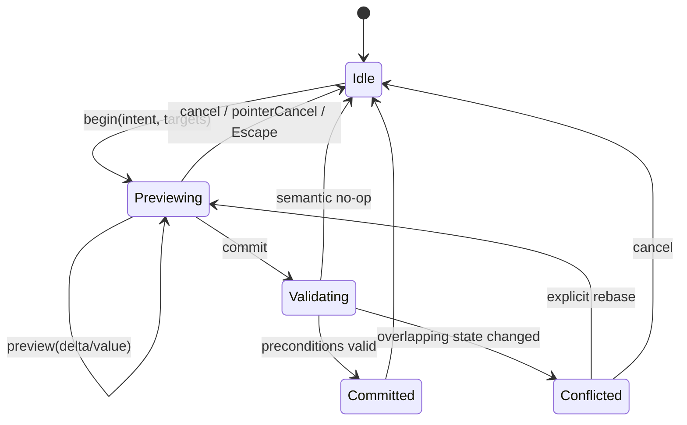
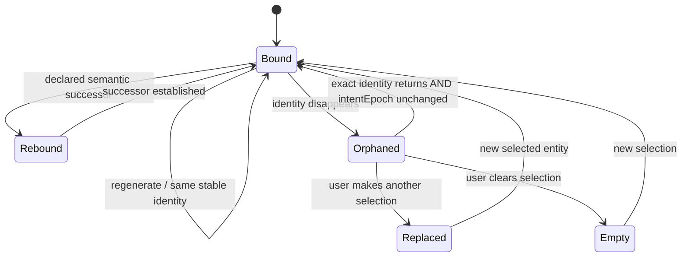
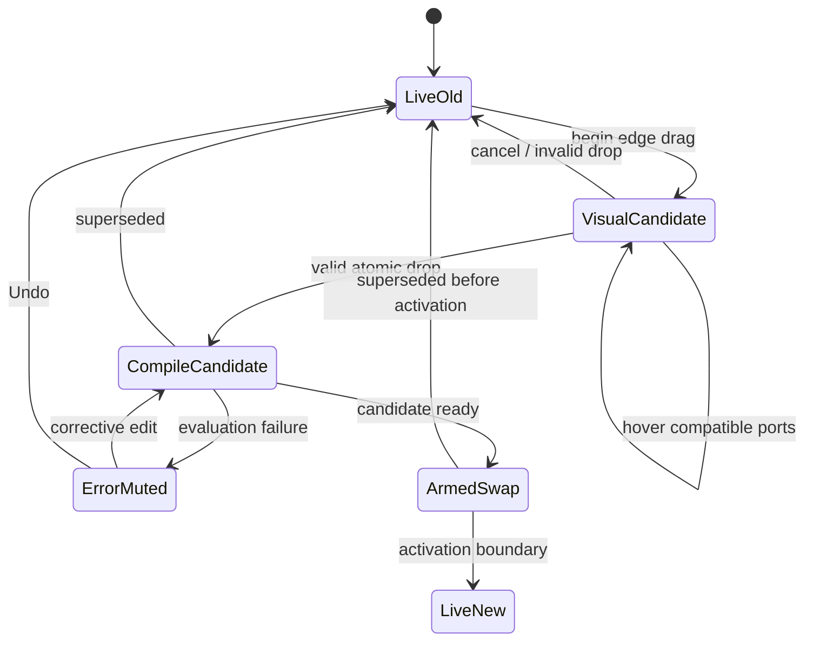
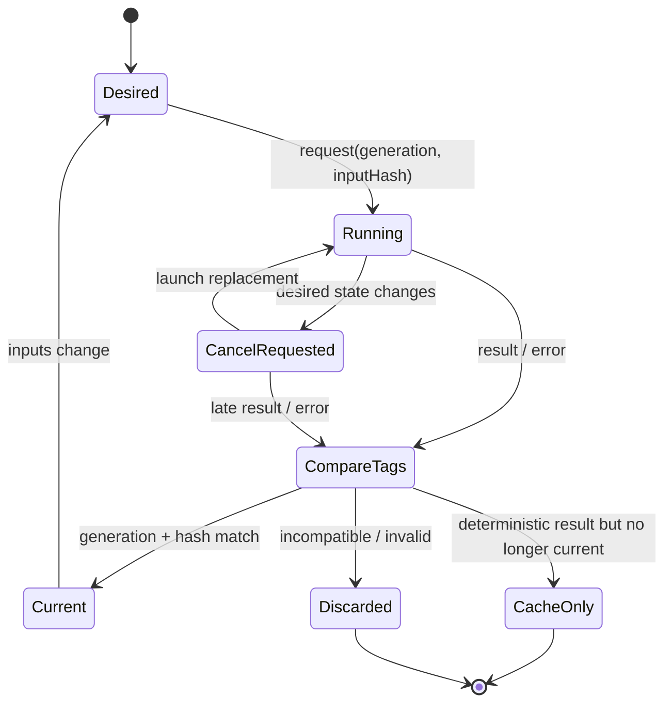

# Cross-Surface Editing, Node-Graph, Timeline, and Undo Semantics

**Research date:** 2026-08-18  
**Program:** Aural Geometry Lab  
**Research charter:** DR-14  
**Artifact snapshot date:** 2026-08-14

**TL;DR.** AGL should have one platform-neutral semantic command model, but **not one undifferentiated state model**. Persistent project state, transient interaction previews, local selection/focus state, asynchronous derived results, and transport/audio runtime state need hard boundaries. High-frequency gestures should be preview overlays that culminate in exactly one semantic transaction and one undo step. Generated content should remain procedural unless the user's intent explicitly calls for a sparse downstream exception, a procedural fork, or a frozen authored artifact. Async cancellation is only a resource optimization: correctness must come from scope-specific generation tokens plus exact dependency hashes. Native `UndoManager`/document systems should adapt to the AGL command history rather than define AGL's semantics.

The program metadata makes this work a direct production gate: AGL-141 is already considered complete, while AGL-145 explicitly depends on DR-14 and requires research-derived state machines and model-based tests before graph/timeline/direct-manipulation production wiring. fileciteturn0file0 The research register likewise identifies DR-14 as a pre-handoff, high-leverage investigation that unblocks AGL-145. fileciteturn0file4 FR-03 is specifically scheduled as an interaction-state-machine audit after DR-14, and FR-11 calls for research-to-engineering distillation after each deep-research run. fileciteturn0file1

## Scope, evidence, and principal findings

There is one material limitation to this review: the four named starting files—`docs/16-cross-platform-interaction-contract.md`, `src/core/interaction.ts`, `src/core/commands.ts`, and `src/core/materialization.ts`—were not present in the uploaded artifact set. The available files were the backlog, frontier-run register, lab manifest, program plan, and research register. A search of the connected GitHub account also produced no accessible AGL repository or match for the interaction-contract file. I therefore **do not claim a line-by-line audit of the present TypeScript implementation**. What follows is a normative replacement/refinement specification, an attack model, and concrete acceptance criteria that can be applied to those files.

That distinction matters because the surrounding program already promises several semantics that DR-14 must make mutually consistent. AGL-012 calls for atomic commands with inverses, undo/redo, and transaction grouping; AGL-023 calls for cancellable worker evaluation; AGL-024 calls for content-addressed evaluation caching; AGL-027 calls for bounded graph freeze-to-clip with lineage; AGL-036 calls for linked event/node/geometry/provenance selection; and AGL-044 already anticipates audio generation IDs. fileciteturn0file0 The interaction model therefore cannot be designed as a local React convenience layer: it sits between the project schema, graph runtime, worker evaluator, transport, audio render plan, visualization system, and future native implementation.

The seven-lab scope also makes generated-content semantics foundational rather than exceptional. Infinite Staircase and Euclidean Rings are already runnable vertical slices, while Tonnetz, Fractal, CA, Chaos, and Penrose introduce increasingly strong provenance, topology, and regeneration requirements. fileciteturn0file2 The program plan places project/runtime determinism before later audio and lab milestones and keeps native iPad as a stretch architecture, which argues strongly for making these semantics portable before framework-specific production wiring. fileciteturn0file3

The strongest external precedents point in the same direction. Myers and Kosbie's CHI work on hierarchical command objects distinguishes low-level interaction from higher-level semantic commands, allowing a drag or widget interaction to culminate in an application-level command suitable for undo. citeturn14search6 Apple's `UndoManager` likewise groups multiple registered operations into a single undoable group, and its automatic grouping is tied to run-loop events rather than application semantics—exactly why AGL should explicitly define its own semantic transaction boundaries. citeturn17search0turn17search3turn17search12 Godot's current `UndoRedo` documents the useful “merge ends” pattern: preserve the original undo state and final redo state for sequential changes to one value. citeturn14search7

The interaction contract should therefore reject ten especially dangerous designs:

| Attack | Why it is wrong for AGL | Required replacement |
|---|---|---|
| Every `pointermove` is a command | Hundreds of undo steps, autosaves, revisions, cache invalidations, and worker jobs | Transient preview overlay; one commit |
| Selection and keyboard focus are the same variable | Moving keyboard navigation changes user intent and can trigger expensive generated selection | Separate focus and selection models |
| Hover becomes “temporary selection” | Pointer motion changes command targets and provenance state | Hover is presentation-only |
| Generated events are directly mutated | The result becomes neither cleanly generated nor cleanly authored | Upstream edit, downstream operator/exception, fork, or freeze |
| Edge dragging mutates the live graph continuously | Produces transient invalid graphs and unstable audio | Visual candidate until valid atomic rewire commit |
| Worker cancellation guarantees freshness | Cancellation can arrive too late or be cooperative | Generation/hash acceptance barrier |
| Document revision alone identifies async validity | Unrelated edits invalidate reusable work; undo can return to identical content | Revision for write ordering, hash for semantics, generation for current intent |
| Generic time-window command coalescing | Two separate user actions close in time become one undo step | Coalesce by semantic interaction session |
| Undo is delegated to React or SwiftUI/AppKit | Web and native acquire different editor semantics | AGL history authoritative; platform adapters mirror it |
| Future collaboration stores generated output as shared state | Replicas exchange enormous derived state and invite nondeterministic conflicts | Replicate semantic inputs; derive output locally |

W3C's accessibility guidance independently reinforces the focus/selection distinction: focus is a single navigation pointer whereas selection can persist and can contain multiple items; in multi-selection interfaces, normal focus movement does not imply selection movement. W3C also warns that “selection follows focus” is harmful when selection activation incurs latency—directly relevant to AGL, where selection can drive provenance queries, visualization, and generated-data inspection. citeturn14search1turn14search3 ProseMirror provides another useful architectural precedent: a range has a stable anchor and moving head, selections can be mapped through document changes, and selection bookmarks can survive transformations and later resolve against the changed document. citeturn15search0

## Revised normative interaction contract

In this section, **MUST**, **SHOULD**, and **MAY** are normative for the proposed AGL interaction contract.

**State must be stratified.** AGL should expose one coherent editor to the user while maintaining several deliberately different state classes internally:

| State stratum | Examples | Persisted in project | Global undo | May affect evaluation/audio |
|---|---|---:|---:|---:|
| Authoritative document | nodes, edges, clips, generator parameters, frozen material, exception operators | Yes | Yes | Yes |
| Interaction state | selection, focus, hover, range anchor, lasso, drag handles | No | No | Usually no |
| Preview overlay | current node position, slider value, clip trim, direct-manipulation candidate | No | No | Yes, through preview channel |
| A/B override | candidate parameter or structural overrides | No until committed | Session-local only | Yes |
| Derived state | evaluated events, geometry, provenance indexes, render plans, cache entries | No, except explicit materialization | No | Is the evaluation/audio result |
| Runtime state | play/pause, playhead, scheduled-generation ID, active audio plan | No by default | No | Yes |
| Command/history state | committed transaction stack, redo pointer, lineage events | Session/history metadata | Defines undo | Indirectly |

The authoritative project **MUST never contain an uncommitted drag state**. Conversely, the canvas, graph, timeline, inspector, visualization, and audio preview **MUST be capable of rendering an effective state that includes a transient preview**. Conceptually:

```text
effective interaction view
    = committed project
    + active preview or B override
    + derived evaluation for that effective state
```

The implementation should not literally clone the whole project for every pointer movement; this is a semantic equation, not a storage requirement.

**One user intent must create one semantic transaction.** The minimum direct-manipulation lifecycle is:

```text
begin → preview* → { commit | cancel }
```

`begin` captures the transaction identity, affected semantic fields, preconditions, and initial values. `preview` updates transient state and may request preview evaluation. `commit` validates the affected fields against the current document and emits one canonical document transaction. `cancel` removes the preview without changing project revision or history.

A 700-event mouse drag is therefore not 700 commands. It is one interaction transaction with 700—or preferably display-rate-throttled—preview observations and a single final `MoveEntities`, `SetOperatorParameter`, `TrimClip`, or equivalent semantic command. This follows the distinction between interaction-level and application-level commands demonstrated in command-object work, but here the rule is stronger because AGL evaluation and audio make intermediate authoritative mutations particularly expensive. citeturn14search6 React Flow itself exposes separate drag start, ongoing drag, and drag stop hooks, showing that the framework can support these phases; AGL should use those hooks to implement its semantics rather than inherit arbitrary framework change granularity. citeturn15search15turn15search18

A drag commit **MUST be a no-op if the canonical final value equals the canonical start value**. A no-op gets no revision increment, no undo item, no redo invalidation, and no committed evaluation generation.

**Commands must be semantic and pure with respect to the project.** Each document command should have a deterministic validation/apply/inverse contract:

```ts
type Revision = string;      // decimal integer in portable JSON
type ContentHash = string;   // e.g. "sha256:..."
type EntityId = string;
type TransactionId = string;
type CommandId = string;

interface CommandEnvelope<K extends string, P> {
  schema: "agl.command";
  schemaVersion: 1;

  commandId: CommandId;
  transactionId: TransactionId;
  logicalActionId: string;

  actor: {
    actorId: string;
    sequence: string;
  };

  kind: K;
  payloadVersion: number;
  payload: P;

  baseRevision: Revision;

  // Fine-grained validity conditions, not merely baseRevision equality.
  preconditions: Precondition[];

  origin:
    | "user"
    | "undo"
    | "redo"
    | "migration"
    | "system";

  lineage?: {
    causedByCommandId?: CommandId;
    migratedFromCommandId?: CommandId;
  };
}

type Precondition =
  | { kind: "entity-exists"; entityId: EntityId }
  | { kind: "entity-absent"; entityId: EntityId }
  | {
      kind: "field-equals";
      entityId: EntityId;
      field: string;
      expectedHash: ContentHash;
    }
  | {
      kind: "input-hash-equals";
      targetId: EntityId;
      expectedHash: ContentHash;
    };
```

A successful commit returns an applied record containing canonical forward and inverse commands plus before/after revision and hashes. The inverse should be generated by the core from validated state, not trusted from a UI payload.

```ts
interface CommittedTransaction {
  transactionId: TransactionId;
  logicalActionId: string;
  label: string;

  revisionBefore: Revision;
  revisionAfter: Revision;
  projectHashBefore: ContentHash;
  projectHashAfter: ContentHash;

  forward: CanonicalCommand[];
  inverse: CanonicalCommand[]; // already ordered for atomic undo
}
```

The important concurrency refinement is that `baseRevision` is **diagnostic and ordering metadata, not the only commit precondition**. Suppose a canvas drag began at revision 100 and, while it was active, a non-overlapping mixer command produced revision 101. Rejecting the drag merely because the global number changed would be unnecessarily pessimistic. The commit should succeed if its targeted fields still equal the values it began from. Conversely, an inspector edit that changed the same node position or generator parameter should invalidate or force an explicit rebase. This is also a useful future-collaboration property: total local revision numbers cease to be sufficient once history can become non-linear. Contemporary CRDT research explicitly notes that concurrent editing makes undo history non-linear. citeturn12academia28

**Interaction states must have non-overlapping responsibilities.**

| Concept | Normative meaning | Persistence and routing rule |
|---|---|---|
| Selection | Entities the user has chosen as the subject of commands/inspection | Local session state; persists across surface/focus changes |
| Primary selection | Distinguished member for inspector/default operation | One at most; must belong to selection |
| Keyboard focus | Current keyboard navigation/input locus | Exactly one logical focus locus; never inferred from selection |
| Hover | Entity under a particular pointer | Ephemeral; never a command target merely because it is hovered |
| Related/provenance highlight | Derived relationship to selected/hovered entities | Read-only derived decoration; never silently added to selection |
| Range anchor | Fixed origin of Shift/range extension | Local to ordered selection domain; not itself “focus” |
| Range head | Moving end of current range | Usually follows focused or pointed item during range extension |
| Orphaned selection | Former selection whose generated entity currently has no valid successor | Retained as explanatory ghost, not an actionable entity |

Selection **MUST NOT follow focus** for graph, timeline, generated-event, and other multi-selectable surfaces. A keyboard user may move focus through events or nodes without launching all the evaluation/inspection behavior associated with selecting each one. This directly follows W3C's distinction and its warning about selection-follow-focus when changing selection carries noticeable latency. citeturn14search0turn14search3

A cross-surface selection should use canonical semantic references rather than surface-specific IDs:

```ts
interface EntityRef {
  kind:
    | "operator"
    | "edge"
    | "clip"
    | "track"
    | "event"
    | "geometry"
    | "control-point";

  id: EntityId;

  // Present for generated entities.
  generated?: {
    producerId: EntityId;
    outputPortId: string;
    stableKey: string;
    sourceFingerprint?: ContentHash;
  };
}

interface SelectionState {
  intentEpoch: string;
  primary?: EntityRef;
  members: EntityRef[];

  range?: {
    domainId: string;
    anchor: SemanticPosition;
    head: SemanticPosition;
  };

  orphaned?: OrphanedSelection[];
}
```

Canvas, timeline, graph, and inspector are then projections over the same semantic selection, not competing owners of it. A graph node selected because it produced a timeline event is a genuine selected entity only if the user selected it; otherwise it is a provenance highlight.

**Range selection should map rather than guess.** When the document changes, the anchor/head should first be mapped through stable identities or a declared ordering transformation. ProseMirror's mapped selections and bookmarks demonstrate the underlying pattern. citeturn15search0 For timeline ranges, a rational-time fallback is valuable:

```ts
type SemanticPosition =
  | {
      kind: "entity";
      ref: EntityRef;
      fallbackTime?: { numerator: string; denominator: string };
    }
  | {
      kind: "time";
      laneId: EntityId;
      time: { numerator: string; denominator: string };
    };
```

If an anchor entity disappears, the fallback is its exact musical-time position where available—not “the nearest surviving event.” Nearest-neighbor retargeting can silently change musical intent.

**Generated selections require conservative disappearance semantics.** On regeneration:

1. An identical stable generated identity remains selected.
2. A generator may explicitly supply a semantic successor relation; that successor may be rebound.
3. Otherwise the missing item becomes an orphaned/ghost selection and is removed from actionable selection.
4. A nearby event **MUST NOT** be substituted based on time, index, geometry distance, or visual proximity.
5. If the exact old identity reappears after Undo, the ghost may reactivate **only if the selection's `intentEpoch` has not changed** since disappearance. Once the user selects something else, the old selection must not resurrect behind their back.

This makes stable IDs useful without pretending that every procedural topology has a meaningful persistent element identity.

**Undo must operate at semantic-transaction granularity.** The MVP should be linear, transaction-level undo/redo. It does not need selective historical undo. Undo applies a transaction's inverse atomically and increments the authoritative project revision; redo reapplies its forward form under the same validation discipline. A new committed user transaction after an undo clears the redo branch. Selection, focus, hover, transport, current evaluation results, and A/B toggles do not create document undo items.

## State machines, command taxonomy, and coalescing laws

The central edit lifecycle should be explicit rather than implicit in event handlers.



A document-affecting Undo invoked while a gesture is still active should first terminate that transient gesture deterministically. For ordinary direct manipulation, the least surprising rule is **cancel preview, then execute the requested Undo**; it should never commit a half-finished gesture as a side effect of Undo.

The corresponding generated-selection machine is:



And candidate graph rewiring while playing should behave as follows:



The **command taxonomy** should be deliberately smaller than the UI action vocabulary. Surface-specific actions translate into portable semantic commands:

| Family | Representative commands | Undo/coalescing |
|---|---|---|
| Scalar/value | `SetOperatorParameter`, `SetTrackGain`, `SetClipProperty` | Coalescible only within one interaction session |
| Geometric | `MoveEntities`, `ResizeEntity`, `SetControlPoint` | Drag collapses to first-before/final-after |
| Timeline | `TrimClip`, `MoveClip`, `SplitClip`, `SetLoopRegionDocumentValue` | Move/trim coalesce per gesture; split does not |
| Structural graph | `CreateNode`, `DeleteEntities`, `ConnectEdge`, `RewireEdge`, `InsertOperatorOnEdge` | Atomic, generally non-coalescible |
| Procedural | `AddExceptionPatch`, `UpdateExceptionPatch`, `ForkGenerator`, `FreezeRange` | Semantic units; never generic time-merge |
| Project | track/lane create-delete-reorder, routing changes | Atomic |
| Runtime-only | play, pause, seek, scrub, audition, A/B toggle | Not document commands |
| History/system | undo, redo, migration events | History control; not normal coalescing candidates |

A graph rewire should be one command, not `DisconnectEdge` followed by `ConnectEdge`, because intermediate disconnection is not the user's semantic action and may temporarily violate invariants:

```ts
interface RewireEdgePayload {
  edgeId: EntityId;

  newSource?: {
    nodeId: EntityId;
    portId: string;
  };

  newTarget?: {
    nodeId: EntityId;
    portId: string;
  };
}
```

The command's validation **MUST** check port existence, port types, graph-cycle rules, and any AGL operator constraints against the complete proposed post-command graph before committing.

Inserting a downstream edit operator should similarly be atomic:

```ts
interface InsertOperatorOnEdgePayload {
  replacedEdgeId: EntityId;

  operator: OperatorEntity;

  upstreamEdge: EdgeEntity;
  downstreamEdge: EdgeEntity;
}
```

Delete/recreate inverses must preserve exact IDs. Forking must carry an explicit deterministic ID map:

```ts
interface ForkGeneratorPayload {
  sourceRootId: EntityId;

  cloneMap: Array<{
    sourceId: EntityId;
    forkId: EntityId;
  }>;

  redirectConsumers: Array<{
    consumerId: EntityId;
    oldSourceId: EntityId;
    newSourceId: EntityId;
  }>;

  lineage: {
    forkedFromRootId: EntityId;
  };
}
```

A subtle but important rule is that **random-stream identity must not accidentally equal node identity**. If cloning a generator assigns new node IDs and the RNG implicitly uses those IDs, a fork would change before the user made any actual divergence. A fork should initially preserve the relevant seed/random-stream keys so that its output is identical to its source at the fork point; an explicit reseed can then diverge it.

The coalescing contract can be stated algebraically. Given sequential commands on the same semantic target:

```text
C₁ : a → b
C₂ : b → c
```

a valid merge `M` must satisfy:

```text
apply(a, M) = c
undo(c, M)  = a
```

and it must have the same observable document result as applying `C₁` then `C₂`.

The normative laws are:

| Law | Requirement |
|---|---|
| Atomicity | A transaction either applies all commands or none |
| Preview isolation | Preview updates never alter authoritative revision/history |
| Gesture unity | One continuous semantic gesture produces at most one undo item |
| No-op elimination | If final canonical document equals initial canonical document, record nothing |
| Exact inversion | Apply then undo restores the canonical pre-state |
| Redo equivalence | Apply → undo → redo restores the canonical post-state |
| Session identity | Coalescing requires the same `logicalActionId` or explicit edit session |
| Target identity | Coalescing requires exactly compatible target/field sets |
| Barrier discipline | Structural edits, target-set changes, focus-to-new-editor commit, and explicit commit boundaries end coalescing |
| No time-only merging | Temporal proximity by itself is never sufficient |
| Initial/final preservation | Merged action retains the first before-state and last after-state |
| Validation preservation | A merged command must satisfy every invariant that the unmerged sequence would |
| Redo branching | New committed edits after undo invalidate redo |
| Async separation | Evaluation completion never retroactively changes history granularity |
| Platform equivalence | A native undo group maps exactly to one committed AGL transaction |

Godot's `MERGE_ENDS` behavior is a useful implementation precedent for the “first undo state, final redo state” part of this law, but AGL's same-session requirement is stricter because Godot's command-name matching alone is not sufficient to model musical intent. citeturn14search7

The practical coalescing policy should be:

| Interaction | Coalesce? | Boundary |
|---|---:|---|
| Pointer drag of nodes | Yes | Pointer/gesture end |
| Multi-node drag | Yes | Same selected ID set for the gesture |
| Clip move or trim | Yes | Gesture end |
| Fader/knob/slider drag | Yes | Gesture end |
| Keyboard key-repeat nudge | Yes | One key-down/repeat/key-up sequence |
| Mouse-wheel parameter adjustment | Prefer one explicit wheel-edit session | Idle/end gesture, not arbitrary milliseconds |
| Text/number editing | Native/local edits internally; one AGL commit on semantic edit commit | Enter, focus commit, explicit apply |
| Create/delete | No generic coalescing | Each semantic action |
| Rewire edge | No | Each valid drop |
| Split/join | No | Each invocation |
| Freeze/materialize | No | Each operation |
| Fork generator | No | Each operation |
| Randomize/reseed | No | Each invocation |
| A/B toggle | Not in document history | N/A |
| Play/pause/seek | Not in document history | N/A |

This deliberately rejects a global “merge anything within 500 ms” rule. Yjs, for example, exposes a time-based capture window for its selective undo manager and an explicit way to stop capturing. citeturn12search0 That behavior is useful for generic collaborative text structures, but AGL has enough semantic information to use interaction-session boundaries instead of guessing intent from elapsed time.

## Generated material, exceptions, and live graph behavior

Generated content needs a four-way distinction that should become explicit in `materialization.ts` and the interaction contract:

**Edit the generator** when the user's intent changes the generating rule globally.

**Insert a downstream operator** when the user wants a systematic transformation while retaining procedural regeneration.

**Fork the generator** when the user wants an independently evolving procedural variant.

**Freeze/materialize** when the user wants to treat a bounded generated result as authored artifact rather than as a regenerated consequence.

Sparse exceptions are a specialized downstream operator rather than hidden mutations of generated events.

This distinction is strongly supported by procedural-editing practice. Houdini's Edit SOP stores cumulative downstream edits and can express them relative to reference geometry, while its Stash/Lock concepts deliberately cache output so upstream geometry no longer drives the result. citeturn16search0turn15search6turn15search9 Houdini's own tooling also shows the identity requirement: creating an Edit node from geometry differences requires compatible point correspondence, and its SOP Modify guidance warns that topology/order changes require explicit IDs to preserve correspondence. citeturn16search3turn16search1 AGL should adopt the semantic principle, not the Houdini data model: **downstream exceptions are safe only when correspondence has a defined meaning**.

The generated-content decision table should therefore be normative:

| User intent / situation | Identity stability | Procedural behavior desired | Correct action |
|---|---|---|---|
| Change Euclidean pulse count, rotation, subdivision rule, Lorenz parameter, recursion depth | N/A | Yes, global | Edit generator parameter |
| Apply transpose, quantization, constrained mapping, gain transform to all regenerated output | Stable transformation semantics | Yes | Insert downstream operator |
| Move one generated note/event while the rest continue regenerating | Stable semantic event identity | Yes | Sparse exception patch |
| Suppress one generated event | Stable semantic event identity | Yes | Suppression exception patch |
| Add one authored event into a generated range | Stable time/provenance anchor | Yes | Insertion exception downstream |
| Make a second procedural variant for one track/consumer | N/A | Yes, independent branch | Fork generator and redirect consumer |
| Change one region using different generator parameters while original remains elsewhere | N/A | Yes | Fork generator, range/consumer routing |
| Freehand-edit many events as an authored phrase | Correspondence no longer useful | No | Freeze bounded range |
| Modify topology/order so prior per-entity correspondence is destroyed | Unstable | Usually no | Freeze |
| Edit a generated entity whose generator cannot promise stable identity | Unstable | Maybe | Prefer generator/downstream transform; otherwise freeze |
| Render a computationally expensive bounded result to lock it | N/A | No live regeneration | Freeze with source lineage |
| “Make this one result independent, but let me know where it came from” | N/A | No | Freeze plus provenance link |
| Targeted exception's source event temporarily disappears | Missing | Yes | Keep exception dormant; never retarget nearest |
| Target returns with exact stable identity | Restored | Yes | Reactivate dormant exception |
| User wants to “refresh” previously frozen material | Source may differ | Explicit | New rematerialization command, not silent mutation |

A sparse exception should have its own persistent procedural representation:

```ts
interface GeneratedTarget {
  producerId: EntityId;
  outputPortId: string;

  // A semantic identity promised by that generator/operator.
  stableKey: string;

  // Guards against interpreting a key under incompatible producer semantics.
  producerSemanticVersion: string;
}

type ExceptionOperation =
  | {
      kind: "modify";
      target: GeneratedTarget;
      field: string;
      value: unknown;
    }
  | {
      kind: "suppress";
      target: GeneratedTarget;
    }
  | {
      kind: "insert";
      anchor: {
        producerId: EntityId;
        laneId?: EntityId;
        time: { numerator: string; denominator: string };
      };
      authoredEntity: unknown;
    };

interface ExceptionRecord {
  exceptionId: EntityId;
  operation: ExceptionOperation;
  status: "active" | "dormant";
}
```

The contract must prohibit “closest match” repair. If an exception targeting generated hit `G:42` disappears and `G:43` now falls at a similar time, the exception remains dormant. Silent retargeting is musically destructive and makes provenance explanations false.

A freeze is a different operation entirely:

```ts
interface FreezeRangePayload {
  source: {
    rootId: EntityId;
    outputPortId: string;
    inputHash: ContentHash;
  };

  range: {
    start: { numerator: string; denominator: string };
    end:   { numerator: string; denominator: string };
  };

  artifact: {
    artifactId: EntityId;
    contentHash: ContentHash;
    storageRef: string;
  };

  provenance: {
    sourceProjectRevision: Revision;
    sourceGraphHash: ContentHash;
  };
}
```

Freeze should be a **prepare-then-commit operation**. The worker may asynchronously prepare the artifact, but `FreezeRange` commits only if the relevant source input hash still equals the prepared source hash. If the generator changed while materialization was running, the command fails its precondition and must rematerialize or explicitly let the user choose the older prepared snapshot. An async job must never silently freeze something different from what the user requested.

After successful freeze, the new authored entities get authored identities. Their provenance refers back to the source graph/range/hash, but upstream edits no longer mutate them. This is conceptually the same semantic distinction exposed by procedural systems that stash or lock generated geometry. citeturn15search6turn15search9

**Graph rewiring while audio is running needs a last-known-valid-plan protocol.** Edge-drag motion should perform visual/type feedback only. It should not repeatedly disconnect/connect the authoritative graph and it should not mutate the current audio topology. On a valid drop:

1. Atomically commit `RewireEdge`.
2. Increment the affected evaluation generation.
3. Cancel obsolete downstream worker jobs.
4. Compile/evaluate the new candidate.
5. Continue playing the old valid plan during the bounded pending interval.
6. When the candidate is ready and still current, activate it at a controlled audio boundary while preserving transport position.
7. Ignore stale candidate activations.
8. If candidate evaluation fails after static validation, keep the document edit but stop/mute the affected current output rather than indefinitely presenting old audio as if it represented the new graph.

That final point is especially important for AGL's scientific/educational mission. “The canvas shows graph B while you are unknowingly hearing graph A forever” is worse than a visible evaluation error. An explicit user-invoked “audition last good” mode could exist later, but stale playback must be unmistakably labeled.

Web Audio provides strong implementation evidence for separating document commits from audio activation. The specification defines distinct control and rendering threads, ordered control-message queues, and effectively asynchronous audio-node operations; rendering proceeds in quanta rather than synchronously with UI mutation. citeturn18search0turn18search1 Thus a React state commit can never legitimately serve as AGL's definition of “the new graph is now the graph being heard.”

Every scheduled audio/event message should carry an activation generation:

```ts
interface AudioPlanActivation {
  planHash: ContentHash;
  evaluationGeneration: string;
  activationGeneration: string;
  transportEpoch: string;
  effectiveFromAudioTime: number;
}
```

The runtime accepts an activation only when all current tokens match. Already sounding voices can follow the defined teardown/tail policy; newly scheduled events from superseded generations must not enter the active schedule. The existing backlog's explicit requirement for AudioWorklet generation IDs is therefore exactly the right seam. fileciteturn0file0

## Async evaluation, temporary overrides, migrations, and future collaboration

The async model should distinguish four values that are too often collapsed into one:

| Token | Meaning | Used for |
|---|---|---|
| `documentRevision` | Total ordering of authoritative commits on this local history | command ordering, dirty state, diagnostics |
| `inputHash` | Exact semantic dependency closure for an evaluation | deterministic cache and equality |
| `generation` | What result this evaluation scope currently wants | stale-result acceptance |
| `requestId` | One physical computation attempt | tracing, cancellation, metrics |

An input hash should include every semantic dependency needed for deterministic output: operator types and semantic versions, parameter values, seeds/random-stream keys, relevant upstream hashes, bounded range/mode, and evaluator semantics version. It must not include irrelevant UI state such as selection or hover.

Each evaluatable scope—graph output, track, visualization projection, preview session, A/B branch, render request—maintains a current desired pair:

```text
(current generation, current inputHash)
```

A result becomes **current** only if:

```text
result.scope still exists
AND result.generation == scope.currentGeneration
AND result.inputHash   == scope.currentInputHash
AND result.semanticVersion is accepted
```

`result.documentRevision == currentRevision` is deliberately **not** required. An unrelated track rename or mixer edit may have increased the project revision while leaving a generator's exact inputs unchanged.

Cancellation is then an optimization, not the correctness mechanism. The DOM standard explicitly describes `AbortSignal` as a signal an API observes and even notes that an operation can choose how to react; Swift task cancellation is explicitly cooperative and does not automatically stop code that fails to check cancellation. citeturn19search4turn19search0turn19search1 Dedicated Web Workers can be terminated more aggressively, including discarding queued tasks and aborting the running worker script, but the application-level currentness check is still necessary around already-transferred results, worker reuse, cache hits, and non-worker asynchronous operations. citeturn19search3

The resulting evaluator state machine is:



A stale but valid deterministic result **may populate the content-addressed cache**, but must not directly become visible/current. If the current document later returns to that hash—for example through Undo—a fresh generation can consume the cached value. This preserves a clean meaning for generation while retaining hash-based reuse.

The race-condition matrix should be adopted as an acceptance artifact:

| Race | Correct result |
|---|---|
| Request A starts, request B supersedes it, B finishes then A finishes | B current; A cache-only/discard |
| A is canceled but completes anyway | Never current unless its generation is current—which it is not |
| Unrelated document edit increments revision while A runs | A may still become current if scope generation/hash are unchanged |
| Relevant edit changes hash while A runs | Increment generation, cancel A, reject late A as current |
| Undo returns to an earlier identical input hash | New generation; reuse cached old-hash output under new generation |
| Selected/evaluated target is deleted before result arrives | Result cannot attach to nonexistent scope |
| Project closes while workers run | All scopes invalidated; late messages ignored |
| Project migration/reload replaces project epoch | Old results rejected regardless of coincidental IDs |
| Superseded worker emits an error late | Do not replace current success/status with stale error |
| Preview evaluation completes after gesture canceled | Never publish as committed state |
| Preview evaluation completes after gesture committed | Cache may be reused; committed channel gets its own generation |
| Committed evaluation returns while B override is active | It remains committed-cache state, not the audible/current B result |
| B evaluation returns after user toggles back to A | B result remains override-cache state; cannot activate |
| Rewire candidate A is superseded by rewire candidate B | Candidate A must never activate |
| New graph is pending while transport runs | Old plan may continue transiently, visibly marked pending |
| New graph evaluation fails | Current document remains; affected audio becomes error/muted rather than indefinitely stale |
| Undo returns graph to known-good content | Activate/reuse old content under a fresh activation generation |
| Cache item has old evaluator/operator semantic version | Cache miss/reject |
| Freeze job finishes after its source changed | Commit precondition fails |
| Seek occurs while evaluation runs | Evaluation may remain valid; scheduling uses new transport epoch |
| Old scheduled messages arrive after seek/plan swap | Worklet/runtime drops messages with stale transport/activation generation |

**A/B should be a transient comparison session, not a document branch masquerading as history.**

```ts
interface OverrideSession {
  sessionId: string;

  baseline: {
    revision: Revision;
    projectHash: ContentHash;
  };

  audibleBranch: "A" | "B";

  overrides: Array<{
    targetId: EntityId;
    field: string;
    value: unknown;
  }>;

  localUndoDepth: number;
  generation: string;
}
```

A is the committed baseline captured for the session; B is an overlay. B edits can have a small **session-local undo history** so a user adjusting several candidate values can Undo an adjustment without polluting project history. A/B toggles themselves are not undo operations. `Commit B` collapses the final semantic diff into one normal document transaction, after revalidating the affected fields. `Cancel` destroys the overlay and its local history.

Transport is orthogonal. Play, pause, seek, loop, and scrub **MUST NOT commit B**, and toggling A/B **MUST NOT reset transport position** unless a specific operator requires a declared restart. Audio activation still obeys generation boundaries. This makes comparison musically useful: A and B are heard at the same transport context rather than as two hidden project revisions.

For MVP, an authoritative document mutation that occurs while an A/B session is active should end or explicitly rebase the comparison before proceeding. The safest initial policy is to end the A/B session on any document-changing command except B-local adjustments. Transport operations do not end it.

**Migration lineage and undo history must be separated.** AGL-011 already requires deterministic sequential migrations that preserve source bytes. fileciteturn0file0 DR-14 should strengthen that contract:

```ts
interface MigrationRecord {
  migrationId: string;
  fromSchemaVersion: number;
  toSchemaVersion: number;

  sourceBytesHash: ContentHash;
  sourceProjectHash: ContentHash;
  migratedProjectHash: ContentHash;

  lineageRelations: Array<
    | { kind: "same"; oldId: EntityId; newId: EntityId }
    | { kind: "split"; oldId: EntityId; newIds: EntityId[] }
    | { kind: "merge"; oldIds: EntityId[]; newId: EntityId }
    | { kind: "retired"; oldId: EntityId }
  >;
}
```

The laws should be:

- Persistent entity IDs remain unchanged when semantic identity remains unchanged.
- A migration that splits or merges entities records that relation explicitly.
- Generated/event lineage IDs must not be recomputed merely because serialization changes.
- If the ID algorithm itself changes, aliases or preserved legacy IDs are required.
- Original source bytes/hash remain available according to the migration framework's existing promise.
- Historical command/audit IDs remain immutable; newer payload representations may point back with `migratedFromCommandId`.
- **The active Undo stack does not cross a project-format migration or reopen boundary.** Opening/migrating establishes a new session baseline.
- Migration itself is not a user-edit command that Cmd-Z should reverse. Revert/version restoration belongs to the document/version system.

Persisting an append-only provenance/audit lineage is compatible with this; persisting a live Undo stack across arbitrary software/schema versions is not necessary and creates substantially harder semantic compatibility obligations.

**Native document infrastructure and AGL undo have different jobs.** On Apple platforms, `NSDocument` and `UIDocument` provide file lifecycle, edited-state/autosave integration, and an `UndoManager`; Apple explicitly documents undo registration as a preferred way for `UIDocument` to track unsaved changes, and `NSDocument` can update its edit status automatically through its undo manager. citeturn17search1turn17search6turn17search15 SwiftUI's `DocumentGroup` likewise tracks value-document edits through bindings and reference-document changes through an environment undo manager. citeturn13search3

The architectural division should be:

```text
AGL core:
    semantic commands
    transaction boundaries
    inverses
    redo branching
    deterministic document state
    command/event lineage

Apple document layer:
    open/save/autosave
    file coordination/version behavior
    native menu presentation
    dirty-state integration
    UndoManager adapter

SwiftUI/AppKit UI:
    gesture/focus plumbing
    action labels
    presentation
```

`UndoManager` should therefore mirror one committed AGL transaction as one native group, not become a second independent semantic history. Apple's own API supports explicit nested grouping, while automatic grouping otherwise follows event-loop passes. citeturn17search0turn17search3turn17search12 A native undo callback should invoke the corresponding AGL transaction inverse through the core; the adapter suppresses duplicate registration while undo/redo is in progress.

Local text-entry mechanics are an exception at the UI level, not the model level. IME composition, cursor motion, and per-keystroke text-control undo may remain native while a field is being edited. Once the edit becomes a semantic project value, the adapter commits one `Set…` transaction to AGL.

**Collaboration should influence data shape now without shipping a CRDT now.** Yjs transactions carry an origin and its undo manager can restrict undo to selected origins; Automerge gives each editing replica an actor identity and models changes as mergeable immutable history. citeturn12search0turn12search7turn12search14 Automerge also makes explicit that concurrent writes to the same logical property are a real conflict case requiring deterministic resolution rather than pretending conflicts cannot exist. citeturn12search8turn12search9 These systems are implementation evidence, not a recommendation that AGL adopt either in MVP.

AGL should nevertheless preserve the following future constraints:

| Constraint now | Future benefit |
|---|---|
| Globally unique stable entity IDs | Remote operations need not depend on array index |
| Never reuse deleted IDs | Old references/undo cannot accidentally target a new object |
| Commands target entity + field, not whole-project snapshots | Concurrent non-overlapping edits remain separable |
| Actor ID and actor sequence already present in envelopes | Future provenance and actor-local undo |
| Transaction/origin IDs explicit | Future atomic grouping and selective tracking |
| Ordered operations use identity relations/order keys, not bare numeric indices | Easier mapping to replicated sequences |
| Generated output is derived, not replicated | Peers exchange generator semantics rather than huge event sets |
| Frozen output is normal authored document data | Frozen material can be replicated normally |
| Selection/focus/hover are separate presence state | Future collaborators can broadcast awareness without polluting project |
| Async results/cache are never authoritative replicated state | Replicas converge on inputs, then derive |
| Undo inverses are semantic/fine-grained | Future local undo need not restore an old whole-document snapshot |
| Structural commands carry preconditions | Concurrent rewires can be detected/repaired intentionally |

Yjs's document updates are designed to be commutative, associative, and idempotent, but that convergence property does not by itself define AGL graph legality or musical conflict policy. citeturn12search13 A future collaborative layer must therefore merge storage operations and then enforce or resolve domain-level invariants such as port cardinality, forbidden cycles, and incompatible simultaneous rewires. AGL should not implement that protocol in MVP; it should merely avoid data structures that make it impossible.

## Verification model and platform mappings

The test harness should operate a **reference state machine** alongside the implementation:

```ts
interface InteractionModel {
  document: Project;
  revision: string;
  projectHash: string;

  undo: ModelTransaction[];
  redo: ModelTransaction[];

  preview?: ModelPreview;
  override?: ModelOverride;

  selection: ModelSelection;
  focus?: ModelFocus;
  hover: Map<number, EntityRef>;

  evaluations: Map<string, ModelEvaluationScope>;
  audio: ModelAudioRuntime;

  lineage: ModelLineage;
}
```

Property generation should interleave gestures, commands, undo/redo, regeneration, worker completion in arbitrary order, transport actions, A/B operations, target deletion, and migration boundaries. The reference model should make async completion explicitly reorderable; otherwise most stale-result bugs will never be exercised.

The following **seventy-eight** cases form a minimum DR-14 property/model-based suite:

| ID | Generated trace / property | Required invariant |
|---|---|---|
| TX-01 | Begin + 1…N previews | Revision and history unchanged during all previews |
| TX-02 | Begin + N previews + commit | Exactly one revision and one undo item |
| TX-03 | Begin + previews + cancel | Canonical document exactly unchanged |
| TX-04 | Drag away then exactly back + commit | No command/history/revision |
| TX-05 | Commit transaction then Undo | Project equals exact pre-transaction canonical state |
| TX-06 | Commit → Undo → Redo | Project equals exact post-transaction canonical state |
| TX-07 | Commit A → Undo → Commit B | Redo of A no longer available |
| TX-08 | Many same-session slider values | Undo uses first value; redo/final uses last |
| TX-09 | Two pointer gestures milliseconds apart | Two undo items despite temporal proximity |
| TX-10 | Active drag plus overlapping inspector edit | One wins explicitly; stale drag cannot overwrite |
| TX-11 | Active drag plus non-overlapping document edit | Drag may commit if its field preconditions still hold |
| TX-12 | Target deleted while dragging | Gesture cancels/conflicts; target not recreated accidentally |
| TX-13 | Multi-node drag | Entire target set moves/undoes atomically |
| TX-14 | Invalid structural command | No partial state, no history, no revision |
| SEL-01 | Move keyboard focus among selected/unselected nodes | Selection remains unchanged |
| SEL-02 | Hover every entity in sequence | Selection/history/document unchanged |
| SEL-03 | Provenance highlight appears | Highlighted entities are not command targets unless selected |
| SEL-04 | Shift-range movement | Anchor remains fixed, head moves |
| SEL-05 | Ordered items inserted before range | Anchor/head mapping follows identities/order transform |
| SEL-06 | Generated selected ID survives regeneration | Selection stays bound |
| SEL-07 | Generated selected ID disappears | No nearest-entity substitution |
| SEL-08 | Undo restores exact ID with unchanged `intentEpoch` | Ghost may rehydrate |
| SEL-09 | User selects another item before old ID returns | Old ghost never resurrects |
| SEL-10 | Some members of multi-selection disappear | Survivors remain; primary selection chosen deterministically |
| GEN-01 | Change generator parameter | Output changes through generator, no exception node |
| GEN-02 | Sparse edit of stable generated entity | Exception patch created/updated |
| GEN-03 | Exception target disappears | Patch becomes dormant |
| GEN-04 | Exact target identity reappears | Dormant patch reactivates |
| GEN-05 | Different nearby event appears | Dormant patch never retargets |
| GEN-06 | Arbitrary topology-changing direct edit | System selects freeze/materialization path |
| GEN-07 | Source changes during freeze preparation | Freeze commit precondition fails |
| GEN-08 | Valid freeze commit | Authored IDs plus source lineage recorded |
| GEN-09 | Edit upstream generator after freeze | Frozen material remains byte/semantic equivalent |
| GEN-10 | Fork generator without further changes | Fork initially evaluates identically to source |
| GEN-11 | Change fork parameter | Only forked consumers change |
| GEN-12 | General downstream transformation | Regeneration continues through operator |
| ASY-01 | Start A, start B, finish B, finish A | Only B becomes current |
| ASY-02 | Cancel A, then A finishes | A cannot become current |
| ASY-03 | Superseded A emits progress | Current progress/status is not regressed |
| ASY-04 | Unrelated project edit while A runs | A may remain valid when generation/hash unchanged |
| ASY-05 | Relevant edit while A runs | Generation advances; A cannot publish current |
| ASY-06 | Target deleted before completion | Result cannot attach |
| ASY-07 | Project close before completion | Late result ignored |
| ASY-08 | Migration/new-project epoch before completion | Old result ignored even with colliding IDs |
| ASY-09 | Old job errors after new job succeeds | Stale error does not replace current success |
| ASY-10 | Old evaluator semantic version in cache | Cache item rejected |
| ASY-11 | Preview job finishes after gesture cancel | No committed/publication promotion |
| ASY-12 | Preview hash equals later committed hash | Cache may be reused only under fresh committed generation |
| ASY-13 | A/B B-result completes while A audible | B result cannot activate |
| ASY-14 | B result completes after B session canceled | Cannot attach to removed session |
| ASY-15 | Rewire A, then rewire B, A plan completes last | A never activates |
| ASY-16 | Rewire candidate pending during playback | Old plan continues only in pending state |
| ASY-17 | Rewire candidate evaluation fails | Affected current output reaches explicit error/muted state |
| ASY-18 | Undo failed/current graph to prior good hash | Cached prior plan can reactivate under new activation generation |
| ASY-19 | Worker ignores cooperative cancellation | Generation/hash gate still prevents stale publication |
| ASY-20 | Seek while plan evaluation runs | Evaluation currentness independent; scheduling uses new transport epoch |
| AB-01 | Start A/B | No document revision or global undo item |
| AB-02 | Toggle A ↔ B repeatedly | No document history entries |
| AB-03 | Play/pause/seek/loop while B active | Override remains temporary; never commits |
| AB-04 | Make multiple B adjustments then local Undo | Only B-local overlay changes |
| AB-05 | Commit B | One ordinary document transaction appears |
| AB-06 | Cancel B | Committed project remains exact baseline |
| AB-07 | Document mutation attempted during A/B | Explicit close/rebase policy prevents overlay leakage |
| MIG-01 | Schema migration with unchanged entity semantics | Stable entity ID preserved |
| MIG-02 | One old entity splits into two | Explicit one-to-many lineage recorded |
| MIG-03 | Multiple old entities merge | Explicit many-to-one lineage recorded |
| MIG-04 | Migration completes | Original source-bytes hash retained |
| MIG-05 | Open/migrate project then press Undo | Undo cannot cross migration/session baseline |
| MIG-06 | Migrate archived command payload | Logical command ID/ancestry preserved |
| NAT-01 | One AGL compound transaction on Apple platform | Exactly one native UndoManager group |
| NAT-02 | Native Undo versus web Undo from same fixture | Identical canonical project result |
| NAT-03 | Native Redo versus web Redo | Identical canonical project result |
| NAT-04 | IME/text field produces many local edits | One semantic AGL field command on commit |
| COL-01 | Serialize command envelope | Actor/origin/transaction metadata round-trips |
| COL-02 | Delete entity then create another | Deleted ID is never reused |
| COL-03 | Simulated concurrent writes to different fields | No whole-object inverse clobbers the unrelated field |
| COL-04 | Simulated concurrent edge rewire | Endpoint precondition detects conflicting intent |
| COL-05 | Concurrent ordered inserts in future adapter model | Operation intent does not depend on transient array index |
| COL-06 | Same generator inputs on two runtimes | Derived output hash matches; generated output need not be replicated |
| COL-07 | Remote-equivalent update changes unrelated revision | Fine-grained local command may still validate |
| XPLAT-01 | Encode/apply/undo shared command fixture in TypeScript and Swift | Byte/canonical semantic results agree |
| XPLAT-02 | Generated selection disappears/restores in both runtimes | Reconciliation state machine agrees |
| XPLAT-03 | Evaluation-result race permutation across runtimes | Same result classified current/cache-only/stale |

That suite should sit beside existing property/invariant work rather than as UI-only tests. The backlog already positions AGL-133 as a property/invariant suite and AGL-146 as cross-platform golden-fixture expansion, making DR-14's state-machine cases a natural extension rather than an isolated test harness. fileciteturn0file0

**React mapping.** The AGL interaction core should be an external deterministic store/service, not a nest of component `useState` calls. React explicitly treats component state as snapshots visible to a particular render/event handler, which makes stale closure capture something to design around rather than use as a revision mechanism. citeturn13search1 `useSyncExternalStore` is React's official mechanism for subscribing a component to a store external to React, and is a good fit for immutable AGL interaction snapshots. citeturn13search2

A recommended web mapping is:

```text
Pointer / keyboard / React Flow event
          │
          ▼
  interaction intent adapter
          │
          ▼
 platform-neutral AGL core
 ┌────────┼──────────┬────────────┐
 ▼        ▼          ▼            ▼
document preview   evaluation   runtime/audio
store    overlay   coordinator   service
 │        │          │            │
 └────────┴──── snapshots ────────┘
                   │
                   ▼
             React surfaces
```

For React Flow specifically:

```text
onNodeDragStart → beginPreviewTransaction
onNodeDrag      → updatePreview
onNodeDragStop  → commitPreviewTransaction
invalid/cancel  → cancelPreviewTransaction
```

React Flow's current API explicitly provides those three phases. citeturn15search15 The graph library may manage hit-testing and presentation, but `applyNodeChanges`-style framework state must not become AGL's authoritative history semantics.

Preview rendering can be throttled to animation frames for efficiency; the final pointer/gesture value must always be committed even if an intermediate frame was skipped. Worker requests should take an `AbortSignal` where useful, but every response still goes through the generation/hash gate defined above. The DOM standard's cancellation semantics make that separation explicit. citeturn19search4

Focus should use real DOM focus/ARIA composite-widget patterns, with `aria-activedescendant` or roving focus where suitable; selection remains AGL state and needs visually distinct treatment. W3C explicitly requires focus and selection to remain distinguishable in multi-selection interfaces. citeturn14search1turn14search3

**SwiftUI mapping.** SwiftUI's `GestureState` is almost a direct framework analogue of an AGL preview overlay: Apple documents it as transient gesture state that updates during the gesture and automatically resets when the gesture ends or is canceled. citeturn13search0turn13search4 That makes the mapping:

```text
Gesture.updating / onChanged → AGL preview
Gesture.onEnded              → AGL commit
gesture/system cancellation  → AGL cancel
```

There is an important trap: Apple's `onEnded` is invoked only when a gesture ends successfully, whereas `GestureState` also resets on cancellation. citeturn13search8 AGL cannot therefore rely on `onEnded` as its only lifecycle cleanup. The Swift adapter needs to guarantee that any active core transaction is canceled when the SwiftUI gesture disappears without a successful commit.

SwiftUI focus should map only to the focus stratum; do not bind `@FocusState` directly to AGL selection. A document/reference model can expose immutable snapshots to views while all mutation still enters the command bus.

For async native evaluation, the same generation/hash logic remains mandatory. Swift task cancellation is cooperative; a task that does not check cancellation can continue running normally. citeturn19search0turn19search1 Therefore Swift `Task.cancel()` is the native equivalent of `AbortController.abort()` in architecture: resource-management signal, not stale-result proof.

For native Undo, `@Environment(\.undoManager)` is available through SwiftUI's environment. citeturn17search2 Register exactly one native undo group for one committed AGL transaction. Do not register every `DragGesture.onChanged` callback.

The expected source-artifact disposition is consequently:

| Starting artifact | DR-14 requirement |
|---|---|
| `docs/16-cross-platform-interaction-contract.md` | Replace any surface-owned semantics with the state strata, interaction lifecycle, focus/selection rules, generated-content decision model, stale-result laws, A/B history domain, and native adapter boundary above |
| `src/core/interaction.ts` | Own preview transaction lifecycle, selection/focus/hover/range state, orphan reconciliation, A/B session, write-set/precondition tracking |
| `src/core/commands.ts` | Own portable command envelopes, transaction records, validation/apply/inverse, history, exact coalescing rules, redo branching, lineage metadata |
| `src/core/materialization.ts` | Own prepare/commit freeze protocol, source-hash preconditions, authored IDs/provenance, exception-patch representation, fork lineage |
| Worker/evaluator seam | Add scope generation, input hash, request ID, cancellation, cache-only/current classification |
| Audio render-plan seam | Add immutable plan hash plus evaluation/activation/transport generations |

## ADR proposal and implementation disposition

**ADR title:** Semantic Transactions, Transient Overlays, and Generation-Gated Derivation for AGL Editing

**Status:** Proposed for acceptance as the DR-14 architectural decision; required before AGL-145 production editor wiring. This directly matches the backlog gate on AGL-145 and should be followed by FR-03's state-machine audit. fileciteturn0file0turn0file1

**Context.** AGL exposes the same musical/mathematical project through canvas manipulation, node graph, timeline, inspector, visualization, and audio transport. Those surfaces can mutate the same underlying semantics while generated outputs and audio plans are asynchronously recalculated. A framework-owned or surface-owned interaction model would permit different undo boundaries, selection meanings, and stale-result rules on different platforms.

**Decision.** Adopt a platform-neutral interaction kernel with the following architectural invariants:

1. The authoritative document changes only through validated semantic transactions.
2. High-frequency direct manipulation uses transient preview overlays and culminates in zero or one document transaction.
3. Selection, keyboard focus, hover, provenance highlighting, and range anchors are distinct local state concepts.
4. Generated entities are immutable results of procedural computation; user editing is expressed as generator edits, downstream transformations/exceptions, forks, or explicit freeze/materialization.
5. Graph structural edits are atomically validated before commit; live audio never follows incomplete drag topology.
6. Async currentness requires a scope-specific generation plus exact semantic input hash; revision numbers are not freshness tokens and cancellation is not a correctness mechanism.
7. Evaluation cache keys are content/semantic hashes, independent from revision.
8. Audio plan activation has its own generation and transport epoch.
9. A/B comparison is a transient override history domain; toggles and transport actions do not pollute project undo, while Commit B creates one ordinary transaction.
10. Active document Undo is linear and transaction-level in MVP.
11. Project migration creates a history baseline and preserves entity/event/command lineage independently from active Undo history.
12. Native document systems manage file lifecycle and dirty-state integration; AGL defines semantic Undo.
13. Command/data structures anticipate actor identity, fine-grained targets, stable IDs, and semantic inverses without implementing CRDT synchronization in MVP.

**Consequences.** The positive consequence is unusually strong coherence: graph dragging, canvas direct manipulation, timeline editing, inspector sliders, web, and Swift all converge on the same history and async semantics. Preview evaluation can still feel continuous without making every frame authoritative. Content-addressed caches remain useful across undo/redo because semantic hash and revision are separate. Generated content stays explainable because the system can always answer whether the user changed a rule, applied an exception, made a variant, or converted output into authored material.

The main costs are real. The command core becomes more sophisticated than a generic Redux reducer or framework `UndoManager`; generated operators need explicit stable-identity contracts where identity is meaningful; evaluation scopes need generation bookkeeping; audio activation needs a last-valid/candidate distinction; and A/B introduces a small transient history domain. Those costs are justified because they centralize complexity that otherwise leaks differently into every surface and every platform.

**Rejected alternative: commit every preview update.** Rejected because interaction sampling rate is not semantic history granularity and because each commit would fan out into autosave, evaluation, provenance, and audio work.

**Rejected alternative: snapshot-based global Undo as the primary abstraction.** Snapshots can remain implementation optimizations, checkpoints, or recovery artifacts, but whole-project restoration is the wrong semantic inverse. It complicates future concurrent non-overlapping edits and makes lineage/intent opaque.

**Rejected alternative: framework-native undo as source of truth.** Rejected because Apple's grouping defaults follow event-loop boundaries and because the web implementation has no corresponding native document history. Apple APIs remain valuable as adapters for native menu/dirty-state behavior. citeturn17search0turn17search6

**Rejected alternative: direct editing of generated output.** Rejected because it makes regeneration behavior unknowable. Established procedural tools distinguish downstream edits from frozen/stashed results and require meaningful correspondence when edits are reapplied across source changes. citeturn16search0turn15search6turn16search1

**Rejected alternative: cancellation-only async safety.** Rejected because both web abort signals and Swift task cancellation are cooperative/application-observed mechanisms in important cases, and therefore cannot establish currentness by themselves. citeturn19search4turn19search1

**Implementation acceptance sequence.** First, implement and fixture the portable `CommandEnvelope`, transaction record, semantic inverses, field-level preconditions, and interaction-state strata. Second, add preview overlays and make every existing direct-manipulation surface use `begin/preview/commit/cancel`. Third, introduce generated identity contracts, dormant exceptions, fork semantics, and hash-guarded freeze. Fourth, generation-gate worker results and audio plans. Fifth, build the React and Swift adapters on top rather than in parallel. Sixth, run the seventy-eight model tests against a pure reference model and both platform implementations. Finally, run FR-03 specifically as an adversarial permutation audit rather than merely confirming happy-path UI behavior. This ordering aligns with the program's planned runtime spine and the explicit AGL-145/FR-03 gate. fileciteturn0file3turn0file0turn0file1

The architectural test for every future interaction should be simple:

> **Can the action be described once as a semantic change to AGL, while canvas, graph, timeline, inspector, generated output, audio, Undo, React, and Swift merely observe or adapt that same meaning?**

If the answer is no, the semantic boundary is still in the wrong layer.

#AuralGeometryLab #EditorArchitecture #UndoRedo #NodeGraph #TimelineEditing #AsyncEvaluation #GeneratedContent #React #SwiftUI #CRDTReadiness

**Rough conversation token estimate:** ~35k–45k user-visible/research-output tokens; retrieval/tool context was substantially larger.